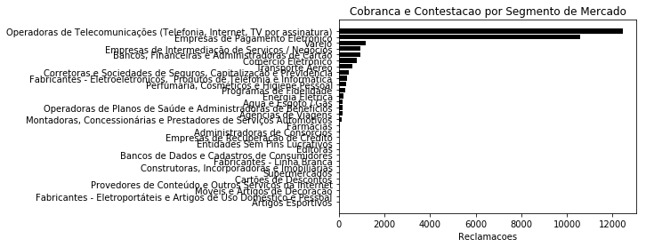
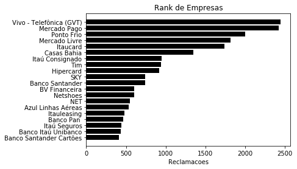
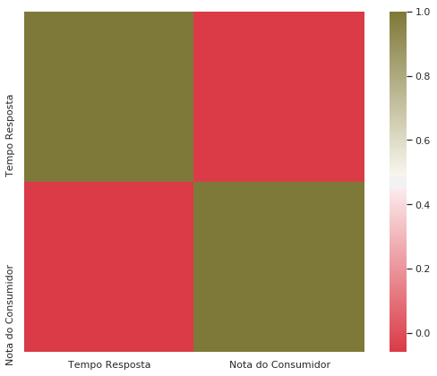
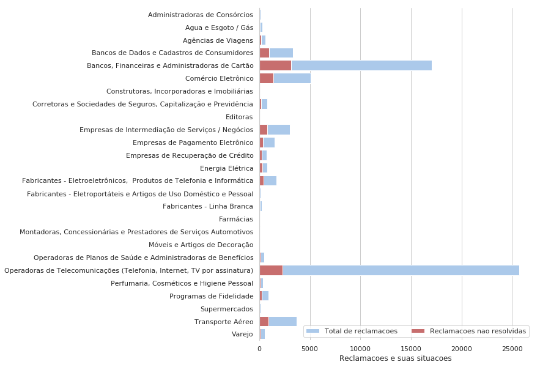

## Analise dos dados de Agosto de 2019

* Dados das reclamações do site Dados do site https://www.consumidor.gov.br
* A base dessa exploração foi tirada do blog https://minerandodados.com.br/exploratory-data-analysis-eda/


```python
import pandas as pd
import numpy as np
import matplotlib.pyplot as plt
%matplotlib inline
```

### Visualisando os dados


```python
!head -n 5 2019-08.csv
```

    
    
    
    
    


```python
df = pd.read_csv('2019-08.csv', sep=';')
df.head()
```


<div>
<style scoped>
    .dataframe tbody tr th:only-of-type {
        vertical-align: middle;
    }

    .dataframe tbody tr th {
        vertical-align: top;
    }

    .dataframe thead th {
        text-align: right;
    }
</style>
<table border="1" class="dataframe">
  <thead>
    <tr style="text-align: right;">
      <th></th>
      <th>Região</th>
      <th>UF</th>
      <th>Cidade</th>
      <th>Sexo</th>
      <th>Faixa Etária</th>
      <th>Data Finalização</th>
      <th>Tempo Resposta</th>
      <th>Nome Fantasia</th>
      <th>Segmento de Mercado</th>
      <th>Área</th>
      <th>Assunto</th>
      <th>Grupo Problema</th>
      <th>Problema</th>
      <th>Como Comprou Contratou</th>
      <th>Procurou Empresa</th>
      <th>Respondida</th>
      <th>Situação</th>
      <th>Avaliação Reclamação</th>
      <th>Nota do Consumidor</th>
      <th>Total</th>
    </tr>
  </thead>
  <tbody>
    <tr>
      <th>0</th>
      <td>SE</td>
      <td>SP</td>
      <td>Guaratinguetá</td>
      <td>F</td>
      <td>entre 41 a 50 anos</td>
      <td>01/08/2019</td>
      <td>10.0</td>
      <td>Vivo - Telefônica (GVT)</td>
      <td>Operadoras de Telecomunicações (Telefonia, Int...</td>
      <td>Telecomunicações</td>
      <td>Pacote de Serviços ( Combo )</td>
      <td>Cobrança / Contestação</td>
      <td>Cobrança por serviço não fornecido/ em desacor...</td>
      <td>Telefone</td>
      <td>S</td>
      <td>S</td>
      <td>Finalizada não avaliada</td>
      <td>Não Avaliada</td>
      <td>NaN</td>
      <td>1</td>
    </tr>
    <tr>
      <th>1</th>
      <td>SE</td>
      <td>SP</td>
      <td>Carapicuíba</td>
      <td>M</td>
      <td>entre 61 a 70 anos</td>
      <td>01/08/2019</td>
      <td>10.0</td>
      <td>Vivo - Telefônica (GVT)</td>
      <td>Operadoras de Telecomunicações (Telefonia, Int...</td>
      <td>Telecomunicações</td>
      <td>Pacote de Serviços ( Combo )</td>
      <td>Vício de Qualidade</td>
      <td>Dificuldade para alterar/ ativar serviços</td>
      <td>Loja física</td>
      <td>S</td>
      <td>S</td>
      <td>Finalizada não avaliada</td>
      <td>Não Avaliada</td>
      <td>NaN</td>
      <td>1</td>
    </tr>
    <tr>
      <th>2</th>
      <td>SE</td>
      <td>SP</td>
      <td>Jaú</td>
      <td>M</td>
      <td>entre 31 a 40 anos</td>
      <td>01/08/2019</td>
      <td>10.0</td>
      <td>Vivo - Telefônica (GVT)</td>
      <td>Operadoras de Telecomunicações (Telefonia, Int...</td>
      <td>Telecomunicações</td>
      <td>Pacote de Serviços ( Combo )</td>
      <td>Vício de Qualidade</td>
      <td>Funcionamento inadequado do serviço (má qualid...</td>
      <td>Não comprei / contratei</td>
      <td>S</td>
      <td>S</td>
      <td>Finalizada não avaliada</td>
      <td>Não Avaliada</td>
      <td>NaN</td>
      <td>1</td>
    </tr>
    <tr>
      <th>3</th>
      <td>SE</td>
      <td>SP</td>
      <td>São Paulo</td>
      <td>F</td>
      <td>entre 41 a 50 anos</td>
      <td>01/08/2019</td>
      <td>10.0</td>
      <td>Itaú Consignado</td>
      <td>Bancos, Financeiras e Administradoras de Cartão</td>
      <td>Serviços Financeiros</td>
      <td>Crédito Consignado (Empréstimo descontado em f...</td>
      <td>Vício de Qualidade</td>
      <td>Portabilidade não efetivada</td>
      <td>Telefone</td>
      <td>S</td>
      <td>S</td>
      <td>Finalizada não avaliada</td>
      <td>Não Avaliada</td>
      <td>NaN</td>
      <td>1</td>
    </tr>
    <tr>
      <th>4</th>
      <td>SE</td>
      <td>SP</td>
      <td>São Paulo</td>
      <td>M</td>
      <td>até 20 anos</td>
      <td>01/08/2019</td>
      <td>10.0</td>
      <td>Mercado Pago</td>
      <td>Empresas de Pagamento Eletrônico</td>
      <td>Serviços Financeiros</td>
      <td>Serviço de pagamento online/ via celular/ maqu...</td>
      <td>Cobrança / Contestação</td>
      <td>Negativação indevida sem contratação do serviç...</td>
      <td>Internet</td>
      <td>S</td>
      <td>S</td>
      <td>Finalizada não avaliada</td>
      <td>Não Avaliada</td>
      <td>NaN</td>
      <td>1</td>
    </tr>
  </tbody>
</table>
</div>


```python
df.sample(5)
```


<div>
<style scoped>
    .dataframe tbody tr th:only-of-type {
        vertical-align: middle;
    }

    .dataframe tbody tr th {
        vertical-align: top;
    }

    .dataframe thead th {
        text-align: right;
    }
</style>
<table border="1" class="dataframe">
  <thead>
    <tr style="text-align: right;">
      <th></th>
      <th>Região</th>
      <th>UF</th>
      <th>Cidade</th>
      <th>Sexo</th>
      <th>Faixa Etária</th>
      <th>Data Finalização</th>
      <th>Tempo Resposta</th>
      <th>Nome Fantasia</th>
      <th>Segmento de Mercado</th>
      <th>Área</th>
      <th>Assunto</th>
      <th>Grupo Problema</th>
      <th>Problema</th>
      <th>Como Comprou Contratou</th>
      <th>Procurou Empresa</th>
      <th>Respondida</th>
      <th>Situação</th>
      <th>Avaliação Reclamação</th>
      <th>Nota do Consumidor</th>
      <th>Total</th>
    </tr>
  </thead>
  <tbody>
    <tr>
      <th>63844</th>
      <td>SE</td>
      <td>RJ</td>
      <td>Duque de Caxias</td>
      <td>M</td>
      <td>entre 21 a 30 anos</td>
      <td>30/08/2019</td>
      <td>10.0</td>
      <td>Banco Bradesco</td>
      <td>Bancos, Financeiras e Administradoras de Cartão</td>
      <td>Serviços Financeiros</td>
      <td>Conta corrente / Salário / Poupança /Conta Apo...</td>
      <td>Cobrança / Contestação</td>
      <td>Cobrança por serviço/produto não contratado / ...</td>
      <td>Não comprei / contratei</td>
      <td>S</td>
      <td>S</td>
      <td>Finalizada avaliada</td>
      <td>Não Resolvida</td>
      <td>1.0</td>
      <td>1</td>
    </tr>
    <tr>
      <th>67051</th>
      <td>SE</td>
      <td>SP</td>
      <td>Guarujá</td>
      <td>M</td>
      <td>entre 21 a 30 anos</td>
      <td>30/08/2019</td>
      <td>4.0</td>
      <td>Mercado Livre</td>
      <td>Empresas de Intermediação de Serviços / Negócios</td>
      <td>Demais Serviços</td>
      <td>Serviços na internet (provedor, hospedagem, ap...</td>
      <td>Cobrança / Contestação</td>
      <td>Dificuldade / atraso na devolução de valores p...</td>
      <td>Internet</td>
      <td>S</td>
      <td>S</td>
      <td>Finalizada avaliada</td>
      <td>Não Resolvida</td>
      <td>1.0</td>
      <td>1</td>
    </tr>
    <tr>
      <th>31125</th>
      <td>SE</td>
      <td>SP</td>
      <td>Jundiaí</td>
      <td>M</td>
      <td>entre 21 a 30 anos</td>
      <td>20/08/2019</td>
      <td>5.0</td>
      <td>Smiles</td>
      <td>Programas de Fidelidade</td>
      <td>Demais Serviços</td>
      <td>Programas de Fidelidade / Benefícios (pontos, ...</td>
      <td>Cobrança / Contestação</td>
      <td>Cobrança indevida / abusiva para alterar ou ca...</td>
      <td>Internet</td>
      <td>S</td>
      <td>S</td>
      <td>Finalizada avaliada</td>
      <td>Resolvida</td>
      <td>5.0</td>
      <td>1</td>
    </tr>
    <tr>
      <th>36035</th>
      <td>NE</td>
      <td>CE</td>
      <td>Maracanaú</td>
      <td>F</td>
      <td>entre 41 a 50 anos</td>
      <td>22/08/2019</td>
      <td>3.0</td>
      <td>Bradesco Cartões</td>
      <td>Bancos, Financeiras e Administradoras de Cartão</td>
      <td>Serviços Financeiros</td>
      <td>Cartão de Crédito / Cartão de Débito / Cartão ...</td>
      <td>Atendimento / SAC</td>
      <td>SAC - Demanda não resolvida / não respondida /...</td>
      <td>Loja física</td>
      <td>S</td>
      <td>S</td>
      <td>Finalizada não avaliada</td>
      <td>Não Avaliada</td>
      <td>NaN</td>
      <td>1</td>
    </tr>
    <tr>
      <th>19669</th>
      <td>SE</td>
      <td>SP</td>
      <td>Jacareí</td>
      <td>F</td>
      <td>entre 21 a 30 anos</td>
      <td>12/08/2019</td>
      <td>6.0</td>
      <td>Caixa Econômica Federal</td>
      <td>Bancos, Financeiras e Administradoras de Cartão</td>
      <td>Serviços Financeiros</td>
      <td>Financiamento de Imóveis</td>
      <td>Cobrança / Contestação</td>
      <td>Cobrança por serviço/produto não contratado / ...</td>
      <td>Não comprei / contratei</td>
      <td>N</td>
      <td>S</td>
      <td>Finalizada avaliada</td>
      <td>Resolvida</td>
      <td>3.0</td>
      <td>1</td>
    </tr>
  </tbody>
</table>
</div>


### Informações sobre o dataset


```python
df.columns
```


    Index(['Região', 'UF', 'Cidade', 'Sexo', 'Faixa Etária', 'Data Finalização',
           'Tempo Resposta', 'Nome Fantasia', 'Segmento de Mercado', 'Área',
           'Assunto', 'Grupo Problema', 'Problema', 'Como Comprou Contratou',
           'Procurou Empresa', 'Respondida', 'Situação', 'Avaliação Reclamação',
           'Nota do Consumidor', 'Total'],
          dtype='object')


```python
df.shape
```


    (67787, 20)


```python
df.info()
```

    <class 'pandas.core.frame.DataFrame'>
    RangeIndex: 67787 entries, 0 to 67786
    Data columns (total 20 columns):
     #   Column                  Non-Null Count  Dtype  
    ---  ------                  --------------  -----  
     0   Região                  67787 non-null  object 
     1   UF                      67787 non-null  object 
     2   Cidade                  67787 non-null  object 
     3   Sexo                    67787 non-null  object 
     4   Faixa Etária            67787 non-null  object 
     5   Data Finalização        67787 non-null  object 
     6   Tempo Resposta          67174 non-null  float64
     7   Nome Fantasia           67787 non-null  object 
     8   Segmento de Mercado     67787 non-null  object 
     9   Área                    67787 non-null  object 
     10  Assunto                 67787 non-null  object 
     11  Grupo Problema          67787 non-null  object 
     12  Problema                67787 non-null  object 
     13  Como Comprou Contratou  67787 non-null  object 
     14  Procurou Empresa        67787 non-null  object 
     15  Respondida              67787 non-null  object 
     16  Situação                67787 non-null  object 
     17  Avaliação Reclamação    67787 non-null  object 
     18  Nota do Consumidor      37820 non-null  float64
     19  Total                   67787 non-null  int64  
    dtypes: float64(2), int64(1), object(17)
    memory usage: 10.3+ MB


```python
df.count()
```


    Região                    67787
    UF                        67787
    Cidade                    67787
    Sexo                      67787
    Faixa Etária              67787
    Data Finalização          67787
    Tempo Resposta            67174
    Nome Fantasia             67787
    Segmento de Mercado       67787
    Área                      67787
    Assunto                   67787
    Grupo Problema            67787
    Problema                  67787
    Como Comprou Contratou    67787
    Procurou Empresa          67787
    Respondida                67787
    Situação                  67787
    Avaliação Reclamação      67787
    Nota do Consumidor        37820
    Total                     67787
    dtype: int64


```python
df.isnull().sum()
```


    Região                        0
    UF                            0
    Cidade                        0
    Sexo                          0
    Faixa Etária                  0
    Data Finalização              0
    Tempo Resposta              613
    Nome Fantasia                 0
    Segmento de Mercado           0
    Área                          0
    Assunto                       0
    Grupo Problema                0
    Problema                      0
    Como Comprou Contratou        0
    Procurou Empresa              0
    Respondida                    0
    Situação                      0
    Avaliação Reclamação          0
    Nota do Consumidor        29967
    Total                         0
    dtype: int64


### Qual a quantidade de reclamações por sexo ?


```python
df.Sexo.value_counts()
```


    M    38806
    F    28981
    Name: Sexo, dtype: int64


### Qual a faixa etária média dos consumidores ?


```python
df.groupby('Sexo')['Faixa Etária'].value_counts()
```


    Sexo  Faixa Etária      
    F     entre 31 a 40 anos     8351
          entre 21 a 30 anos     7795
          entre 41 a 50 anos     4753
          entre 51 a 60 anos     3592
          entre 61 a 70 anos     2604
          mais de 70 anos        1189
          até 20 anos             697
    M     entre 31 a 40 anos    13235
          entre 21 a 30 anos    11851
          entre 41 a 50 anos     6020
          entre 51 a 60 anos     3470
          entre 61 a 70 anos     2277
          mais de 70 anos        1019
          até 20 anos             934
    Name: Faixa Etária, dtype: int64


### Qual o grupo de problema mais comum ?


```python
df['Grupo Problema'].value_counts()
```


    Cobrança / Contestação    30079
    Contrato / Oferta         13357
    Vício de Qualidade         9408
    Atendimento / SAC          7870
    Informação                 4020
    Entrega do Produto         2705
    Saúde e Segurança           348
    Name: Grupo Problema, dtype: int64


### Qual o segmento de mercado mais afetado ?


```python
segmento = df[df[u'Grupo Problema']==u'Cobrança / Contestação']
segmento.head()
```


<div>
<style scoped>
    .dataframe tbody tr th:only-of-type {
        vertical-align: middle;
    }

    .dataframe tbody tr th {
        vertical-align: top;
    }

    .dataframe thead th {
        text-align: right;
    }
</style>
<table border="1" class="dataframe">
  <thead>
    <tr style="text-align: right;">
      <th></th>
      <th>Região</th>
      <th>UF</th>
      <th>Cidade</th>
      <th>Sexo</th>
      <th>Faixa Etária</th>
      <th>Data Finalização</th>
      <th>Tempo Resposta</th>
      <th>Nome Fantasia</th>
      <th>Segmento de Mercado</th>
      <th>Área</th>
      <th>Assunto</th>
      <th>Grupo Problema</th>
      <th>Problema</th>
      <th>Como Comprou Contratou</th>
      <th>Procurou Empresa</th>
      <th>Respondida</th>
      <th>Situação</th>
      <th>Avaliação Reclamação</th>
      <th>Nota do Consumidor</th>
      <th>Total</th>
    </tr>
  </thead>
  <tbody>
    <tr>
      <th>0</th>
      <td>SE</td>
      <td>SP</td>
      <td>Guaratinguetá</td>
      <td>F</td>
      <td>entre 41 a 50 anos</td>
      <td>01/08/2019</td>
      <td>10.0</td>
      <td>Vivo - Telefônica (GVT)</td>
      <td>Operadoras de Telecomunicações (Telefonia, Int...</td>
      <td>Telecomunicações</td>
      <td>Pacote de Serviços ( Combo )</td>
      <td>Cobrança / Contestação</td>
      <td>Cobrança por serviço não fornecido/ em desacor...</td>
      <td>Telefone</td>
      <td>S</td>
      <td>S</td>
      <td>Finalizada não avaliada</td>
      <td>Não Avaliada</td>
      <td>NaN</td>
      <td>1</td>
    </tr>
    <tr>
      <th>4</th>
      <td>SE</td>
      <td>SP</td>
      <td>São Paulo</td>
      <td>M</td>
      <td>até 20 anos</td>
      <td>01/08/2019</td>
      <td>10.0</td>
      <td>Mercado Pago</td>
      <td>Empresas de Pagamento Eletrônico</td>
      <td>Serviços Financeiros</td>
      <td>Serviço de pagamento online/ via celular/ maqu...</td>
      <td>Cobrança / Contestação</td>
      <td>Negativação indevida sem contratação do serviç...</td>
      <td>Internet</td>
      <td>S</td>
      <td>S</td>
      <td>Finalizada não avaliada</td>
      <td>Não Avaliada</td>
      <td>NaN</td>
      <td>1</td>
    </tr>
    <tr>
      <th>5</th>
      <td>SE</td>
      <td>SP</td>
      <td>São Paulo</td>
      <td>F</td>
      <td>entre 31 a 40 anos</td>
      <td>01/08/2019</td>
      <td>10.0</td>
      <td>Ponto Frio</td>
      <td>Varejo</td>
      <td>Serviços Financeiros</td>
      <td>Cartão de Crédito / Cartão de Débito / Cartão ...</td>
      <td>Cobrança / Contestação</td>
      <td>Cobrança de tarifas, taxas, valores não previs...</td>
      <td>Loja física</td>
      <td>S</td>
      <td>S</td>
      <td>Finalizada não avaliada</td>
      <td>Não Avaliada</td>
      <td>NaN</td>
      <td>1</td>
    </tr>
    <tr>
      <th>7</th>
      <td>NE</td>
      <td>PE</td>
      <td>Recife</td>
      <td>F</td>
      <td>entre 31 a 40 anos</td>
      <td>02/08/2019</td>
      <td>9.0</td>
      <td>Mercado Livre</td>
      <td>Empresas de Intermediação de Serviços / Negócios</td>
      <td>Demais Produtos</td>
      <td>Vestuário e Artigos de Uso Pessoal (roupa, cal...</td>
      <td>Cobrança / Contestação</td>
      <td>Cobrança adicional não informada previamente (...</td>
      <td>Internet</td>
      <td>S</td>
      <td>S</td>
      <td>Finalizada não avaliada</td>
      <td>Não Avaliada</td>
      <td>NaN</td>
      <td>1</td>
    </tr>
    <tr>
      <th>10</th>
      <td>SE</td>
      <td>SP</td>
      <td>Taboão da Serra</td>
      <td>F</td>
      <td>entre 21 a 30 anos</td>
      <td>03/08/2019</td>
      <td>9.0</td>
      <td>Itaucard</td>
      <td>Bancos, Financeiras e Administradoras de Cartão</td>
      <td>Serviços Financeiros</td>
      <td>Cartão de Crédito / Cartão de Débito / Cartão ...</td>
      <td>Cobrança / Contestação</td>
      <td>Cobrança de compra/saque não reconhecido</td>
      <td>Não comprei / contratei</td>
      <td>N</td>
      <td>S</td>
      <td>Finalizada não avaliada</td>
      <td>Não Avaliada</td>
      <td>NaN</td>
      <td>1</td>
    </tr>
  </tbody>
</table>
</div>


```python
segmento['Segmento de Mercado'].value_counts()
```


    Operadoras de Telecomunicações (Telefonia, Internet, TV por assinatura)    12431
    Bancos, Financeiras e Administradoras de Cartão                            10577
    Empresas de Intermediação de Serviços / Negócios                            1180
    Comércio Eletrônico                                                          967
    Transporte Aéreo                                                             953
    Empresas de Pagamento Eletrônico                                             795
    Empresas de Recuperação de Crédito                                           599
    Energia Elétrica                                                             461
    Bancos de Dados e Cadastros de Consumidores                                  354
    Corretoras e Sociedades de Seguros, Capitalização e Previdência              322
    Agências de Viagens                                                          290
    Operadoras de Planos de Saúde e Administradoras de Benefícios                206
    Programas de Fidelidade                                                      187
    Agua e Esgoto / Gás                                                          180
    Perfumaria, Cosméticos e Higiene Pessoal                                     178
    Varejo                                                                       142
    Fabricantes - Eletroeletrônicos,  Produtos de Telefonia e Informática         70
    Administradoras de Consórcios                                                 62
    Editoras                                                                      28
    Farmácias                                                                     17
    Construtoras, Incorporadoras e Imobiliárias                                   16
    Supermercados                                                                 14
    Fabricantes - Linha Branca                                                    11
    Montadoras, Concessionárias e Prestadores de Serviços Automotivos              9
    Cartões de Descontos                                                           7
    Entidades Sem Fins Lucrativos                                                  6
    Fabricantes - Eletroportáteis e Artigos de Uso Doméstico e Pessoal             6
    Provedores de Conteúdo e Outros Serviços na Internet                           4
    Artigos Esportivos                                                             4
    Móveis e Artigos de Decoração                                                  3
    Name: Segmento de Mercado, dtype: int64


```python
fig, ax = plt.subplots()
y_pos = np.arange(len(segmento['Segmento de Mercado'].value_counts()))
values = segmento['Segmento de Mercado'].value_counts()
segmentos = segmento['Segmento de Mercado'].unique()
ax.barh(y_pos, values, align='center', color='black')
ax.set_yticks(y_pos)
ax.set_yticklabels(segmentos)
ax.invert_yaxis()
ax.set_xlabel('Reclamacoes')
ax.set_title('Cobranca e Contestacao por Segmento de Mercado')
plt.show()
```





```python
fig, ax = plt.subplots()
y_pos = np.arange(len(segmento['Nome Fantasia'].value_counts()[:20]))
values = segmento['Nome Fantasia'].value_counts()[:20]
segmentos = segmento['Nome Fantasia'].unique()[:20]
ax.barh(y_pos, values, align='center', color='black')
ax.set_yticks(y_pos)
ax.set_yticklabels(segmentos)
ax.invert_yaxis()
ax.set_xlabel('Reclamacoes')
ax.set_title('Rank de Empresas')
plt.show()
```





### Existe alguma correlação entre o tempo de resposta e a nota do consumidor ?


```python
import seaborn as sns
f, ax = plt.subplots(figsize=(10, 7))
#df_filll = df_fill.drop('Total',axis=1)
corr = df_fill.corr()
sns.heatmap(corr, mask=np.zeros_like(corr, dtype=np.bool), cmap=sns.diverging_palette(10, 80, n=10, as_cmap=True), square=True, ax=ax)
```


    <matplotlib.axes._subplots.AxesSubplot at 0x7f417a2d1438>





```python
x = df.groupby(u'Segmento de Mercado')[u'Segmento de Mercado'].count()
#Filtrando os segmentos de mercado com mais de 20 reclamações
x = x[x > 20]
df1 = df[df[u'Segmento de Mercado'].isin(x.keys())]
df1 = df1[df1[u'Avaliação Reclamação']==u'Não Resolvida']
x1 = df1.groupby(u'Segmento de Mercado')[u'Segmento de Mercado'].count()
```


```python
import seaborn as sns
sns.set(style="whitegrid")
f, ax = plt.subplots(figsize=(8, 10))
sns.set_color_codes("pastel")
sns.barplot(x=x.values, y=x.keys(), label="Total de reclamacoes", color="b")
sns.set_color_codes("muted")
sns.barplot(x=x1.values, y=x1.keys(),label="Reclamacoes nao resolvidas", color="r")
ax.legend(ncol=2, loc="lower right", frameon=True)
ax.set(ylabel="", xlabel="Reclamacoes e suas situacoes")
sns.despine(left=False, bottom=True)
```





```python
municipios = pd.read_excel('municipiosBrasil.xls')
municipios.head()
```


<div>
<style scoped>
    .dataframe tbody tr th:only-of-type {
        vertical-align: middle;
    }

    .dataframe tbody tr th {
        vertical-align: top;
    }

    .dataframe thead th {
        text-align: right;
    }
</style>
<table border="1" class="dataframe">
  <thead>
    <tr style="text-align: right;">
      <th></th>
      <th>ID</th>
      <th>LATITUDE</th>
      <th>LONGITUDE</th>
      <th>Mun/UF</th>
      <th>MUNICIPIO</th>
      <th>UF</th>
      <th>Valor</th>
    </tr>
  </thead>
  <tbody>
    <tr>
      <th>0</th>
      <td>1</td>
      <td>LATITUDE</td>
      <td>-66.88</td>
      <td>Mun/UF</td>
      <td>ACRELANDIA</td>
      <td>AC</td>
      <td>39560.038911</td>
    </tr>
    <tr>
      <th>1</th>
      <td>2</td>
      <td>-10.94</td>
      <td>-69.56</td>
      <td>ASSIS BRASIL - AC</td>
      <td>ASSIS BRASIL</td>
      <td>AC</td>
      <td>17842.150989</td>
    </tr>
    <tr>
      <th>2</th>
      <td>3</td>
      <td>-11.01</td>
      <td>-68.74</td>
      <td>BRASILEIA - AC</td>
      <td>BRASILEIA</td>
      <td>AC</td>
      <td>93373.394313</td>
    </tr>
    <tr>
      <th>3</th>
      <td>4</td>
      <td>-9.83</td>
      <td>-67.95</td>
      <td>BUJARI - AC</td>
      <td>BUJARI</td>
      <td>AC</td>
      <td>28516.567493</td>
    </tr>
    <tr>
      <th>4</th>
      <td>5</td>
      <td>-10.57</td>
      <td>-67.67</td>
      <td>CAPIXABA - AC</td>
      <td>CAPIXABA</td>
      <td>AC</td>
      <td>18886.455136</td>
    </tr>
  </tbody>
</table>
</div>


```python
import unicodedata
import re

dataset = municipios

def remover_acentos(txt):
    nfkd = unicodedata.normalize('NFKD', txt)
    palavraSemAcento = u"".join([c for c in nfkd if not unicodedata.combining(c)])
    # Usa expressão regular para retornar a palavra apenas com números, letras e espaço
    palavraSemAcento = re.sub('[^a-zA-Z0-9 \\\]', '', palavraSemAcento)
    palavraSemAcento = str(palavraSemAcento).upper()
    return palavraSemAcento

dataset['MUNICIPIO'] = dataset['MUNICIPIO'].apply(remover_acentos)
```


```python
dataset.sample(20)
```


<div>
<style scoped>
    .dataframe tbody tr th:only-of-type {
        vertical-align: middle;
    }

    .dataframe tbody tr th {
        vertical-align: top;
    }

    .dataframe thead th {
        text-align: right;
    }
</style>
<table border="1" class="dataframe">
  <thead>
    <tr style="text-align: right;">
      <th></th>
      <th>ID</th>
      <th>LATITUDE</th>
      <th>LONGITUDE</th>
      <th>Mun/UF</th>
      <th>MUNICIPIO</th>
      <th>UF</th>
      <th>Valor</th>
    </tr>
  </thead>
  <tbody>
    <tr>
      <th>5088</th>
      <td>5089</td>
      <td>-22.4</td>
      <td>-51.52</td>
      <td>NARANDIBA - SP</td>
      <td>NARANDIBA</td>
      <td>SP</td>
      <td>23389.004739</td>
    </tr>
    <tr>
      <th>4931</th>
      <td>4932</td>
      <td>-20.07</td>
      <td>-50.33</td>
      <td>GUARANI D'OESTE - SP</td>
      <td>GUARANI DOESTE</td>
      <td>SP</td>
      <td>13482.954865</td>
    </tr>
    <tr>
      <th>4314</th>
      <td>4315</td>
      <td>-29.29</td>
      <td>-52.05</td>
      <td>TRAVESSEIRO - RS</td>
      <td>TRAVESSEIRO</td>
      <td>RS</td>
      <td>14569.909962</td>
    </tr>
    <tr>
      <th>2703</th>
      <td>2704</td>
      <td>-7.62</td>
      <td>-38.55</td>
      <td>SANTA INES - PB</td>
      <td>SANTA INES</td>
      <td>PB</td>
      <td>24961.536287</td>
    </tr>
    <tr>
      <th>2768</th>
      <td>2769</td>
      <td>-8.38</td>
      <td>-35.45</td>
      <td>AMARAJI - PE</td>
      <td>AMARAJI</td>
      <td>PE</td>
      <td>134639.491168</td>
    </tr>
    <tr>
      <th>4245</th>
      <td>4246</td>
      <td>-28.66</td>
      <td>-56.00</td>
      <td>SAO BORJA - RS</td>
      <td>SAO BORJA</td>
      <td>RS</td>
      <td>399726.833166</td>
    </tr>
    <tr>
      <th>1726</th>
      <td>1727</td>
      <td>-21.29</td>
      <td>-44.65</td>
      <td>ITUTINGA - MG</td>
      <td>ITUTINGA</td>
      <td>MG</td>
      <td>27484.306377</td>
    </tr>
    <tr>
      <th>5497</th>
      <td>5498</td>
      <td>-11.14</td>
      <td>-48.16</td>
      <td>SILVANOPOLIS - TO</td>
      <td>SILVANOPOLIS</td>
      <td>TO</td>
      <td>31493.639477</td>
    </tr>
    <tr>
      <th>2974</th>
      <td>2975</td>
      <td>-3.19</td>
      <td>-41.64</td>
      <td>BOM PRINCIPIO DO PIAUI - PI</td>
      <td>BOM PRINCIPIO DO PIAUI</td>
      <td>PI</td>
      <td>32218.717998</td>
    </tr>
    <tr>
      <th>634</th>
      <td>635</td>
      <td>-6.87</td>
      <td>-39.87</td>
      <td>ASSARE - CE</td>
      <td>ASSARE</td>
      <td>CE</td>
      <td>122672.184041</td>
    </tr>
    <tr>
      <th>3973</th>
      <td>3974</td>
      <td>-28.25</td>
      <td>-54.01</td>
      <td>CATUIPE - RS</td>
      <td>CATUIPE</td>
      <td>RS</td>
      <td>71079.236999</td>
    </tr>
    <tr>
      <th>5415</th>
      <td>5416</td>
      <td>-11.62</td>
      <td>-46.82</td>
      <td>DIANOPOLIS - TO</td>
      <td>DIANOPOLIS</td>
      <td>TO</td>
      <td>100345.684543</td>
    </tr>
    <tr>
      <th>1834</th>
      <td>1835</td>
      <td>-16.86</td>
      <td>-41.25</td>
      <td>MONTE FORMOSO - MG</td>
      <td>MONTE FORMOSO</td>
      <td>MG</td>
      <td>28372.154529</td>
    </tr>
    <tr>
      <th>493</th>
      <td>494</td>
      <td>-11.83</td>
      <td>-39.61</td>
      <td>PE DE SERRA - BA</td>
      <td>PE DE SERRA</td>
      <td>BA</td>
      <td>78585.604739</td>
    </tr>
    <tr>
      <th>1496</th>
      <td>1497</td>
      <td>-21.48</td>
      <td>-44.64</td>
      <td>CARRANCAS - MG</td>
      <td>CARRANCAS</td>
      <td>MG</td>
      <td>25314.299182</td>
    </tr>
    <tr>
      <th>1233</th>
      <td>1234</td>
      <td>-3.1</td>
      <td>-45.03</td>
      <td>MATINHA - MA</td>
      <td>MATINHA</td>
      <td>MA</td>
      <td>107431.995343</td>
    </tr>
    <tr>
      <th>3501</th>
      <td>3502</td>
      <td>-23.49</td>
      <td>-50.64</td>
      <td>SANTO ANTONIO DO PARAISO - PR</td>
      <td>SANTO ANTONIO DO PARAISO</td>
      <td>PR</td>
      <td>17602.001584</td>
    </tr>
    <tr>
      <th>2525</th>
      <td>2526</td>
      <td>-2.41</td>
      <td>-48.15</td>
      <td>TOME-ACU - PA</td>
      <td>TOMEACU</td>
      <td>PA</td>
      <td>272550.822049</td>
    </tr>
    <tr>
      <th>4171</th>
      <td>4172</td>
      <td>-29.66</td>
      <td>-53.14</td>
      <td>PARAISO DO SUL - RS</td>
      <td>PARAISO DO SUL</td>
      <td>RS</td>
      <td>41197.486337</td>
    </tr>
    <tr>
      <th>5279</th>
      <td>5280</td>
      <td>-20.58</td>
      <td>-47.85</td>
      <td>SAO JOAQUIM DA BARRA - SP</td>
      <td>SAO JOAQUIM DA BARRA</td>
      <td>SP</td>
      <td>267555.464625</td>
    </tr>
  </tbody>
</table>
</div>


```python
import folium
from folium import plugins

mapa = folium.Map(location=[-15.788497,-47.879873],zoom_start=5,tiles='Stamen Toner')
coordenadas=[]

for cid,uf in zip(dataset.MUNICIPIO[:20000],dataset.UF[:20000]):
    cidadeUf = cid+' - '+uf
    lat = municipios[municipios['Mun/UF'] == cidadeUf]['LATITUDE'].values
    long = municipios[municipios['Mun/UF'] == cidadeUf]['LONGITUDE'].values
    if lat != '' and long != '':
        lat = float(str(lat).replace('[','').replace(']','').replace(' ',','))
        long = float(str(long).replace('[','').replace(']','').replace(' ',','))
        coordenadas.append([lat,long])
mapa.add_child(plugins.HeatMap(coordenadas))
mapa
```

    /home/dayvson/.local/lib/python3.6/site-packages/ipykernel_launcher.py:11: DeprecationWarning: The truth value of an empty array is ambiguous. Returning False, but in future this will result in an error. Use `array.size > 0` to check that an array is not empty.
      # This is added back by InteractiveShellApp.init_path()
    /home/dayvson/.local/lib/python3.6/site-packages/ipykernel_launcher.py:11: FutureWarning: elementwise comparison failed; returning scalar instead, but in the future will perform elementwise comparison
      # This is added back by InteractiveShellApp.init_path()


<div style="width:100%;"><div style="position:relative;width:100%;height:0;padding-bottom:60%;"><iframe src="about:blank" style="position:absolute;width:100%;height:100%;left:0;top:0;border:none !important;" data-html=PCFET0NUWVBFIGh0bWw+CjxoZWFkPiAgICAKICAgIDxtZXRhIGh0dHAtZXF1aXY9ImNvbnRlbnQtdHlwZSIgY29udGVudD0idGV4dC9odG1sOyBjaGFyc2V0PVVURi04IiAvPgogICAgCiAgICAgICAgPHNjcmlwdD4KICAgICAgICAgICAgTF9OT19UT1VDSCA9IGZhbHNlOwogICAgICAgICAgICBMX0RJU0FCTEVfM0QgPSBmYWxzZTsKICAgICAgICA8L3NjcmlwdD4KICAgIAogICAgPHNjcmlwdCBzcmM9Imh0dHBzOi8vY2RuLmpzZGVsaXZyLm5ldC9ucG0vbGVhZmxldEAxLjUuMS9kaXN0L2xlYWZsZXQuanMiPjwvc2NyaXB0PgogICAgPHNjcmlwdCBzcmM9Imh0dHBzOi8vY29kZS5qcXVlcnkuY29tL2pxdWVyeS0xLjEyLjQubWluLmpzIj48L3NjcmlwdD4KICAgIDxzY3JpcHQgc3JjPSJodHRwczovL21heGNkbi5ib290c3RyYXBjZG4uY29tL2Jvb3RzdHJhcC8zLjIuMC9qcy9ib290c3RyYXAubWluLmpzIj48L3NjcmlwdD4KICAgIDxzY3JpcHQgc3JjPSJodHRwczovL2NkbmpzLmNsb3VkZmxhcmUuY29tL2FqYXgvbGlicy9MZWFmbGV0LmF3ZXNvbWUtbWFya2Vycy8yLjAuMi9sZWFmbGV0LmF3ZXNvbWUtbWFya2Vycy5qcyI+PC9zY3JpcHQ+CiAgICA8bGluayByZWw9InN0eWxlc2hlZXQiIGhyZWY9Imh0dHBzOi8vY2RuLmpzZGVsaXZyLm5ldC9ucG0vbGVhZmxldEAxLjUuMS9kaXN0L2xlYWZsZXQuY3NzIi8+CiAgICA8bGluayByZWw9InN0eWxlc2hlZXQiIGhyZWY9Imh0dHBzOi8vbWF4Y2RuLmJvb3RzdHJhcGNkbi5jb20vYm9vdHN0cmFwLzMuMi4wL2Nzcy9ib290c3RyYXAubWluLmNzcyIvPgogICAgPGxpbmsgcmVsPSJzdHlsZXNoZWV0IiBocmVmPSJodHRwczovL21heGNkbi5ib290c3RyYXBjZG4uY29tL2Jvb3RzdHJhcC8zLjIuMC9jc3MvYm9vdHN0cmFwLXRoZW1lLm1pbi5jc3MiLz4KICAgIDxsaW5rIHJlbD0ic3R5bGVzaGVldCIgaHJlZj0iaHR0cHM6Ly9tYXhjZG4uYm9vdHN0cmFwY2RuLmNvbS9mb250LWF3ZXNvbWUvNC42LjMvY3NzL2ZvbnQtYXdlc29tZS5taW4uY3NzIi8+CiAgICA8bGluayByZWw9InN0eWxlc2hlZXQiIGhyZWY9Imh0dHBzOi8vY2RuanMuY2xvdWRmbGFyZS5jb20vYWpheC9saWJzL0xlYWZsZXQuYXdlc29tZS1tYXJrZXJzLzIuMC4yL2xlYWZsZXQuYXdlc29tZS1tYXJrZXJzLmNzcyIvPgogICAgPGxpbmsgcmVsPSJzdHlsZXNoZWV0IiBocmVmPSJodHRwczovL3Jhd2Nkbi5naXRoYWNrLmNvbS9weXRob24tdmlzdWFsaXphdGlvbi9mb2xpdW0vbWFzdGVyL2ZvbGl1bS90ZW1wbGF0ZXMvbGVhZmxldC5hd2Vzb21lLnJvdGF0ZS5jc3MiLz4KICAgIDxzdHlsZT5odG1sLCBib2R5IHt3aWR0aDogMTAwJTtoZWlnaHQ6IDEwMCU7bWFyZ2luOiAwO3BhZGRpbmc6IDA7fTwvc3R5bGU+CiAgICA8c3R5bGU+I21hcCB7cG9zaXRpb246YWJzb2x1dGU7dG9wOjA7Ym90dG9tOjA7cmlnaHQ6MDtsZWZ0OjA7fTwvc3R5bGU+CiAgICAKICAgICAgICAgICAgPG1ldGEgbmFtZT0idmlld3BvcnQiIGNvbnRlbnQ9IndpZHRoPWRldmljZS13aWR0aCwKICAgICAgICAgICAgICAgIGluaXRpYWwtc2NhbGU9MS4wLCBtYXhpbXVtLXNjYWxlPTEuMCwgdXNlci1zY2FsYWJsZT1ubyIgLz4KICAgICAgICAgICAgPHN0eWxlPgogICAgICAgICAgICAgICAgI21hcF82MmFiMDdjMDljYWU0NDgwOTI5ZDQ0OWM0ZTU3Nzc2YyB7CiAgICAgICAgICAgICAgICAgICAgcG9zaXRpb246IHJlbGF0aXZlOwogICAgICAgICAgICAgICAgICAgIHdpZHRoOiAxMDAuMCU7CiAgICAgICAgICAgICAgICAgICAgaGVpZ2h0OiAxMDAuMCU7CiAgICAgICAgICAgICAgICAgICAgbGVmdDogMC4wJTsKICAgICAgICAgICAgICAgICAgICB0b3A6IDAuMCU7CiAgICAgICAgICAgICAgICB9CiAgICAgICAgICAgIDwvc3R5bGU+CiAgICAgICAgCiAgICA8c2NyaXB0IHNyYz0iaHR0cHM6Ly9sZWFmbGV0LmdpdGh1Yi5pby9MZWFmbGV0LmhlYXQvZGlzdC9sZWFmbGV0LWhlYXQuanMiPjwvc2NyaXB0Pgo8L2hlYWQ+Cjxib2R5PiAgICAKICAgIAogICAgICAgICAgICA8ZGl2IGNsYXNzPSJmb2xpdW0tbWFwIiBpZD0ibWFwXzYyYWIwN2MwOWNhZTQ0ODA5MjlkNDQ5YzRlNTc3NzZjIiA+PC9kaXY+CiAgICAgICAgCjwvYm9keT4KPHNjcmlwdD4gICAgCiAgICAKICAgICAgICAgICAgdmFyIG1hcF82MmFiMDdjMDljYWU0NDgwOTI5ZDQ0OWM0ZTU3Nzc2YyA9IEwubWFwKAogICAgICAgICAgICAgICAgIm1hcF82MmFiMDdjMDljYWU0NDgwOTI5ZDQ0OWM0ZTU3Nzc2YyIsCiAgICAgICAgICAgICAgICB7CiAgICAgICAgICAgICAgICAgICAgY2VudGVyOiBbLTE1Ljc4ODQ5NywgLTQ3Ljg3OTg3M10sCiAgICAgICAgICAgICAgICAgICAgY3JzOiBMLkNSUy5FUFNHMzg1NywKICAgICAgICAgICAgICAgICAgICB6b29tOiA1LAogICAgICAgICAgICAgICAgICAgIHpvb21Db250cm9sOiB0cnVlLAogICAgICAgICAgICAgICAgICAgIHByZWZlckNhbnZhczogZmFsc2UsCiAgICAgICAgICAgICAgICB9CiAgICAgICAgICAgICk7CgogICAgICAgICAgICAKCiAgICAgICAgCiAgICAKICAgICAgICAgICAgdmFyIHRpbGVfbGF5ZXJfZjA2YjQzZmYxMGYxNGY3YWI1YzM3YzhjZGMyYTAxMTkgPSBMLnRpbGVMYXllcigKICAgICAgICAgICAgICAgICJodHRwczovL3N0YW1lbi10aWxlcy17c30uYS5zc2wuZmFzdGx5Lm5ldC90b25lci97en0ve3h9L3t5fS5wbmciLAogICAgICAgICAgICAgICAgeyJhdHRyaWJ1dGlvbiI6ICJNYXAgdGlsZXMgYnkgXHUwMDNjYSBocmVmPVwiaHR0cDovL3N0YW1lbi5jb21cIlx1MDAzZVN0YW1lbiBEZXNpZ25cdTAwM2MvYVx1MDAzZSwgdW5kZXIgXHUwMDNjYSBocmVmPVwiaHR0cDovL2NyZWF0aXZlY29tbW9ucy5vcmcvbGljZW5zZXMvYnkvMy4wXCJcdTAwM2VDQyBCWSAzLjBcdTAwM2MvYVx1MDAzZS4gRGF0YSBieSBcdTAwMjZjb3B5OyBcdTAwM2NhIGhyZWY9XCJodHRwOi8vb3BlbnN0cmVldG1hcC5vcmdcIlx1MDAzZU9wZW5TdHJlZXRNYXBcdTAwM2MvYVx1MDAzZSwgdW5kZXIgXHUwMDNjYSBocmVmPVwiaHR0cDovL3d3dy5vcGVuc3RyZWV0bWFwLm9yZy9jb3B5cmlnaHRcIlx1MDAzZU9EYkxcdTAwM2MvYVx1MDAzZS4iLCAiZGV0ZWN0UmV0aW5hIjogZmFsc2UsICJtYXhOYXRpdmVab29tIjogMTgsICJtYXhab29tIjogMTgsICJtaW5ab29tIjogMCwgIm5vV3JhcCI6IGZhbHNlLCAib3BhY2l0eSI6IDEsICJzdWJkb21haW5zIjogImFiYyIsICJ0bXMiOiBmYWxzZX0KICAgICAgICAgICAgKS5hZGRUbyhtYXBfNjJhYjA3YzA5Y2FlNDQ4MDkyOWQ0NDljNGU1Nzc3NmMpOwogICAgICAgIAogICAgCiAgICAgICAgICAgIHZhciBoZWF0X21hcF9iMjczODVhOTE5MWI0MDc5YjdhYjZhY2JjM2JjMzllNSA9IEwuaGVhdExheWVyKAogICAgICAgICAgICAgICAgW1stMTAuOTQsIC02OS41Nl0sIFstMTEuMDEsIC02OC43NF0sIFstOS44MywgLTY3Ljk1XSwgWy0xMC41NywgLTY3LjY3XSwgWy03LjYzLCAtNzIuNjddLCBbLTExLjAyLCAtNjguNzRdLCBbLTguMTYsIC03MC4zNV0sIFstOS40MywgLTcxLjg4XSwgWy03LjYxLCAtNzIuODldLCBbLTguODMsIC02OS4yNl0sIFstOC45NCwgLTcyLjc5XSwgWy0xMC4yNywgLTY3LjE1XSwgWy05LjU4LCAtNjcuNTNdLCBbLTguMjYsIC03Mi43NF0sIFstOS45NywgLTY3LjgxXSwgWy03Ljc0LCAtNzIuNjRdLCBbLTkuNDMsIC03MC40OV0sIFstOS4wNiwgLTY4LjY1XSwgWy0xMC4xNSwgLTY3LjczXSwgWy04LjE2LCAtNzAuNzZdLCBbLTEwLjY1LCAtNjguNV0sIFstOS4yNiwgLTM3LjkzXSwgWy05LjY4LCAtMzYuM10sIFstOS43NSwgLTM2LjY2XSwgWy05LjUsIC0zNi4wMl0sIFstOS40LCAtMzUuNV0sIFstOS44NCwgLTM1LjldLCBbLTkuNjcsIC0zNy4xMl0sIFstOS41NywgLTM2LjQ5XSwgWy05LjgyLCAtMzcuMjhdLCBbLTkuNjQsIC0zNi4yMl0sIFstOS4yNCwgLTM2LjAxXSwgWy05LjQsIC0zNi45OV0sIFstOS4zOSwgLTM2LjE1XSwgWy04Ljg0LCAtMzUuNTZdLCBbLTkuNzgsIC0zNi4zNV0sIFstOS45NSwgLTM2Ljc5XSwgWy05LjEyLCAtMzcuNl0sIFstOS40LCAtMzYuMDddLCBbLTkuNDgsIC0zNy4zN10sIFstOS4yNSwgLTM2LjI5XSwgWy05LjYzLCAtMzYuNTddLCBbLTguOSwgLTM1LjcyXSwgWy05LjYzLCAtMzUuOF0sIFstMTAuMTIsIC0zNi4xN10sIFstOS42MSwgLTM2Ljc2XSwgWy05LjM4LCAtMzcuOTldLCBbLTkuMzksIC0zNy4xXSwgWy05LjM5LCAtMzYuNzZdLCBbLTkuOSwgLTM2LjY3XSwgWy0xMC4yOSwgLTM2LjNdLCBbLTkuMjcsIC0zNS43MV0sIFstOS44OCwgLTM2LjgyXSwgWy04Ljk3LCAtMzUuOTNdLCBbLTkuNTMsIC0zNi42M10sIFstMTAuMTIsIC0zNi42Nl0sIFstOS4yMSwgLTM3Ljc1XSwgWy05LjYzLCAtMzcuMl0sIFstOC44NCwgLTM1LjQ2XSwgWy05LjA4LCAtMzUuMjVdLCBbLTkuNjUsIC0zNy4wXSwgWy05LjEzLCAtMzUuNzRdLCBbLTguOTMsIC0zNS41N10sIFstOS45MiwgLTM2LjQ3XSwgWy05LjgzLCAtMzYuNzNdLCBbLTkuNzQsIC0zNi41XSwgWy05LjY2LCAtMzUuNzNdLCBbLTkuNTMsIC0zNi45OF0sIFstOS40NCwgLTM2LjM4XSwgWy05LjAxLCAtMzUuMjJdLCBbLTkuMjMsIC0zNy4zNV0sIFstOS43MSwgLTM1Ljg5XSwgWy05LjU3LCAtMzYuM10sIFstOS4xMSwgLTM3LjczXSwgWy05LjE1LCAtMzUuNTNdLCBbLTkuMzgsIC0zNS44NF0sIFstOS4zLCAtMzYuODZdLCBbLTkuNiwgLTM3LjI0XSwgWy05LjMsIC0zNS45NF0sIFstOC45MSwgLTM1LjY0XSwgWy05LjUxLCAtMzcuMTldLCBbLTkuMTYsIC0zNy4zNV0sIFstOS42NywgLTM3LjMyXSwgWy05LjQsIC0zNi42Ml0sIFstOS43NCwgLTM3LjQzXSwgWy05LjI1LCAtMzguMF0sIFstOS40NiwgLTM1LjU1XSwgWy05LjIzLCAtMzUuNDldLCBbLTkuMzYsIC0zNi4zN10sIFstMTAuMjksIC0zNi41OF0sIFstMTAuNCwgLTM2LjQzXSwgWy05LjU5LCAtMzUuOTVdLCBbLTkuNDcsIC0zNi4yOV0sIFstOS42MiwgLTM3Ljc1XSwgWy05LjMxLCAtMzcuMjhdLCBbLTkuMDQsIC0zNS4zOV0sIFstOS4xNSwgLTM1LjI5XSwgWy0xMC4xOCwgLTM2Ljg0XSwgWy05LjMxLCAtMzYuNDddLCBbLTkuNDcsIC0zNS44NV0sIFstOS44MywgLTM1Ljk3XSwgWy05LjYsIC0zNS44Ml0sIFstOS4zNywgLTM3LjI0XSwgWy05LjE2LCAtMzYuMjJdLCBbLTEwLjEyLCAtMzYuOV0sIFstOS4wMSwgLTM2LjA1XSwgWy05LjU1LCAtMzcuMzhdLCBbLTkuMzEsIC0zNS41Nl0sIFstOS43OCwgLTM2LjA5XSwgWy05LjI2LCAtMzUuMzddLCBbLTkuOTMsIC0zNi41NV0sIFstOS41NiwgLTM1LjgyXSwgWy05LjM1LCAtMzcuNV0sIFstOS42NCwgLTM2LjQ5XSwgWy05LjksIC0zNi4zNV0sIFstOS45NywgLTM3LjBdLCBbLTkuMTYsIC0zNi4wM10sIFstOS4zNywgLTM2LjI0XSwgWy0zLjIyLCAtNjQuOF0sIFstMy4zNiwgLTY4LjE5XSwgWy0zLjU4LCAtNjEuNF0sIFstMy43NywgLTYxLjY0XSwgWy03LjE5LCAtNTkuODldLCBbLTQuMzcsIC03MC4xOV0sIFstMy41OCwgLTU5LjEzXSwgWy0wLjk3LCAtNjIuOTJdLCBbLTIuNzksIC01Ny4wN10sIFstNC4zOCwgLTcwLjAzXSwgWy0zLjg5LCAtNjEuMzddLCBbLTIuOTcsIC01Ny41OV0sIFstOC43NSwgLTY3LjM5XSwgWy00LjM4LCAtNTkuNTldLCBbLTMuMzIsIC02MS4yXSwgWy02LjUzLCAtNjQuMzhdLCBbLTQuODgsIC02Ni44OV0sIFstMy43NiwgLTYwLjM2XSwgWy0zLjIyLCAtNTkuODJdLCBbLTQuMDgsIC02My4xNF0sIFstMy44MywgLTYyLjA1XSwgWy02LjY2LCAtNjkuODddLCBbLTcuNDMsIC03MC4wMl0sIFstMi41MSwgLTY2LjA5XSwgWy03LjU0LCAtNzIuNThdLCBbLTcuNSwgLTYzLjAyXSwgWy03LjA1LCAtNzEuNjldLCBbLTMuMjgsIC02MC4xOF0sIFstMy4xNCwgLTU4LjQ0XSwgWy02LjQyLCAtNjguMjVdLCBbLTIuNzQsIC01OC4wMl0sIFstMS44MiwgLTY2LjU5XSwgWy0zLjQ4LCAtNjYuMDZdLCBbLTIuNzQsIC02Ni43Nl0sIFstNy4yNSwgLTY0Ljc5XSwgWy0zLjMsIC02MC42Ml0sIFstMy40MiwgLTYwLjQ1XSwgWy0zLjEsIC02MC4wMl0sIFstNS44LCAtNjEuM10sIFstMS44NSwgLTY1LjU4XSwgWy0zLjM4LCAtNTcuNzFdLCBbLTIuMTgsIC01Ni43MV0sIFstMy44OCwgLTU5LjA5XSwgWy0yLjYyLCAtNjAuOTRdLCBbLTUuMTIsIC02MC4zOF0sIFstMi42MiwgLTU2LjczXSwgWy03LjcxLCAtNjYuOTddLCBbLTIuMDMsIC02MC4wMl0sIFstMi42OSwgLTU5LjddLCBbLTAuNDEsIC02NS4wMV0sIFstMy4xLCAtNjcuOTRdLCBbLTAuMTMsIC02Ny4wOF0sIFstMy4zNywgLTY4Ljg3XSwgWy0yLjU3LCAtNTcuODddLCBbLTIuODMsIC01OC4yXSwgWy00LjI1LCAtNjkuOTNdLCBbLTUuNjIsIC02My4xOF0sIFstMy4zNSwgLTY0LjcxXSwgWy0yLjg3LCAtNjcuOF0sIFstMi45OSwgLTY1LjFdLCBbLTIuNTMsIC01Ny43Nl0sIFstMy4xMywgLTU4LjE1XSwgWzIuMDUsIC01MC43OV0sIFsyLjQ5LCAtNTAuOTRdLCBbMC45OCwgLTUwLjhdLCBbMC44NSwgLTUxLjE4XSwgWzAuNzEsIC01MC44XSwgWy0xLjEyLCAtNTIuMF0sIFswLjAzLCAtNTEuMDZdLCBbLTAuMTEsIC01MS4yOF0sIFszLjg0LCAtNTEuODNdLCBbMC43NywgLTUxLjk0XSwgWzAuNzEsIC01MS40MV0sIFsxLjc0LCAtNTAuNzldLCBbLTAuMDUsIC01MS4xOF0sIFswLjg5LCAtNTIuMF0sIFsxLjUsIC01MC45MV0sIFstMC44LCAtNTIuNDVdLCBbLTEzLjI1LCAtNDEuNjZdLCBbLTguNzIsIC0zOS4xMV0sIFstMTEuNjYsIC0zOC4wMV0sIFstMTAuNTMsIC0zOC4xXSwgWy0xMS44NiwgLTM4Ljc2XSwgWy0xNC4xMiwgLTM5Ljg4XSwgWy0xMi4xMywgLTM4LjQxXSwgWy0xNy41MSwgLTM5LjE5XSwgWy0xNC43LCAtMzkuNjNdLCBbLTEzLjAzLCAtMzkuNl0sIFstMTIuMzksIC0zOC43NV0sIFstMTEuNDUsIC00MS40M10sIFstMTQuNjEsIC00MS4xM10sIFstMTIuOCwgLTQxLjMzXSwgWy0xMC4zNCwgLTM5LjgzXSwgWy0xMi4wLCAtNDQuNjldLCBbLTEyLjE1LCAtMzkuMjRdLCBbLTEwLjQsIC0zOC4zM10sIFstMTIuNDMsIC0zOS4xMl0sIFstMTAuNTcsIC00MC4yN10sIFstMTEuNjYsIC0zOC4wOF0sIFstMTMuODUsIC0zOS43NF0sIFstMTIuMjIsIC0zOC4yXSwgWy0xNC40MiwgLTQxLjQ2XSwgWy0xMS4zMywgLTM4Ljk2XSwgWy0xMi4wOCwgLTM4LjQ5XSwgWy0xNS4yNiwgLTM5LjQxXSwgWy0xMy4wNywgLTM5LjBdLCBbLTE0LjMxLCAtMzkuMzJdLCBbLTEyLjMsIC00NC41M10sIFstMTEuOTYsIC00MC4xNl0sIFstMTAuNTcsIC0zOC42MV0sIFstMTEuMDgsIC00My4xNF0sIFstMTMuNjIsIC00MS4zMl0sIFstMTQuODgsIC00MC41N10sIFstMTEuODEsIC00Mi4wNV0sIFstMTQuMjEsIC0zOS42XSwgWy0xMi4xNSwgLTQ0Ljk5XSwgWy0xMS43NiwgLTQxLjkxXSwgWy0xNC44MSwgLTM5LjQ3XSwgWy0xNS44NiwgLTM4Ljg4XSwgWy0xNS4wMywgLTQxLjI2XSwgWy0xMS42MSwgLTM4LjhdLCBbLTE0LjM2LCAtNDAuMl0sIFstMTIuNjYsIC00MC42XSwgWy0xMy4yNSwgLTQzLjQxXSwgWy0xNC4zNywgLTQwLjVdLCBbLTEyLjcsIC00MS44Ml0sIFstMTEuOTYsIC00MS4yNl0sIFstMTIuODIsIC00Mi43M10sIFstMTMuMzgsIC00Mi41Ml0sIFstMTMuMSwgLTM5Ljc5XSwgWy0xMi40OCwgLTQzLjk2XSwgWy0xMS45OSwgLTQyLjYyXSwgWy0xNC4yLCAtNDEuNjZdLCBbLTE0Ljk1LCAtMzkuM10sIFstMTAuNywgLTQzLjYzXSwgWy0xNC45NywgLTQwLjRdLCBbLTEyLjUzLCAtMzkuMTldLCBbLTEyLjYxLCAtMzguOTVdLCBbLTE0LjUsIC00Mi4yMl0sIFstMTEuMDksIC00MC40M10sIFstMTQuMzMsIC00MC45MV0sIFstMTQuMDYsIC00Mi40N10sIFstMTEuNjksIC00MS40Nl0sIFstMTMuNDgsIC0zOS4wNF0sIFstMTEuMDIsIC00MC4zXSwgWy0xNS40MSwgLTM5LjQ5XSwgWy0xMi42OSwgLTM4LjMyXSwgWy0xMy45NCwgLTM5LjFdLCBbLTkuNTEsIC00My4wMV0sIFstMTAuNSwgLTQwLjMyXSwgWy0xMy4wNywgLTQ0LjJdLCBbLTExLjY4LCAtNDEuNzZdLCBbLTE1LjY3LCAtMzguOTRdLCBbLTExLjgsIC0zOS4xMV0sIFstMTIuNjYsIC0zOC41NV0sIFstMTQuNDEsIC00Mi44Nl0sIFstMTUuNSwgLTQxLjIzXSwgWy0xMC42NywgLTM5LjQ5XSwgWy05LjksIC0zOS4xM10sIFstMTEuNjYsIC0zOS44M10sIFstMTEuMzgsIC00MC4wMV0sIFstMTQuNiwgLTQxLjMzXSwgWy0xNy43MywgLTM5LjI2XSwgWy0xMS45NCwgLTM3Ljk0XSwgWy0xNC4zLCAtNDMuNzZdLCBbLTkuMTYsIC00MC45N10sIFstMTIuNzYsIC0zOS40Ml0sIFstMTIuMzEsIC00NC44Nl0sIFstMTIuMzUsIC0zOC4zN10sIFstMTMuMzIsIC00Mi4yOV0sIFstMTEuMTMsIC00Mi4xMV0sIFstOC45OCwgLTM5LjA5XSwgWy0xMC42LCAtMzguMzhdLCBbLTExLjEsIC0zOC41MV0sIFstMTQuNjQsIC0zOS41NV0sIFstMTQuMTgsIC00NC41M10sIFstMTIuNSwgLTM4Ljk5XSwgWy0xMi44LCAtMzkuMTZdLCBbLTExLjU2LCAtMzkuMjhdLCBbLTEyLjQyLCAtMzguNzJdLCBbLTExLjgxLCAtMzcuNjFdLCBbLTE0Ljg5LCAtNDEuOTZdLCBbLTEzLjc2LCAtNDEuMDRdLCBbLTEyLjIzLCAtMzguNzVdLCBbLTE1LjAzLCAtNDEuOTNdLCBbLTEzLjgyLCAtNDQuNDVdLCBbLTEwLjI4LCAtMzcuOTJdLCBbLTEzLjM0LCAtNDQuNjNdLCBbLTEyLjAyLCAtNDQuMjVdLCBbLTEzLjM1LCAtMzkuODFdLCBbLTExLjUxLCAtMzguMTVdLCBbLTEyLjIzLCAtNDQuNDJdLCBbLTEyLjY3LCAtMzkuMV0sIFstOC45OSwgLTM5LjldLCBbLTE0LjQzLCAtMzkuOV0sIFstMTMuNzYsIC00MS43N10sIFstMTIuOSwgLTM5LjE5XSwgWy0xMi45NCwgLTM5LjUyXSwgWy0xNS41MywgLTQwLjldLCBbLTExLjk0LCAtMzguMDhdLCBbLTEzLjQxLCAtNDIuMTRdLCBbLTExLjc5LCAtMzcuOTRdLCBbLTEwLjUsIC0zOS4wMV0sIFstMTYuMzcsIC0zOS41OF0sIFstMTAuNiwgLTM4LjIxXSwgWy0xNC4yLCAtNDQuMjhdLCBbLTEyLjI2LCAtMzguOTZdLCBbLTEwLjc0LCAtNDAuMTNdLCBbLTE0Ljk4LCAtMzkuOTJdLCBbLTE0Ljg2LCAtMzkuNjZdLCBbLTExLjA0LCAtNDUuMTldLCBbLTEzLjc0LCAtMzkuNDhdLCBbLTExLjQ3LCAtMzkuNzhdLCBbLTExLjQyLCAtNDIuNV0sIFstOS4zMywgLTM4LjI1XSwgWy0xNC4zMiwgLTM5LjQ2XSwgWy0xMi42LCAtMzkuMDRdLCBbLTE0LjU0LCAtNDEuOTRdLCBbLTE0LjIyLCAtNDIuNzhdLCBbLTE2LjU4LCAtMzkuNzhdLCBbLTEwLjY4LCAtMzguMjhdLCBbLTEyLjc2LCAtNDAuMjFdLCBbLTE0LjI1LCAtNDIuMjVdLCBbLTE0Ljg2LCAtMzkuNThdLCBbLTEzLjQxLCAtNDEuMjhdLCBbLTE0Ljg0LCAtMzkuOThdLCBbLTExLjY0LCAtNDIuMDFdLCBbLTEyLjg4LCAtNDIuNDhdLCBbLTEyLjY1LCAtNDAuOTNdLCBbLTE0LjE2LCAtMzkuMzddLCBbLTE3LjY4LCAtNDAuMV0sIFstMTQuMDYsIC0zOS42NF0sIFstMTIuNjUsIC00Mi4yMV0sIFstMTEuNTQsIC00MS45N10sIFstMTIuMTgsIC00My4yMl0sIFstMTEuNzQsIC0zOS4xOV0sIFstMTMuNzcsIC00Mi43MV0sIFstMTMuODIsIC0zOS4xNF0sIFstMTQuNzUsIC00MC4wOF0sIFstMTQuNzgsIC0zOS4wNF0sIFstMTEuNzgsIC0zOC4zNV0sIFstMTIuMywgLTM5LjNdLCBbLTE0LjEzLCAtMzkuNzNdLCBbLTEyLjE1LCAtMzkuNzNdLCBbLTExLjgyLCAtNDIuNjFdLCBbLTEzLjI1LCAtNDAuMDhdLCBbLTEzLjI4LCAtNDAuOTVdLCBbLTEyLjI0LCAtNDEuNjFdLCBbLTEyLjA1LCAtMzguNzZdLCBbLTExLjMsIC00MS44NV0sIFstMTYuNTcsIC0zOS41NV0sIFstMTIuNTIsIC00MC4zXSwgWy0xNC43OCwgLTM5LjI4XSwgWy0xNC4yNywgLTM4Ljk5XSwgWy0xMi45OCwgLTQwLjk3XSwgWy0xNC4xNiwgLTQwLjBdLCBbLTE0LjI4LCAtMzkuODRdLCBbLTE2LjA4LCAtMzkuNjFdLCBbLTExLjAxLCAtNDIuMzldLCBbLTE1LjE0LCAtMzkuNzJdLCBbLTE0LjY3LCAtMzkuMzddLCBbLTE3LjAzLCAtMzkuNTNdLCBbLTEzLjc3LCAtMzkuNjhdLCBbLTE1LjI0LCAtNDAuNjJdLCBbLTEyLjI2LCAtMzguMDRdLCBbLTE3LjE2LCAtNDAuMzNdLCBbLTEyLjg4LCAtMzguNjddLCBbLTE0Ljg5LCAtMzkuNDJdLCBbLTE1Ljk1LCAtMzkuNTNdLCBbLTE1LjI0LCAtNDAuMjRdLCBbLTExLjMxLCAtMzguMjNdLCBbLTE0LjQyLCAtMzkuNTZdLCBbLTEzLjQ1LCAtMzkuOTRdLCBbLTE1LjY2LCAtNDAuMDZdLCBbLTEyLjcxLCAtMzkuNjldLCBbLTEzLjUzLCAtNDAuMTVdLCBbLTEwLjY5LCAtMzkuODVdLCBbLTE1LjExLCAtNDAuMDddLCBbLTEzLjgxLCAtNDEuMjldLCBbLTEzLjczLCAtMzkuMTRdLCBbLTE0LjQxLCAtNDMuNTVdLCBbLTEzLjYxLCAtNDQuNDNdLCBbLTE0Ljg1LCAtNDIuNDNdLCBbLTExLjE4LCAtNDAuNTFdLCBbLTEzLjUzLCAtMzkuOTddLCBbLTEwLjI2LCAtNDAuMTldLCBbLTEzLjExLCAtMzguODldLCBbLTExLjU2LCAtMzcuNzhdLCBbLTEzLjg1LCAtNDAuMDhdLCBbLTEwLjA2LCAtMzguMzVdLCBbLTEzLjI1LCAtMzkuNTddLCBbLTE0LjAxLCAtMzkuODhdLCBbLTExLjM1LCAtNDEuNjZdLCBbLTkuNDEsIC00MC41XSwgWy0xNi44NCwgLTQwLjE1XSwgWy0xMS4wNCwgLTQxLjk2XSwgWy0xNS4xOSwgLTM5LjQ5XSwgWy0xMy41MSwgLTQxLjU5XSwgWy0xMy42NSwgLTQwLjIxXSwgWy0xNC4wMywgLTQyLjE0XSwgWy0xMy4xOCwgLTM5LjQyXSwgWy0xNy42MSwgLTQwLjM0XSwgWy0xMi4zNSwgLTQwLjldLCBbLTEzLjQ3LCAtNDAuMjJdLCBbLTExLjc4LCAtMzguOV0sIFstMTEuMzgsIC00MS44M10sIFstMTIuODksIC0zOC4zMl0sIFstMTIuNTYsIC00MS4zOV0sIFstMTQuNjgsIC00Mi41XSwgWy0xMy42NCwgLTQxLjg0XSwgWy0xMi4xMywgLTQwLjM2XSwgWy0xNS41NiwgLTQwLjQyXSwgWy0xMy4wMSwgLTQyLjY5XSwgWy05LjE2LCAtMzkuMDVdLCBbLTEyLjc0LCAtMzguNjJdLCBbLTE0LjY2LCAtNDEuNDldLCBbLTE1LjYyLCAtNDAuMjZdLCBbLTExLjcxLCAtNDAuMTRdLCBbLTE0LjMzLCAtNDMuNzddLCBbLTE0LjM4LCAtNDEuODddLCBbLTE0LjE0LCAtNDAuMjRdLCBbLTEwLjcxLCAtNDQuMDNdLCBbLTEzLjQ0LCAtNDAuNDNdLCBbLTEyLjc3LCAtMzguOTFdLCBbLTE0LjEsIC0zOS4wMV0sIFstMTMuMCwgLTQwLjUzXSwgWy0xNS41NiwgLTM5LjNdLCBbLTEyLjUzLCAtMzguMjldLCBbLTEzLjksIC00Mi44NF0sIFstMTcuMzcsIC00MC4yMl0sIFstMTEuNDIsIC00MC41OV0sIFstMTIuODcsIC0zOS44NV0sIFstMTAuOTUsIC00MC41N10sIFstMTQuMjQsIC00MC43N10sIFstMTAuNDMsIC0zOS4zM10sIFstMTEuNTUsIC00My4yOF0sIFstMTEuNTUsIC00MS4xNV0sIFstMTUuMDIsIC00Mi4zNl0sIFstMTMuMCwgLTQxLjM3XSwgWy0xOC4wOCwgLTM5LjU1XSwgWy0xMS45NiwgLTQxLjYzXSwgWy0xMS44NSwgLTQwLjQ3XSwgWy0xMy4wLCAtMzkuMTFdLCBbLTEyLjA2LCAtNDMuNTRdLCBbLTEyLjYyLCAtMzguOTldLCBbLTEzLjIyLCAtMzkuNV0sIFstMTMuMDMsIC0zOS4wMV0sIFstMTMuNTksIC0zOS4xXSwgWy0xMC44MiwgLTM5LjQyXSwgWy0xNC43OSwgLTQwLjE0XSwgWy0xMS42LCAtMzkuNjNdLCBbLTEzLjgxLCAtMzkuNjJdLCBbLTEzLjAyLCAtNDAuMDZdLCBbLTEyLjgxLCAtNDEuMDddLCBbLTExLjIzLCAtMzguNDhdLCBbLTE3Ljg5LCAtMzkuMzddLCBbLTEyLjgsIC00Mi4xNl0sIFstMTAuMzEsIC0zOC40XSwgWy0xMS4zNiwgLTM4LjMzXSwgWy0xMi4zMSwgLTQyLjg5XSwgWy0xMi4wMSwgLTM4LjYxXSwgWy0xMC45NywgLTQxLjA4XSwgWy0xNC4yNiwgLTQzLjE2XSwgWy0xMi41MiwgLTQxLjU1XSwgWy0xMy40NCwgLTQyLjIzXSwgWy0xMi42OSwgLTQzLjE4XSwgWy0xMC42OCwgLTM3Ljg2XSwgWy0xNS40NiwgLTM5LjY1XSwgWy05LjQsIC0zOC4yMl0sIFstMTEuODMsIC0zOS42MV0sIFstMTIuMTUsIC0zOC42NV0sIFstMTAuMDEsIC0zNy44OV0sIFstMTMuMTUsIC00MS43N10sIFstMTAuMCwgLTQyLjVdLCBbLTE0LjQ5LCAtNDIuNjhdLCBbLTEwLjc0LCAtNDAuMzZdLCBbLTExLjgxLCAtMzkuOV0sIFstMTMuNzYsIC0zOS4zN10sIFstMTQuOTQsIC00MS43Ml0sIFstMTEuNzMsIC00MC41NV0sIFstMTMuMjUsIC00MC4zNl0sIFstMTQuNjcsIC00MC40N10sIFstMTQuNTMsIC00MC4zNl0sIFstMTIuNDMsIC0zOC4zMl0sIFstMTAuODYsIC00MC4xM10sIFstMTYuNDUsIC0zOS4wNl0sIFstMTUuNTksIC0zOS44N10sIFstMTcuMzQsIC0zOS4yMl0sIFstMTEuMjksIC00MS45OF0sIFstMTQuNjgsIC00MS42N10sIFstMTMuNDQsIC0zOS40Ml0sIFstMTAuOTcsIC0zOS42Ml0sIFstMTAuNzUsIC0zOS4yMV0sIFstMTEuNDEsIC00MC4xMl0sIFstMTIuNCwgLTM5LjVdLCBbLTkuNjIsIC00Mi4wOF0sIFstMTEuNDksIC0zOS40Ml0sIFstMTEuNzQsIC00NC45MV0sIFstMTEuODEsIC0zOS4zOF0sIFstMTMuNiwgLTQyLjkzXSwgWy0xMS4wNCwgLTM4LjQzXSwgWy0xMC44MywgLTM4LjUzXSwgWy0xNS40NSwgLTQwLjczXSwgWy0xMy41NywgLTQxLjgxXSwgWy0xNC40MSwgLTQyLjA3XSwgWy0xMy4xMiwgLTQyLjI5XSwgWy0xMS40OCwgLTM3LjkzXSwgWy04Ljg1LCAtMzguNzVdLCBbLTEyLjI4LCAtNDAuNDldLCBbLTEyLjg3LCAtMzguNzZdLCBbLTEyLjk3LCAtMzguNTFdLCBbLTExLjk1LCAtMzguOTddLCBbLTkuNzMsIC0zOC4xMl0sIFstMTYuMjcsIC0zOS4wMl0sIFstMTQuOTYsIC0zOS44MV0sIFstMTMuMjksIC0zOS44MV0sIFstMTUuNDIsIC0zOS4zM10sIFstMTMuMzksIC00NC4xOV0sIFstMTEuMCwgLTQ0LjUxXSwgWy0xMi43NywgLTM5LjUyXSwgWy0xMS4yNSwgLTM5LjM3XSwgWy0xMi45OCwgLTQ0LjA1XSwgWy0xMi4wMSwgLTM4Ljg2XSwgWy0xMi41NCwgLTM4LjcxXSwgWy0xMi45NiwgLTM5LjI2XSwgWy0xMi40MywgLTM5LjI1XSwgWy0xMi4zNiwgLTQ0Ljk3XSwgWy0xMS41LCAtMzkuNTRdLCBbLTEyLjg0LCAtMzkuMDhdLCBbLTEyLjYsIC0zOC45N10sIFstMTMuNCwgLTQ0LjE5XSwgWy0xMi42MiwgLTM4LjY4XSwgWy0xMS4yMiwgLTQxLjkxXSwgWy0xMi40MywgLTM4Ljk2XSwgWy0xNS4wOCwgLTM5LjMzXSwgWy0xMS40MSwgLTM5Ljg2XSwgWy0xMy4wNCwgLTM5LjQ1XSwgWy0xMi41MSwgLTM4LjQ5XSwgWy0xMi43MiwgLTM5LjE4XSwgWy0xMS42LCAtMzguNl0sIFstMTIuNzMsIC0zOC43Nl0sIFstMTAuOTQsIC00MC40MV0sIFstMTIuNDEsIC00MS43N10sIFstMTQuNTcsIC00Mi45NF0sIFstMTAuNDYsIC00MC4xOV0sIFstOS43NCwgLTQxLjg4XSwgWy0xMy41NywgLTQzLjU5XSwgWy0xMi43NiwgLTQzLjk1XSwgWy0xMi4xNiwgLTM5LjMzXSwgWy0xMS42NiwgLTM5LjBdLCBbLTExLjQxLCAtNDAuM10sIFstMTIuNzgsIC0zOC40XSwgWy0xMy4wOCwgLTQzLjQ2XSwgWy0xMC4zNSwgLTM4LjIxXSwgWy05LjQ1LCAtNDAuODJdLCBbLTEyLjA4LCAtNDEuNjNdLCBbLTEyLjcsIC00NC4wXSwgWy0xNC4wMiwgLTQxLjI0XSwgWy0xMy41NCwgLTQyLjQ5XSwgWy0xMS45NywgLTM5LjFdLCBbLTEzLjUzLCAtMzkuMDldLCBbLTExLjg0LCAtNDAuNzldLCBbLTE3LjUzLCAtMzkuNzRdLCBbLTEyLjI5LCAtMzguNjJdLCBbLTExLjQ4LCAtMzguOTldLCBbLTEzLjYsIC0zOS40OV0sIFstMTIuMzksIC0zOC42Ml0sIFstMTQuOTcsIC00MS40MV0sIFstMTAuOTYsIC0zOC43OF0sIFstOS44NCwgLTM5LjQ4XSwgWy0xMy4yNiwgLTM5LjY2XSwgWy0xNC4zMSwgLTM5LjMyXSwgWy0xNC4yMSwgLTM5LjUyXSwgWy0xMS4zMywgLTQyLjEzXSwgWy0xMC43MywgLTQxLjMyXSwgWy0xNS4yOSwgLTM5LjA3XSwgWy0xNC43NywgLTQyLjY1XSwgWy0xNC41OSwgLTM5LjI4XSwgWy0xMi4wOCwgLTQxLjA5XSwgWy0xMy4zNywgLTM5LjA3XSwgWy0xMS40MSwgLTM5LjQ2XSwgWy0xMS42LCAtNDAuMTNdLCBbLTExLjUyLCAtNDAuMzJdLCBbLTExLjI1LCAtNDAuOTRdLCBbLTEyLjk3LCAtMzkuMzldLCBbLTEyLjk2LCAtMzguNl0sIFstMTcuMjIsIC00MC4wOV0sIFstMTQuODYsIC00MC44M10sIFstMTIuMjgsIC00MS4xNl0sIFstMTIuMTIsIC00My44OF0sIFstMTMuNjgsIC0zOS40N10sIFstNy4zNSwgLTM5LjA0XSwgWy00LjIyLCAtMzguN10sIFstMi44OCwgLTQwLjEyXSwgWy02LjA5LCAtMzkuNDVdLCBbLTYuNTcsIC00MC4xMl0sIFstMy41OCwgLTQwLjU0XSwgWy03LjAsIC0zOS43NF0sIFstNS41MiwgLTM4LjI3XSwgWy0zLjQ5LCAtMzkuNTddLCBbLTYuNzcsIC0zOS45OF0sIFstMy45NCwgLTM5LjQzXSwgWy0zLjksIC0zOC4zOV0sIFstNC41NiwgLTM3Ljc3XSwgWy00LjM3LCAtMzguODFdLCBbLTQuNzUsIC00MC44M10sIFstNy4yMSwgLTQwLjA0XSwgWy00LjQxLCAtMzkuMDRdLCBbLTYuMzIsIC00MC4xNl0sIFstNi44NywgLTM5Ljg3XSwgWy02Ljk0LCAtMzguOTZdLCBbLTYuNzMsIC0zOC43MV0sIFstNS4zMSwgLTM4LjkyXSwgWy03LjMsIC0zOS4zXSwgWy00LjI4LCAtMzguNjRdLCBbLTcuMTcsIC0zOC43OF0sIFstMy4wMSwgLTQxLjEzXSwgWy00LjMyLCAtMzguODhdLCBbLTQuMTgsIC0zOC4xM10sIFstMy4wNSwgLTQwLjE2XSwgWy01LjEyLCAtMzkuNzNdLCBbLTcuNDksIC0zOC45OF0sIFstMi45LCAtNDAuODRdLCBbLTcuMDcsIC00MC4zN10sIFstNC4zNSwgLTM5LjMxXSwgWy00LjQ3LCAtMzguOV0sIFstNC4yMywgLTM5LjE5XSwgWy0zLjk1LCAtNDAuNDddLCBbLTcuMDQsIC0zOS4yOF0sIFstNi41MywgLTM5LjQ5XSwgWy00LjE2LCAtNDAuOTRdLCBbLTQuMTMsIC0zOC4yM10sIFstNi4xMywgLTM5Ljg3XSwgWy00LjY0LCAtNDAuMl0sIFstMy43MywgLTM4LjY1XSwgWy02LjYsIC0zOS4wNl0sIFstMy4wMywgLTQxLjI0XSwgWy00Ljg0LCAtMzkuMTRdLCBbLTQuMywgLTM4LjQ5XSwgWy0zLjUzLCAtNDAuNjVdLCBbLTUuMTcsIC00MC42N10sIFstNy4yMywgLTM5LjRdLCBbLTQuNCwgLTQwLjkxXSwgWy0yLjkxLCAtNDAuMTddLCBbLTUuOTEsIC0zOS4yNl0sIFstNi4wMywgLTM4LjM0XSwgWy0zLjg5LCAtMzguNDVdLCBbLTYuOTMsIC0zOS41Nl0sIFstMy43OSwgLTQwLjI2XSwgWy0zLjcxLCAtMzguNTRdLCBbLTQuNDUsIC0zNy43OV0sIFstMy43NiwgLTQwLjgxXSwgWy00LjA1LCAtMzkuNDVdLCBbLTQuMDQsIC00MC43NV0sIFstMy4xMiwgLTQwLjgyXSwgWy02Ljg4LCAtMzkuMjFdLCBbLTMuOTEsIC00MC4zOF0sIFstNC4wNCwgLTM4LjYzXSwgWy00LjE2LCAtNDAuNzRdLCBbLTQuMjYsIC0zOC45M10sIFstNC40LCAtNDAuNDNdLCBbLTQuMDksIC0zOC40OV0sIFstNC44LCAtMzguNzVdLCBbLTMuOTIsIC00MC44OF0sIFstNC45NywgLTM4LjYzXSwgWy00LjcxLCAtMzcuMzVdLCBbLTYuNCwgLTM4Ljg2XSwgWy02LjM1LCAtMzkuMjldLCBbLTUuMzksIC00MC4zXSwgWy00LjksIC00MC43NV0sIFstNi43OSwgLTM4LjcxXSwgWy00LjMyLCAtNDAuNzFdLCBbLTQuNTQsIC00MC43MV0sIFstNS44MSwgLTM4LjNdLCBbLTMuNzQsIC0zOS43OF0sIFstNC42NywgLTM3LjgyXSwgWy0zLjk2LCAtMzguNTJdLCBbLTMuNjgsIC0zOS41OF0sIFstMy4zNiwgLTM5LjgzXSwgWy00LjU2LCAtMzguOTJdLCBbLTIuOTIsIC0zOS45MV0sIFstNC41MiwgLTM5LjYyXSwgWy01LjYxLCAtMzguNzZdLCBbLTUuNjUsIC0zOC42Ml0sIFstNS44OSwgLTM4LjYyXSwgWy00LjgzLCAtMzcuNzhdLCBbLTcuNTgsIC0zOS4yOV0sIFstNy42OCwgLTM5LjAxXSwgWy0yLjc5LCAtNDAuNTFdLCBbLTcuMjEsIC0zOS4zMV0sIFstNi41MiwgLTM5LjUyXSwgWy02Ljc1LCAtMzguOTddLCBbLTUuMTQsIC0zOC4wOV0sIFstNC44NSwgLTM5LjU3XSwgWy0zLjg3LCAtMzguNjJdLCBbLTMuODksIC0zOC42OF0sIFstMy4xMiwgLTQwLjE0XSwgWy0zLjIyLCAtNDAuNjldLCBbLTMuNTIsIC00MC4zNF0sIFstNy4zOCwgLTM4Ljc3XSwgWy0zLjU0LCAtNDAuNDVdLCBbLTcuMzEsIC0zOC45NF0sIFstNS42NywgLTM5LjE5XSwgWy0zLjU2LCAtMzkuOTddLCBbLTcuMjUsIC0zOS4xNF0sIFstNS43NCwgLTM5LjYyXSwgWy00Ljc4LCAtNDAuMDZdLCBbLTUuMSwgLTM4LjM3XSwgWy0zLjQ2LCAtNDAuNjhdLCBbLTMuMjIsIC00MC4xMl0sIFstMy45LCAtNDAuNzRdLCBbLTQuMywgLTM4Ljk5XSwgWy03LjA5LCAtMzkuNjhdLCBbLTQuNywgLTQwLjU2XSwgWy01LjUzLCAtNDAuNzddLCBbLTQuNDksIC0zOC41OV0sIFstNi4yNCwgLTM4LjkxXSwgWy00LjE3LCAtMzguNDZdLCBbLTMuOTgsIC0zOC42Ml0sIFstNC4yMiwgLTM4LjkyXSwgWy0zLjk4LCAtNDAuNjldLCBbLTQuNzQsIC0zNy45NV0sIFstNC4xNSwgLTM4Ljg0XSwgWy0zLjQxLCAtMzkuMDNdLCBbLTMuNDMsIC0zOS4xNF0sIFstNi4yMSwgLTQwLjY5XSwgWy00LjA5LCAtMzkuMjNdLCBbLTUuNDUsIC0zOS43MV0sIFstNy44MiwgLTM5LjA3XSwgWy0zLjc5LCAtMzkuMjddLCBbLTYuMDQsIC0zOC40Nl0sIFstNC4wMiwgLTM4LjNdLCBbLTUuOCwgLTM5LjQxXSwgWy00LjI0LCAtNDAuNjRdLCBbLTQuNzQsIC00MC45Ml0sIFstNy41MywgLTM5LjExXSwgWy03LjA5LCAtNDAuMDJdLCBbLTUuNjYsIC0zOC4yNV0sIFstNS44NCwgLTQwLjddLCBbLTQuOTcsIC0zOS4wMV0sIFstNi4yNSwgLTM5LjJdLCBbLTUuMTksIC0zOS4yOV0sIFstNS4wNywgLTM3Ljk4XSwgWy00LjIyLCAtMzguNzNdLCBbLTQuMTQsIC00MC41OF0sIFstNC45NCwgLTM3Ljk3XSwgWy02LjU0LCAtMzkuOV0sIFstNy4yOCwgLTQwLjQ1XSwgWy00LjMzLCAtNDAuMTVdLCBbLTMuNDYsIC00MC4yMV0sIFstNy4xOCwgLTM5LjczXSwgWy00LjA0LCAtNDAuODZdLCBbLTMuNiwgLTM4Ljk2XSwgWy01LjI3LCAtMzguMjddLCBbLTMuNjcsIC0zOS4yNF0sIFstNS41OCwgLTM5LjM3XSwgWy0zLjM1LCAtNDAuNDZdLCBbLTMuNjgsIC00MC4zNV0sIFstNS43MywgLTM5LjBdLCBbLTUuMjQsIC0zOC4xM10sIFstNC44MywgLTQwLjMyXSwgWy02LjY4LCAtMzkuNzZdLCBbLTYuMCwgLTQwLjI5XSwgWy0zLjk4LCAtMzkuNThdLCBbLTMuNzMsIC00MC45OV0sIFstMy4yNywgLTM5LjI2XSwgWy0zLjU4LCAtMzkuNDNdLCBbLTMuODUsIC00MC45Ml0sIFstNi42NCwgLTM4LjddLCBbLTMuNjcsIC0zOS4zNV0sIFstMy42MiwgLTM5LjVdLCBbLTMuMzEsIC00MC41NV0sIFstNC4xOSwgLTQwLjQ3XSwgWy02Ljc4LCAtMzkuMjldLCBbLTMuNTYsIC00MS4wOV0sIFstMTUuNzgsIC00Ny45M10sIFstMjAuMDcsIC00MS4xMl0sIFstMTguNTQsIC00MC45N10sIFstMTguOTgsIC00MC43NF0sIFstMjAuNzYsIC00MS41M10sIFstMjAuNjMsIC00MC43NV0sIFstMTkuMDUsIC00MS4wMV0sIFstMjAuNzksIC00MC42NV0sIFstMjEuMTUsIC00MS41Nl0sIFstMTkuODIsIC00MC4yN10sIFstMjAuOTEsIC00MS4xOV0sIFstMTkuNTEsIC00MS4wMV0sIFstMTguNzUsIC00MC44OV0sIFstMTguNTQsIC00MC4yOV0sIFstMjEuMTEsIC00MS42N10sIFstMjAuMTQsIC00MS4yOV0sIFstMjAuODQsIC00MS4xMV0sIFstMjAuMjYsIC00MC40Ml0sIFstMjAuNiwgLTQxLjE4XSwgWy0xOS41MywgLTQwLjYzXSwgWy0xOC41OSwgLTM5LjczXSwgWy0yMC4zNiwgLTQxLjI0XSwgWy0yMC42MiwgLTQxLjY4XSwgWy0yMC4zNiwgLTQwLjY1XSwgWy0yMC42OCwgLTQxLjg0XSwgWy0xOC4zNywgLTQwLjgzXSwgWy0xOS45MywgLTQwLjRdLCBbLTIwLjc3LCAtNDEuNjddLCBbLTIwLjY1LCAtNDAuNTFdLCBbLTIwLjIzLCAtNDEuNTFdLCBbLTE5LjgzLCAtNDAuMzddLCBbLTIwLjU0LCAtNDEuNjZdLCBbLTIwLjc5LCAtNDAuODFdLCBbLTIwLjM0LCAtNDEuNjRdLCBbLTE5LjgsIC00MC44NV0sIFstMjEuMDEsIC00MC44M10sIFstMTkuODcsIC00MC44N10sIFstMjAuMzQsIC00MS41M10sIFstMTguOSwgLTQwLjA3XSwgWy0yMC43OCwgLTQxLjM5XSwgWy0xOS43NSwgLTQwLjM4XSwgWy0xOS44OSwgLTQxLjA1XSwgWy0xOS4zOSwgLTQwLjA3XSwgWy0xOC44NiwgLTQxLjEyXSwgWy0yMS4wNCwgLTQwLjgyXSwgWy0yMC40MSwgLTQwLjY4XSwgWy0xOS40MSwgLTQwLjU0XSwgWy0yMS4wNiwgLTQxLjM2XSwgWy0xOC4xMiwgLTQwLjM2XSwgWy0xOC4wOSwgLTQwLjUxXSwgWy0yMC40NiwgLTQxLjQxXSwgWy0yMC45NSwgLTQxLjM0XSwgWy0xOC43MSwgLTQwLjRdLCBbLTE5LjIyLCAtNDAuODVdLCBbLTE4LjAzLCAtNDAuMTVdLCBbLTE4LjM4LCAtNDAuMTJdLCBbLTIwLjgzLCAtNDAuNzJdLCBbLTE4LjEyLCAtNDAuNTRdLCBbLTIxLjA5LCAtNDEuMDRdLCBbLTE5LjI2LCAtNDAuMzNdLCBbLTIwLjg2LCAtNDAuOTNdLCBbLTIwLjEsIC00MC41M10sIFstMjAuMDQsIC00MC43NF0sIFstMTkuOTMsIC00MC42XSwgWy0xOS4xNCwgLTQwLjYyXSwgWy0xOS4wMSwgLTQwLjUzXSwgWy0yMS4wMiwgLTQxLjY1XSwgWy0xOC43MSwgLTM5Ljg1XSwgWy0xOS43MywgLTQwLjY1XSwgWy0yMC4xMiwgLTQwLjNdLCBbLTE5LjE5LCAtNDAuMDldLCBbLTIwLjY3LCAtNDEuMF0sIFstMjAuMzQsIC00MS4xM10sIFstMjAuMzksIC00MC40OV0sIFstMTguNjEsIC00MC42MV0sIFstMTguOTksIC00MC4zOF0sIFstMjAuMzMsIC00MC4yOV0sIFstMjAuMzEsIC00MC4zM10sIFstMTYuNzUsIC00OS40M10sIFstMTYuMiwgLTQ4LjddLCBbLTE3LjM5LCAtNTAuMzddLCBbLTE2LjQxLCAtNTAuMTZdLCBbLTE0Ljk4LCAtNDcuNzhdLCBbLTE4LjA3LCAtNDguNzZdLCBbLTE1Ljc2LCAtNDguMjhdLCBbLTE2LjA4LCAtNDguNV0sIFstMTcuNzIsIC00OS40OF0sIFstMTQuMTksIC00OS4zM10sIFstMTQuMTMsIC00Ny41MV0sIFstMTQuNDgsIC00Ni40OV0sIFstMTMuOTIsIC00OS4yOV0sIFstMTYuMjUsIC00OS45OF0sIFstMTYuNjEsIC01MS4wOV0sIFstMTYuMzIsIC00OC45NV0sIFstMTguMzMsIC00OC4yMV0sIFstMTYuNDYsIC00OS45Nl0sIFstMTYuODIsIC00OS4yNF0sIFstMTguMjksIC01MS4xNF0sIFstMTguOTYsIC01MS45Ml0sIFstMTYuMzUsIC00OS42OF0sIFstMTUuODksIC01Mi4yNV0sIFstMTYuOTEsIC00OS40NV0sIFstMTUuMDksIC01MC42M10sIFstMTYuMzgsIC01MS41Nl0sIFstMTQuOTIsIC01MS4wOF0sIFstMTYuNjgsIC01MC40Nl0sIFstMTYuNDYsIC00OS43NV0sIFstMTYuMTksIC01Mi41NF0sIFstMTQuOTcsIC00OC45MV0sIFstMTYuOTcsIC00OC45NV0sIFstMTYuMjEsIC01Mi4xN10sIFstMTguMjEsIC00OS43NF0sIFstMTYuNjEsIC00OC45Nl0sIFstMTMuNjMsIC00OS44MV0sIFstMTYuNDMsIC00OS4zOF0sIFstMTUuMjQsIC01MS4xNl0sIFstMTguMTQsIC00OS4wNF0sIFstMTYuMTgsIC01MC40M10sIFstMTQuNDcsIC00Ni40XSwgWy0xNS44LCAtNDYuOTJdLCBbLTE4Ljc2LCAtNTAuOTRdLCBbLTE2LjY2LCAtNTAuNjRdLCBbLTE4LjQ5LCAtNDkuNDddLCBbLTE4LjU1LCAtNTEuMTNdLCBbLTE2Ljk1LCAtNTEuODFdLCBbLTE3Ljc0LCAtNDguNjJdLCBbLTE2LjcxLCAtNDkuMF0sIFstMTYuNzYsIC00OS42OV0sIFstMTMuNzksIC00OC41N10sIFstMTQuMzEsIC00OS4xNV0sIFstMTcuNjMsIC00Ny43OF0sIFstMTMuMDMsIC00Ni43N10sIFstMTQuMjUsIC00OS42NV0sIFstMTUuMzUsIC00OS43XSwgWy0xOC4wOSwgLTUwLjJdLCBbLTE4LjE3LCAtNDcuOTRdLCBbLTE2LjQ0LCAtNDkuNDldLCBbLTEzLjc5LCAtNDcuNDVdLCBbLTE1LjMsIC00OS41OV0sIFstMTYuOTcsIC00OS43N10sIFstMTguNCwgLTUyLjU0XSwgWy0xNi4wNywgLTQ3LjkyXSwgWy0xNS43OSwgLTQ4Ljc3XSwgWy0xNC4xNSwgLTQ4LjA3XSwgWy0xNi4yOSwgLTUwLjU0XSwgWy0xNS45MiwgLTQ4LjhdLCBbLTE4LjE0LCAtNDguNTZdLCBbLTE2Ljc2LCAtNDcuNjFdLCBbLTE3LjE5LCAtNDguN10sIFstMTQuNTQsIC00OS45Nl0sIFstMTcuMjgsIC00OS4zOF0sIFstMTguMjYsIC00OC4xNV0sIFstMTQuNTYsIC00Ni4xN10sIFstMTYuMjUsIC00OS4zN10sIFstMTguMTUsIC00Ny41Nl0sIFstMTYuMjMsIC01MS4yNV0sIFstMTMuMjksIC00Ni4zOV0sIFstMTYuNzIsIC01Mi4zMV0sIFstMTcuNDIsIC00OS42Nl0sIFstMTcuMzMsIC00OS45M10sIFstMTMuODYsIC00OS4wN10sIFstMTUuNDQsIC01MC4zNl0sIFstMTYuMTgsIC01MC43OF0sIFstMTYuNTgsIC01MC4zXSwgWy0xNC40NCwgLTQ3LjA1XSwgWy0xNS41MywgLTQ3LjMzXSwgWy0xMy42NSwgLTQ4Ljg4XSwgWy0xNi41MSwgLTQ5LjAyXSwgWy0xOC4xMywgLTQ4LjA4XSwgWy0xNS4zMSwgLTQ5LjExXSwgWy0xNi42NywgLTQ5LjI1XSwgWy0xNi40OSwgLTQ5LjQyXSwgWy0xNS45MywgLTUwLjE0XSwgWy0xOC4wMSwgLTQ5LjM1XSwgWy0xOC42NCwgLTUwLjA2XSwgWy0xNi44MywgLTQ5LjUzXSwgWy0xNS42MSwgLTUwLjAyXSwgWy0xMy45MywgLTQ2LjQ4XSwgWy0xNC43MywgLTQ5LjddLCBbLTE1LjcxLCAtNDkuODJdLCBbLTE2Ljk2LCAtNDkuMjJdLCBbLTE0LjcyLCAtNDkuNDZdLCBbLTE0LjA5LCAtNDYuNjNdLCBbLTE4LjQ4LCAtNDkuOThdLCBbLTE3LjE0LCAtNDkuOThdLCBbLTE2LjM1LCAtNDkuNDldLCBbLTE3LjcyLCAtNDguMTZdLCBbLTE2LjQ0LCAtNTEuMTFdLCBbLTE2LjMxLCAtNTAuOV0sIFstMTYuMDIsIC00OS44MV0sIFstMTUuOTEsIC00OS42XSwgWy0xNS43NSwgLTQ5LjYzXSwgWy0xOS4wNiwgLTUxLjU0XSwgWy0xNC45NSwgLTQ5LjU0XSwgWy0xNS44MiwgLTUwLjYxXSwgWy0xNS41NiwgLTQ5Ljk0XSwgWy0xOC43NiwgLTUxLjM0XSwgWy0xNi4yLCAtNDkuNl0sIFstMTguNDIsIC00OS4yMV0sIFstMTYuNiwgLTUwLjc5XSwgWy0xNy4wNCwgLTUwLjE0XSwgWy0xNS43NSwgLTQ5LjMzXSwgWy0xNy44OCwgLTUxLjcxXSwgWy0xNi4xNywgLTUwLjk1XSwgWy0xNS45NSwgLTQ5LjM3XSwgWy0xNy44LCAtNDkuNjFdLCBbLTE1Ljg2LCAtNTAuODZdLCBbLTE2LjYxLCAtNDguNzRdLCBbLTE2LjI1LCAtNDcuOTVdLCBbLTE3LjI5LCAtNDkuNDldLCBbLTE0LjQ4LCAtNDYuMTFdLCBbLTE0LjAxLCAtNDkuMTddLCBbLTE3Ljk4LCAtNDguNjRdLCBbLTE1LjQ0LCAtNTAuNzRdLCBbLTE3Ljk3LCAtNTAuMzNdLCBbLTE1LjA1LCAtNDguMTZdLCBbLTEzLjUzLCAtNDguMjJdLCBbLTE3LjU2LCAtNTIuNTVdLCBbLTE2LjU0LCAtNTAuNzNdLCBbLTEzLjI1LCAtNDYuOV0sIFstMTYuMCwgLTUxLjM5XSwgWy0xNy40NCwgLTUxLjE3XSwgWy0xMy4xMSwgLTQ4LjZdLCBbLTE3LjczLCAtNDkuMV0sIFstMTUuMzIsIC01MC4wNV0sIFstMTYuMTIsIC01MC4yMV0sIFstMTQuNzQsIC01MC41N10sIFstMTMuNzcsIC01MC4yOF0sIFstMTMuNzMsIC00OS4yN10sIFstMTYuNTgsIC00OS44OF0sIFstMTYuNCwgLTQ5LjIxXSwgWy0xNC40NywgLTQ4LjQ2XSwgWy0xNS4wMiwgLTQ5Ljg5XSwgWy0xOC4wNSwgLTQ4LjI1XSwgWy0xNC4wOSwgLTUwLjMyXSwgWy0xNS4xNCwgLTQ5LjU3XSwgWy0xNC4yOCwgLTQ5LjM4XSwgWy0xMy43NCwgLTQ2Ljg4XSwgWy0xNi4zNywgLTQ5LjMyXSwgWy0xNi4wMywgLTUwLjcxXSwgWy0xNi4wNSwgLTQ4LjAzXSwgWy0xMy4yNCwgLTQ5LjVdLCBbLTE3LjAzLCAtNDguMjldLCBbLTE2LjIyLCAtNDkuMTldLCBbLTE4LjIzLCAtNDcuODNdLCBbLTE1LjE2LCAtNDguMjhdLCBbLTE2LjczLCAtNTEuNTNdLCBbLTE2LjgsIC00OS45Ml0sIFstMTcuMzIsIC00OC40Ml0sIFstMTYuNzksIC01MC4xNl0sIFstMTguMTcsIC00OS4zNV0sIFstMTguOTEsIC01MC42NV0sIFstMTYuOTQsIC01MC40NF0sIFstMTcuNTIsIC01Mi4wNl0sIFstMTYuMDksIC00OS4zM10sIFstMTQuNzYsIC00OS41N10sIFstMTcuMywgLTQ5LjAxXSwgWy0xNi40MiwgLTUxLjgyXSwgWy0xNS44NSwgLTQ4Ljk1XSwgWy0xNy4zLCAtNDguMjhdLCBbLTE1LjQ1LCAtNDcuNjFdLCBbLTE3LjUyLCAtNDkuNDRdLCBbLTEzLjQ0LCAtNDkuMTRdLCBbLTE3LjgxLCAtNTAuMTZdLCBbLTE3LjM1LCAtNTIuNjddLCBbLTE0LjA5LCAtNDYuMzZdLCBbLTE3LjI1LCAtNDkuMjRdLCBbLTE4LjQ0LCAtNTAuNDVdLCBbLTE1LjMxLCAtNDkuNThdLCBbLTE1LjQ0LCAtNDkuNTFdLCBbLTE3Ljc3LCAtNDguNzddLCBbLTE3Ljc5LCAtNTAuOTJdLCBbLTE1LjE2LCAtNDkuOF0sIFstMTYuMTksIC01MC4zMV0sIFstMTYuNTcsIC00OS42OV0sIFstMTcuMzEsIC00OC40OF0sIFstMTUuNzYsIC01MS4xXSwgWy0xNy44MSwgLTUwLjU5XSwgWy0xNS4yOSwgLTQ5LjQyXSwgWy0xNy4zMiwgLTUzLjJdLCBbLTE1LjEzLCAtNDkuMTJdLCBbLTE2LjA4LCAtNDkuNDldLCBbLTEzLjcxLCAtNDkuMDFdLCBbLTE0LjQzLCAtNDkuN10sIFstMTcuNTYsIC01MC42M10sIFstMTYuNDgsIC00OS4zMV0sIFstMTUuOTQsIC00OC4yNV0sIFstMTMuMzksIC00Ni4zMV0sIFstMTUuOTMsIC00OS4yNl0sIFstMTYuODEsIC01MC40MV0sIFstMTYuNTIsIC01MC4zN10sIFstMTQuODYsIC00OS4zMl0sIFstMTMuMjcsIC01MC4xNl0sIFstMTcuMDUsIC00OC42Nl0sIFstMTUuMzUsIC00OS44MV0sIFstMTguOTksIC01MC41NF0sIFstMTYuNywgLTQ5LjA5XSwgWy0xOC4zLCAtNTEuOTZdLCBbLTE2LjY1LCAtNDguNl0sIFstMTQuNDcsIC00Ni40OF0sIFstMTYuMDUsIC00OS42XSwgWy0xMy43NywgLTQ3LjI2XSwgWy0xNi4zOSwgLTQ5LjA4XSwgWy0xOC4zNSwgLTQ3Ljc4XSwgWy0xNi42NCwgLTQ5LjQ4XSwgWy0xMy41LCAtNDguNzRdLCBbLTE2LjYxLCAtNTAuMTNdLCBbLTE3Ljg1LCAtNTAuM10sIFstMTQuMjgsIC00OS45Ml0sIFstMTQuNTIsIC00OS4xNF0sIFstMTUuNDksIC00OS42OF0sIFstMTcuNDYsIC00OC4yXSwgWy0xNi4wNiwgLTQ3Ljk3XSwgWy0xNy4wNCwgLTQ5LjYzXSwgWy0xNi43NCwgLTQ4LjUxXSwgWy0xNy43MywgLTQ5LjhdLCBbLTE1LjAzLCAtNDcuMDVdLCBbLTE1LjQ1LCAtNDguODhdLCBbLTQuOTQsIC00Ny41XSwgWy00LjEzLCAtNDMuMzJdLCBbLTIuODQsIC00Mi4xMV0sIFstMi40LCAtNDQuNDFdLCBbLTQuNjIsIC00My40N10sIFstNC4xNiwgLTQ1LjQ3XSwgWy00LjIxLCAtNDQuNDRdLCBbLTMuNjksIC00NS45XSwgWy05LjExLCAtNDUuOTNdLCBbLTEuNTYsIC00NS45M10sIFstNS41NiwgLTQ2Ljc0XSwgWy0zLjI2LCAtNDQuNjJdLCBbLTMuNjcsIC00My4xMV0sIFstMi45NSwgLTQ1LjY2XSwgWy0yLjg5LCAtNDEuOV0sIFstNC43MywgLTQ1LjldLCBbLTMuNDUsIC00NC43OF0sIFstMi44MywgLTQ0LjA1XSwgWy00LjIyLCAtNDQuNzhdLCBbLTIuOTcsIC00NC4zMV0sIFstMS43LCAtNDUuMTNdLCBbLTIuNywgLTQ0LjczXSwgWy03LjUzLCAtNDYuMDNdLCBbLTYuNzUsIC00My4wMl0sIFstNS41LCAtNDUuMjRdLCBbLTIuNzQsIC00Mi44Ml0sIFstMy43MywgLTQ1LjMxXSwgWy0zLjE1LCAtNDMuNTFdLCBbLTcuMjIsIC00NC41NV0sIFstMi40NCwgLTQ0Ljc4XSwgWy00LjU4LCAtNDQuNzZdLCBbLTEuNzgsIC00Ni4zXSwgWy0zLjU2LCAtNDUuOTldLCBbLTQuNDIsIC00Ni43Nl0sIFstNC4yMiwgLTQ1LjAzXSwgWy0zLjY4LCAtNDIuNzVdLCBbLTQuMDgsIC00NS40OV0sIFstMy45NCwgLTQyLjkyXSwgWy01LjgzLCAtNDMuODNdLCBbLTQuMzQsIC00Ni40XSwgWy01LjU5LCAtNDcuMDFdLCBbLTIuOTIsIC00NC4wNV0sIFstMi44OCwgLTQ0LjY3XSwgWy0zLjMyLCAtNDUuMDFdLCBbLTYuMTcsIC00Ny4zNl0sIFstMS40NCwgLTQ1LjcxXSwgWy0zLjYzLCAtNDQuMzddLCBbLTQuNzIsIC00NC4zMl0sIFstNy4zMywgLTQ3LjQ2XSwgWy0xLjE5LCAtNDYuMDJdLCBbLTQuODUsIC00My4zNV0sIFstMi4wLCAtNDQuNTNdLCBbLTIuMTksIC00NC44Ml0sIFstMi4zNiwgLTQ2LjBdLCBbLTIuMSwgLTQ2LjEyXSwgWy0zLjc0LCAtNDMuMzZdLCBbLTUuMTcsIC00Ny43OF0sIFstNC40NSwgLTQzLjg4XSwgWy00LjI1LCAtNDMuMDFdLCBbLTYuMDIsIC00NC4yNF0sIFstNC4xMywgLTQ0LjEyXSwgWy0xLjgyLCAtNDQuODZdLCBbLTUuNTUsIC00Ny40Ml0sIFstNS4wMywgLTQ0LjQzXSwgWy00LjE1LCAtNDIuOTRdLCBbLTQuODgsIC00NC42OF0sIFstNi41NiwgLTQ3LjQ1XSwgWy02Ljk2LCAtNDYuNjhdLCBbLTYuMTUsIC00NC44OV0sIFstNi40MywgLTQ2LjE5XSwgWy02Ljk2LCAtNDYuMTddLCBbLTUuNzMsIC00NC4xNV0sIFstMS40LCAtNDUuNzhdLCBbLTUuMTUsIC00NC4yOV0sIFstNS4wMiwgLTQ0LjI3XSwgWy01Ljc0LCAtNDcuMzZdLCBbLTUuMzIsIC00NC4yNF0sIFstNS40NiwgLTQ0LjA3XSwgWy0zLjQyLCAtNDUuNjddLCBbLTIuMTIsIC00NS44OF0sIFstNS40MSwgLTQ0LjMzXSwgWy01LjgxLCAtNDYuMTNdLCBbLTIuMTMsIC00NC42XSwgWy0yLjU5LCAtNDMuNDZdLCBbLTIuNzcsIC00NC4wNl0sIFstMy42NiwgLTQ1LjIyXSwgWy00LjU4LCAtNDQuODVdLCBbLTUuNTIsIC00Ny40N10sIFstNS4xNCwgLTQ1Ljc5XSwgWy0zLjM5LCAtNDQuMzVdLCBbLTQuNDUsIC00Ny41Ml0sIFstNS44MSwgLTQ0LjIyXSwgWy01LjM3LCAtNDUuNjNdLCBbLTUuNDQsIC00Ny40XSwgWy00Ljk2LCAtNDQuN10sIFstMS44NCwgLTQ2LjA5XSwgWy00LjI4LCAtNDUuMjRdLCBbLTQuNDQsIC00NC45M10sIFstNC40OSwgLTQ0Ljg5XSwgWy0zLjk1LCAtNDQuODJdLCBbLTYuMDQsIC00My41Ml0sIFstNC44MSwgLTQ1LjMzXSwgWy02LjE4LCAtNDcuMDNdLCBbLTQuNTIsIC00NC40Nl0sIFstNy4wOCwgLTQ1LjE0XSwgWy0xLjI2LCAtNDUuODddLCBbLTMuMzksIC00Mi4yXSwgWy0yLjA0LCAtNDUuOTVdLCBbLTQuNTksIC00NS41N10sIFstMi4zMSwgLTQ1Ljg0XSwgWy0zLjYyLCAtNDMuMTFdLCBbLTMuMSwgLTQ1LjAzXSwgWy01LjUxLCAtNDMuMTldLCBbLTMuNjMsIC00NC41NV0sIFstMy41OCwgLTQyLjZdLCBbLTYuMzcsIC00NC4zNl0sIFstMy41NiwgLTQ0LjU4XSwgWy0yLjA2LCAtNDQuNzhdLCBbLTMuNDksIC00NS4yNV0sIFstNS44MywgLTQ3LjA2XSwgWy0yLjg2LCAtNDQuMDNdLCBbLTMuNDYsIC00My45XSwgWy03LjExLCAtNDYuMjVdLCBbLTYuNzMsIC00NC4wNF0sIFstMi44NCwgLTQ1LjY5XSwgWy0yLjk5LCAtNDQuOTldLCBbLTIuNTMsIC00NC4xXSwgWy0yLjY0LCAtNDQuODldLCBbLTYuNDMsIC00My45OF0sIFstNS42OCwgLTQzLjA5XSwgWy02LjE4LCAtNDMuNzhdLCBbLTYuNiwgLTQ0LjA3XSwgWy0yLjcxLCAtNDIuNTNdLCBbLTQuMTgsIC00NS4yXSwgWy00LjU2LCAtNDQuNTldLCBbLTIuOTcsIC00NS4zNF0sIFstMy4yOSwgLTQ1LjE3XSwgWy0yLjU3LCAtNDQuODVdLCBbLTQuMzgsIC00NC4zM10sIFstMy42LCAtNDUuMzRdLCBbLTIuNTIsIC00NS4wOF0sIFstMy44NywgLTQ1LjI4XSwgWy0zLjcyLCAtNDQuMjJdLCBbLTQuNjcsIC00NC44OV0sIFstNi4zMywgLTQ3LjM5XSwgWy0xLjg5LCAtNDQuNl0sIFstNS4yOSwgLTQ0LjQ5XSwgWy0yLjkyLCAtNDQuMDZdLCBbLTIuMzgsIC00NS44Ml0sIFstMi41OSwgLTQ1LjM2XSwgWy0zLjQsIC00NC4wMl0sIFstMi41MSwgLTQzLjQzXSwgWy0yLjQyLCAtNDQuMV0sIFstNy4zNiwgLTQ2LjYxXSwgWy01LjkzLCAtNDcuMzhdLCBbLTIuOTMsIC00NC4yM10sIFstNy4xNCwgLTQ1LjM0XSwgWy01LjUsIC00NC41Nl0sIFstMi4yMywgLTQ1LjNdLCBbLTMuNjYsIC00NS4zOF0sIFstNC4wNiwgLTQ1LjY5XSwgWy0yLjYyLCAtNDUuNzddLCBbLTMuNTEsIC00Mi41NF0sIFstMy4xNCwgLTQ0LjMyXSwgWy0zLjExLCAtNDIuNDFdLCBbLTIuNSwgLTQzLjI1XSwgWy00Ljg2LCAtNDQuMzZdLCBbLTMuMzMsIC00My41Ml0sIFstMi42OSwgLTQ0LjgyXSwgWy0zLjM2LCAtNDIuNDFdLCBbLTYuODEsIC00NC42NF0sIFstNS41NywgLTQ0LjM4XSwgWy03LjA4LCAtNDQuODFdLCBbLTUuMTIsIC00Ny4zOF0sIFstNi4yNSwgLTQyLjg1XSwgWy0yLjk1LCAtNDQuOF0sIFstMy41NSwgLTQ2LjI1XSwgWy02LjQ2LCAtNDcuMDVdLCBbLTUuMTEsIC00My44MV0sIFstNi40OSwgLTQzLjddLCBbLTIuNTYsIC00NC4wNV0sIFstNS4wNSwgLTQ0LjU4XSwgWy0yLjUzLCAtNDQuM10sIFstNC4zOCwgLTQ0LjY3XSwgWy00LjA0LCAtNDQuNDddLCBbLTUuMDgsIC00OC40Ml0sIFstNi44MiwgLTQ2LjUzXSwgWy03LjAyLCAtNDUuNDhdLCBbLTUuMSwgLTQ1LjA3XSwgWy01LjAyLCAtNDQuOTldLCBbLTIuODksIC00NC44OF0sIFstMy44NCwgLTQ1LjE2XSwgWy01LjI1LCAtNDQuMDVdLCBbLTUuNDQsIC00Ny4yOV0sIFstMS44NSwgLTQ1LjEyXSwgWy01Ljg3LCAtNDYuNjldLCBbLTYuNDcsIC00NC4xOV0sIFstNi40MSwgLTQzLjU0XSwgWy04LjQ3LCAtNDUuNzRdLCBbLTQuMjUsIC00My45NF0sIFstNS4wOSwgLTQyLjgzXSwgWy00LjUzLCAtNDQuNjJdLCBbLTMuNzIsIC00NS41NV0sIFstNS4yNSwgLTQ0LjY0XSwgWy0xLjY2LCAtNDUuMzddLCBbLTIuMiwgLTQ1LjM0XSwgWy0yLjc2LCAtNDIuMjddLCBbLTMuMiwgLTQzLjRdLCBbLTMuNTQsIC00My45MV0sIFstMy4yMiwgLTQ1LjBdLCBbLTQuOTgsIC00Ny45OV0sIFstMy40NiwgLTQ0Ljg3XSwgWy00LjA0LCAtNDUuMjNdLCBbLTMuMjQsIC00NS44Ml0sIFstMTguNDgsIC00Ny40XSwgWy0xOS4xNiwgLTQ1LjQ0XSwgWy0yMC4zLCAtNDIuNDddLCBbLTIwLjM2LCAtNDMuMTRdLCBbLTE5LjA3LCAtNDIuNTRdLCBbLTE3Ljk5LCAtNDIuMzhdLCBbLTIwLjA1LCAtNDguMV0sIFstMjAuOTQsIC00NS4zOV0sIFstMTcuMDgsIC00MC45M10sIFstMTUuNzQsIC00MS40Nl0sIFstMTkuNDksIC00MS4wNl0sIFstMjEuOTcsIC00NC42XSwgWy0yMi4xNywgLTQ0LjY0XSwgWy0yMi4yLCAtNDYuNjFdLCBbLTIxLjg4LCAtNDIuN10sIFstMjEuNDIsIC00NS45NF0sIFstMjEuMTQsIC00My43N10sIFstMTYuMTgsIC00MC42OV0sIFstMTguOTcsIC00MS45N10sIFstMjAuODYsIC00Ni4zOF0sIFstMjEuMjQsIC00Ni4xNF0sIFstMjAuNTIsIC00MS44OV0sIFstMjAuNDIsIC00MS45Nl0sIFstMjEuMDIsIC00My40MV0sIFstMTkuNDEsIC00MS43Ml0sIFstMjAuMSwgLTQzLjA0XSwgWy0xOC43MywgLTQzLjM2XSwgWy0yMC41LCAtNDIuOF0sIFstMjIuMDYsIC00Ni41Nl0sIFstMjEuNzQsIC00NC4zXSwgWy0xNy42LCAtNDIuMTZdLCBbLTIxLjMxLCAtNDMuNzRdLCBbLTE5LjY1LCAtNDIuODddLCBbLTIxLjAxLCAtNDIuMV0sIFstMTkuMTksIC00NC4yNF0sIFstMjEuMzQsIC00My4zN10sIFstMTYuODUsIC00Mi4wN10sIFstMTguNjQsIC00OC4xOF0sIFstMjEuOTEsIC00NC4yNV0sIFstMjAuNjYsIC00Mi41Ml0sIFstMTguNDMsIC00OS4xOF0sIFstMTkuMDMsIC00Ni4xNV0sIFstMTkuOTQsIC00NS4xNl0sIFstMTkuNTksIC00Ni45NF0sIFstMjEuMzYsIC00Ni45NF0sIFstMjAuMjgsIC00NS41M10sIFstMjEuMzUsIC00Ni4xNF0sIFstMjEuNjEsIC00Mi44M10sIFstMTcuODYsIC00Mi41NV0sIFstMTUuOTEsIC00Ni4xXSwgWy0yMS4zMSwgLTQyLjg2XSwgWy0xOC4wNCwgLTQxLjExXSwgWy0xOC4xLCAtNDQuMjZdLCBbLTIxLjk1LCAtNDQuODldLCBbLTE5LjI4LCAtNDMuOTVdLCBbLTIwLjAsIC00NS45N10sIFstMTUuODgsIC00MC41NV0sIFstMjEuNzIsIC00Ni4zOF0sIFstMTkuOTQsIC00My40OF0sIFstMjEuMjQsIC00Mi4yM10sIFstMjEuMjIsIC00My43N10sIFstMjAuMjgsIC00My4wNF0sIFstMjEuMTgsIC00My45N10sIFstMTkuODMsIC00My4wOV0sIFstMjEuOTQsIC00My40MV0sIFstMTkuODEsIC00My45NV0sIFstMTkuMjIsIC00Mi40OF0sIFstMjAuNCwgLTQ0LjAyXSwgWy0xNi45NSwgLTQyLjQ2XSwgWy0xNS42MSwgLTQxLjc0XSwgWy0xNy4wNiwgLTQwLjU3XSwgWy0xOS45NiwgLTQ0LjE5XSwgWy0yMS42LCAtNDMuNzVdLCBbLTIxLjcyLCAtNDMuMDVdLCBbLTE4Ljc4LCAtNDUuNV0sIFstMjEuMDksIC00NS41Nl0sIFstMjIuMTYsIC00NC4zOV0sIFstMTcuMSwgLTQzLjgxXSwgWy0xOS43MywgLTQ1LjI1XSwgWy0yMS45NCwgLTQ0LjE5XSwgWy0yMS4wMSwgLTQ2LjUyXSwgWy0xOS43LCAtNDMuNDddLCBbLTE5LjgyLCAtNDIuMzFdLCBbLTIyLjQ3LCAtNDYuMTRdLCBbLTIxLjAzLCAtNDQuNzVdLCBbLTIwLjMyLCAtNDQuMjNdLCBbLTE2LjU2LCAtNDUuOTldLCBbLTE1LjMyLCAtNDQuNzVdLCBbLTIyLjI3LCAtNDYuMTZdLCBbLTIxLjYzLCAtNDYuMzldLCBbLTE2Ljg3LCAtNDMuMDFdLCBbLTIwLjkyLCAtNDMuMjRdLCBbLTE3LjAxLCAtNDYuMF0sIFstMTYuMiwgLTQ0LjQyXSwgWy0yMi40NywgLTQ1LjZdLCBbLTE5LjA1LCAtNDIuNzFdLCBbLTIwLjE0LCAtNDQuMl0sIFstMjIuNDQsIC00Ni4zNV0sIFstMTcuODcsIC00NC4xOF0sIFstMTkuNDIsIC00Mi4yNF0sIFstMTUuNjEsIC00Ni40Ml0sIFstMTcuMzUsIC00NC45Nl0sIFstMTYuMDMsIC00Ny4wOV0sIFstMjEuNDcsIC00Ni4zOV0sIFstMTkuNTIsIC00NC40NV0sIFstMjIuMzUsIC00NS43N10sIFstMTUuOTYsIC00MS40OV0sIFstMTguNTEsIC00OS41XSwgWy0xOS4yOSwgLTQ0LjQxXSwgWy0xOS44OCwgLTQzLjY3XSwgWy0yMC42OSwgLTQxLjkyXSwgWy0yMC43OSwgLTQyLjc5XSwgWy0yMS45MiwgLTQ2LjM4XSwgWy0yMC42MiwgLTQ1LjE1XSwgWy0yMi43NSwgLTQ2LjE0XSwgWy0yMi42MSwgLTQ2LjA1XSwgWy0yMS44NSwgLTQ1LjI5XSwgWy0xOC4yMywgLTQxLjc0XSwgWy0yMS44MywgLTQ1LjRdLCBbLTIxLjcxLCAtNDYuMjRdLCBbLTE5LjUzLCAtNDkuNDhdLCBbLTE2LjUsIC00NC44MV0sIFstMjAuODksIC00NS4yN10sIFstMjEuMSwgLTQ1LjgzXSwgWy0xOS43NiwgLTQ4LjU3XSwgWy0xOS42OSwgLTQ2LjE3XSwgWy0yMS4yMywgLTQ1Ljc1XSwgWy0yMS4wMiwgLTQ1LjE4XSwgWy0yMC42OCwgLTQyLjYyXSwgWy0xOC43MiwgLTQ5LjJdLCBbLTIwLjc2LCAtNDUuMjddLCBbLTE4LjUyLCAtNDIuNjJdLCBbLTIwLjQzLCAtNDEuODZdLCBbLTIwLjkyLCAtNDMuNjFdLCBbLTE3LjY5LCAtNDIuNTFdLCBbLTIwLjYxLCAtNDcuMDVdLCBbLTE5LjU0LCAtNDQuMTFdLCBbLTE4LjY4LCAtNDkuNTddLCBbLTE5LjA2LCAtNDEuODVdLCBbLTE2LjMyLCAtNDMuNzFdLCBbLTIwLjYxLCAtNDYuMDVdLCBbLTIwLjE3LCAtNDIuMjddLCBbLTE3LjE4LCAtNDEuNjldLCBbLTIwLjg3LCAtNDMuNzNdLCBbLTIwLjk1LCAtNDMuOF0sIFstMjAuNzMsIC00Mi4wMl0sIFstMTkuNzksIC00Mi4xM10sIFstMTcuNTIsIC00My4wMV0sIFstMjIuMDQsIC00NS42OV0sIFstMTcuNywgLTQwLjc2XSwgWy0xOS4wOCwgLTQzLjE0XSwgWy0yMS40NiwgLTQ1LjIyXSwgWy0yMC41NSwgLTQ0Ljg3XSwgWy0yMi4xMiwgLTQ1LjEyXSwgWy0yMC4xOCwgLTQ0Ljc3XSwgWy0xOS4wLCAtNDYuMzFdLCBbLTIwLjk3LCAtNDYuMTFdLCBbLTIwLjU0LCAtNDQuNjNdLCBbLTE5LjY5LCAtNTAuNjhdLCBbLTIxLjQ4LCAtNDQuNjRdLCBbLTIxLjc3LCAtNDUuODRdLCBbLTIyLjAsIC00NC40Nl0sIFstMjAuNzksIC00My45M10sIFstMTguNTcsIC00Ny44N10sIFstMjAuNTgsIC00Ni45Ml0sIFstMjEuMzgsIC00Mi42OV0sIFstMjAuMDcsIC00My40XSwgWy0yMC42OSwgLTQzLjQ5XSwgWy0xNy4zMSwgLTQxLjUxXSwgWy0xNS4zNSwgLTQyLjk2XSwgWy0yMS45NywgLTQ0LjkzXSwgWy0xOS4xNCwgLTQ1LjcxXSwgWy0xOC43NiwgLTQxLjNdLCBbLTE4LjU4LCAtNDkuMTldLCBbLTIxLjY3LCAtNDMuMjJdLCBbLTIwLjA0LCAtNDEuNjhdLCBbLTE3LjA4LCAtNDIuNTNdLCBbLTE1LjMsIC00NS42MV0sIFstMjIuMCwgLTQzLjA1XSwgWy0yMC45LCAtNDMuMzZdLCBbLTIwLjM5LCAtNDcuMjZdLCBbLTE3LjA4LCAtNDQuMl0sIFstMjAuNDQsIC00NC43Nl0sIFstMjAuODUsIC00Mi44XSwgWy0xOC4yMywgLTQyLjg0XSwgWy0xOS42OSwgLTQ5LjA4XSwgWy0xNi4yOSwgLTQxLjc5XSwgWy0yMS4wOSwgLTQ2LjJdLCBbLTIxLjEyLCAtNDQuNDddLCBbLTE5LjkxLCAtNDguMzhdLCBbLTIyLjE2LCAtNDUuNDVdLCBbLTE5LjkyLCAtNDEuNjldLCBbLTE5LjAzLCAtNDMuNDJdLCBbLTE5Ljc1LCAtNDQuODldLCBbLTIxLjg4LCAtNDUuMDhdLCBbLTIyLjQxLCAtNDUuNzldLCBbLTE1LjI5LCAtNDQuNDFdLCBbLTE5LjYzLCAtNDMuOThdLCBbLTIyLjE1LCAtNDYuMDNdLCBbLTIwLjUsIC00My44NV0sIFstMTguOCwgLTQzLjY4XSwgWy0xOS45MywgLTQ3LjU0XSwgWy0yMC42NiwgLTQzLjc4XSwgWy0xOS4xNywgLTQxLjQ3XSwgWy0yMi41NSwgLTQ1LjkyXSwgWy0xOS45MywgLTQ0LjA1XSwgWy0yMS4xOCwgLTQ1LjQ0XSwgWy0xNi42OCwgLTQ0LjM2XSwgWy0xOS4xMiwgLTQ0LjMyXSwgWy0yMS43OSwgLTQ1LjddLCBbLTE4LjM4LCAtNDQuNDVdLCBbLTE4LjYyLCAtNDIuMjhdLCBbLTE4LjQ3LCAtNDcuMl0sIFstMTkuNTEsIC00Mi42Ml0sIFstMTYuNjEsIC00Mi4xOF0sIFstMjEuNTgsIC00My4yNl0sIFstMjEuMDIsIC00NC4yMl0sIFstMTkuODIsIC00NS45XSwgWy0yMi42MywgLTQ2LjAyXSwgWy0yMC40NCwgLTQ1LjU1XSwgWy0xOS44MywgLTQyLjM5XSwgWy0xOC4wNywgLTQzLjQ3XSwgWy0xNy4yMywgLTQwLjkxXSwgWy0yMC44NywgLTQ1LjUxXSwgWy0xNi44LCAtNDIuODZdLCBbLTIwLjgzLCAtNDMuOF0sIFstMjIuMjEsIC00NS4yNl0sIFstMjAuMzgsIC00NC4zM10sIFstMTguOTQsIC00Ni42N10sIFstMjEuODMsIC00NC44XSwgWy0xOC45NiwgLTQxLjA5XSwgWy0xNS45MywgLTQxLjg0XSwgWy0xOC43NSwgLTQ0LjQzXSwgWy0xOC40NCwgLTQzLjY1XSwgWy0yMi41LCAtNDUuMjhdLCBbLTIwLjM0LCAtNDYuODVdLCBbLTE5Ljk3LCAtNDcuNzddLCBbLTIxLjQ2LCAtNDIuOTZdLCBbLTIwLjY2LCAtNDQuMzNdLCBbLTIxLjE0LCAtNDMuNTFdLCBbLTE4LjI0LCAtNDMuNl0sIFstMjAuNDgsIC00My4xOV0sIFstMTkuODQsIC00Mi43N10sIFstMjAuOTksIC00My4wXSwgWy0yMC42MSwgLTQyLjE0XSwgWy0xOC43NywgLTQxLjQ4XSwgWy0xOC44LCAtNDIuNTldLCBbLTIwLjEzLCAtNDQuODhdLCBbLTE1LjcyLCAtNDEuMzRdLCBbLTIxLjUxLCAtNDYuMTldLCBbLTE1LjcyLCAtNDEuMF0sIFstMTYuNjUsIC00Ni4yN10sIFstMTkuMzcsIC00Mi4xXSwgWy0xOC45NiwgLTQzLjI1XSwgWy0yMC4xNiwgLTQyLjk2XSwgWy0yMi4yNSwgLTQ1LjE2XSwgWy0yMS4zMSwgLTQyLjgxXSwgWy0yMS4xLCAtNDQuMDJdLCBbLTE5LjA1LCAtNDIuOTJdLCBbLTE5LjQ2LCAtNDUuNl0sIFstMjAuOTcsIC00My4xOF0sIFstMjAuMjgsIC00NS45XSwgWy0xOC40MywgLTQ3LjZdLCBbLTIwLjIsIC00MS43OV0sIFstMjEuNjEsIC00NS41Nl0sIFstMTkuMjEsIC00Mi4wNF0sIFstMTcuMjgsIC00My45NV0sIFstMTkuNjIsIC00Mi4yM10sIFstMjAuNjcsIC00NC4wNl0sIFstMjAuODQsIC00Mi42NV0sIFstMTkuNzYsIC00NC4zMV0sIFstMjAuNjUsIC00MS45XSwgWy0xNC45MiwgLTQyLjgxXSwgWy0yMi4wNCwgLTQ1Ljk1XSwgWy0yMi40NiwgLTQ2LjAxXSwgWy0yMS43NCwgLTQyLjQ2XSwgWy0xOS41MiwgLTQ1Ljc4XSwgWy0xOC43NCwgLTQ3LjY5XSwgWy0yMS4wOSwgLTQyLjE4XSwgWy0yMS41NSwgLTQzLjUxXSwgWy0yMi44NSwgLTQ2LjMxXSwgWy0yMS40LCAtNDUuODJdLCBbLTIwLjgsIC00Mi4wM10sIFstMTguMDcsIC00My4yNF0sIFstMTYuNjMsIC00MC43Nl0sIFstMTguNzUsIC00NC44OV0sIFstMTkuMTUsIC00Mi4wOF0sIFstMTkuMjMsIC00My4wMl0sIFstMjAuNzIsIC00Mi4yN10sIFstMTkuODgsIC00NC40M10sIFstMjAuNDYsIC00NS40Ml0sIFstMTQuOTQsIC00Ni4yM10sIFstMjAuODQsIC00Ni43MV0sIFstMTkuNTYsIC00NC40NF0sIFstMTYuOTksIC00Mi4zNV0sIFstMTcuMzEsIC00NC4yM10sIFstMTYuNDcsIC00My40OF0sIFstMTcuOTYsIC00Mi4wXSwgWy0xOC4wNiwgLTQxLjQyXSwgWy0xOC41NCwgLTQxLjkyXSwgWy0xOC4xNiwgLTQyLjc2XSwgWy0yMC4yNiwgLTQ5LjE5XSwgWy0xNi44OSwgLTQwLjkyXSwgWy0xNi4xMywgLTQyLjUzXSwgWy0yMC4wMiwgLTQ4Ljk0XSwgWy0xOS4zNiwgLTQ0LjA1XSwgWy0xOC45OSwgLTQxLjUzXSwgWy0xNS4wOCwgLTQzLjEyXSwgWy0xNi44NSwgLTQzLjY5XSwgWy0xOC45OCwgLTQxLjIyXSwgWy0yMS41MywgLTQzLjJdLCBbLTIyLjY1LCAtNDUuODVdLCBbLTE4LjgyLCAtNDIuNDddLCBbLTE4LjQ1LCAtNDMuNzRdLCBbLTE4Ljg1LCAtNDEuOTRdLCBbLTE2LjU1LCAtNDIuODldLCBbLTE4LjQ5LCAtNDcuNzJdLCBbLTE4Ljc3LCAtNDIuOTNdLCBbLTIwLjc2LCAtNDUuOTFdLCBbLTIwLjU3LCAtNDMuMF0sIFstMTcuMDEsIC00My42N10sIFstMjEuMjksIC00Ni44XSwgWy0yMS4zNSwgLTQzLjA0XSwgWy0yMS43MywgLTQzLjAzXSwgWy0yMS4zLCAtNDYuNzFdLCBbLTIxLjE1LCAtNDIuNzldLCBbLTE4Ljg0LCAtNDYuNzldLCBbLTIxLjAsIC00Mi43MV0sIFstMTkuMjEsIC00OS43OF0sIFstMjIuMDYsIC00NS41NF0sIFstMTkuNDMsIC00Mi4yMV0sIFstMjEuNDMsIC00My45Nl0sIFstMTkuNDcsIC00Ni41M10sIFstMTYuODYsIC00NC45MV0sIFstMTUuNjYsIC00NC4xNl0sIFstMjAuNDYsIC00Ny4xMl0sIFstMjAuMDIsIC00NC4wNV0sIFstMjIuMDYsIC00Ni40NF0sIFstMjEuMTUsIC00NC43NF0sIFstMTYuMjEsIC00NC45XSwgWy0yMC4wNywgLTQ0LjNdLCBbLTE5Ljk1LCAtNDQuN10sIFstMjAuMTcsIC00NS43MV0sIFstMjEuMTcsIC00NC45Ml0sIFstMjAuOTMsIC00NS44M10sIFstMTkuNTksIC00MS45N10sIFstMjIuMzEsIC00Ni4zMl0sIFstMTUuNDksIC00Mi4xOV0sIFstMTkuMDMsIC00Ny45MV0sIFstMjEuNCwgLTQ0LjkxXSwgWy0xOS41NCwgLTQyLjEyXSwgWy0xOS40OSwgLTQ0LjM5XSwgWy0xOC43MiwgLTQ0LjM2XSwgWy0xOS40MSwgLTQyLjQxXSwgWy0xOS44LCAtNDEuNzFdLCBbLTE5LjQ2LCAtNDIuNTNdLCBbLTE4LjY5LCAtNDkuOTRdLCBbLTIyLjA5LCAtNDYuMTldLCBbLTE4Ljk4LCAtNDcuNDZdLCBbLTE5LjYxLCAtNDMuMjJdLCBbLTE4LjU2LCAtNDEuMjNdLCBbLTIwLjI1LCAtNDMuOF0sIFstMTcuMDYsIC00My4zXSwgWy0xNS4xLCAtNDQuMDldLCBbLTIwLjM5LCAtNDQuNDhdLCBbLTE3LjQsIC00MS42Nl0sIFstMjIuNDIsIC00NS40NV0sIFstMTcuODUsIC00Mi44NV0sIFstMjEuNDEsIC00Mi44MV0sIFstMTguMDMsIC00MS42OF0sIFstMTkuNDEsIC00My4zMl0sIFstMjEuMDcsIC00Ny4wNF0sIFstMjIuMjgsIC00NC44N10sIFstMjIuMjksIC00NC45M10sIFstMTkuMTcsIC00MS44Nl0sIFstMTYuNTYsIC00MS41XSwgWy0xOS45LCAtNDkuMzhdLCBbLTIwLjQ3LCAtNDUuMTJdLCBbLTIyLjc2LCAtNDYuMjJdLCBbLTIwLjE5LCAtNDQuNDJdLCBbLTIwLjczLCAtNDYuNzVdLCBbLTIwLjA3LCAtNDQuNTddLCBbLTIwLjY3LCAtNDMuNjFdLCBbLTE2LjYxLCAtNDEuNzZdLCBbLTE5LjM5LCAtNDEuMTddLCBbLTE4Ljk2LCAtNDkuNDZdLCBbLTIxLjMxLCAtNDQuODddLCBbLTE5LjcyLCAtNTAuMTldLCBbLTIxLjI5LCAtNDQuNjVdLCBbLTE5LjUxLCAtNDMuNzRdLCBbLTE2LjE0LCAtNDAuMjldLCBbLTIxLjAxLCAtNDYuNzRdLCBbLTIyLjI4LCAtNDYuNjFdLCBbLTE5LjY0LCAtNDIuNzVdLCBbLTE1LjMzLCAtNDMuNjddLCBbLTE4LjQ2LCAtNDEuOF0sIFstMTUuOCwgLTQzLjNdLCBbLTE1LjQ4LCAtNDQuMzZdLCBbLTIwLjE0LCAtNDUuNV0sIFstMTUuOTksIC00NC4yN10sIFstMjAuNTMsIC00My45OF0sIFstMTcuMDgsIC00Mi4yNV0sIFstMjAuNDUsIC00Mi42Nl0sIFstMTcuMjMsIC00NC40NF0sIFstMTkuMjMsIC00NC4wMl0sIFstMTYuNDMsIC00MS4wXSwgWy0yMS45OSwgLTQ1LjI5XSwgWy0xNi42NSwgLTQxLjAzXSwgWy0xOS4xNywgLTQyLjY3XSwgWy0xOS44MSwgLTQzLjE3XSwgWy0xNy43NCwgLTQ2LjE3XSwgWy0xNy43NSwgLTQ0LjE3XSwgWy0xNS45LCAtNDAuMTddLCBbLTE2LjksIC00Mi42XSwgWy0xOC4yMSwgLTQyLjQ5XSwgWy0xNi41NCwgLTQyLjUxXSwgWy0xOS45NSwgLTQ0LjM0XSwgWy0yMS43NiwgLTQzLjM1XSwgWy0xNi44NCwgLTQzLjU4XSwgWy0yMS4yNSwgLTQ2LjU3XSwgWy0xNC4yNiwgLTQ0LjE2XSwgWy0xNy42MywgLTQxLjczXSwgWy0xOC4xNywgLTQ2LjhdLCBbLTIwLjAyLCAtNDUuNTRdLCBbLTE2Ljk4LCAtNDQuNThdLCBbLTIwLjkxLCAtNDQuMDddLCBbLTE4Ljc3LCAtNDYuNF0sIFstMTcuODMsIC00Ni41MV0sIFstMTkuNjIsIC00My44OV0sIFstMjAuMTUsIC00MS42Ml0sIFstMjEuOTcsIC00NS4zNV0sIFstMjAuNzksIC00My40N10sIFstMjEuMzcsIC00Mi40N10sIFstMTcuODgsIC00NC41N10sIFstMjEuMjQsIC00NS4wXSwgWy0xOS43MSwgLTQ1LjAyXSwgWy0xNy4wOCwgLTQyLjY5XSwgWy0yMS41MywgLTQyLjY0XSwgWy0yMi4wMiwgLTQ0LjMyXSwgWy0yMS44NCwgLTQzLjc5XSwgWy0xOS41NSwgLTUwLjU4XSwgWy0xNS45LCAtNDQuM10sIFstMjAuNDQsIC00Mi4xXSwgWy0xNi4xMSwgLTQ0LjU4XSwgWy0yMS41MSwgLTQ0LjldLCBbLTE5LjgsIC00NS42OF0sIFstMTcuMDcsIC00MC43MV0sIFstMjEuNjcsIC00NS45Ml0sIFstMjEuNDgsIC00NC4zM10sIFstMTcuODQsIC00Mi4wN10sIFstMTUuMDUsIC00Mi45NF0sIFstMTQuNzUsIC00My45M10sIFstMjAuMjUsIC00Mi4wM10sIFstMjAuMzUsIC00MS45NV0sIFstMTguNzgsIC00MC45OF0sIFstMjEuODYsIC00My4wMV0sIFstMTkuNTEsIC00NC42N10sIFstMjIuMywgLTQ1LjM3XSwgWy0yMC4zNywgLTQzLjQxXSwgWy0xOC41LCAtNDIuMDhdLCBbLTIwLjA1LCAtNDQuMThdLCBbLTIxLjY5LCAtNDIuOTVdLCBbLTE5LjcxLCAtNDIuNzNdLCBbLTIyLjQ0LCAtNDUuMTZdLCBbLTE5LjMzLCAtNDUuMjNdLCBbLTIwLjI1LCAtNDEuODddLCBbLTE1LjY4LCAtNDAuNzRdLCBbLTE4LjQ3LCAtNDMuMDZdLCBbLTE5Ljk4LCAtNDQuNDJdLCBbLTE4LjU5LCAtNDEuOV0sIFstMjEuODYsIC00My4zMV0sIFstMTQuODUsIC00My45Ml0sIFstMjAuMjgsIC00Mi4zNF0sIFstMTUuMzksIC00Mi44Nl0sIFstMTkuNTUsIC00NC4wOF0sIFstMTkuMjIsIC00NS45Nl0sIFstMTkuOTksIC00Ni4yMl0sIFstMTYuMjIsIC00MS40N10sIFstMTguNjYsIC00MS40XSwgWy0yMS4xOSwgLTQzLjM0XSwgWy0xOS4yMiwgLTQyLjZdLCBbLTE3LjIxLCAtNDIuNTldLCBbLTIxLjY4LCAtNDQuNl0sIFstMTYuMjYsIC00NC4xNl0sIFstMjAuODksIC00Mi4zNF0sIFstMjEuMTksIC00Mi42MV0sIFstMTQuNzQsIC00NC40XSwgWy0yMC4zMywgLTQ0LjA1XSwgWy0xOS44NCwgLTQ1LjQxXSwgWy0xOC4zMiwgLTQ0LjExXSwgWy0yMS43NSwgLTQ1LjU0XSwgWy0xNC40MiwgLTQ0LjM2XSwgWy0xOC44NywgLTQ4Ljg4XSwgWy0xNS4xNSwgLTQyLjg3XSwgWy0yMS4zMiwgLTQ2LjM2XSwgWy0xOC43MiwgLTQ3LjQ5XSwgWy0xNi44NiwgLTQxLjI1XSwgWy0yMS4xOSwgLTQ2Ljk4XSwgWy0yMi40MywgLTQ2LjU3XSwgWy0xNi43MywgLTQzLjg2XSwgWy0xNS4xNywgLTQyLjQ5XSwgWy0xOC42LCAtNDUuMzVdLCBbLTE4LjU0LCAtNDQuNl0sIFstMTkuMjEsIC00My4zN10sIFstMjIuNjEsIC00Ni4zNl0sIFstMjEuMTMsIC00Mi4zNl0sIFstMTkuOCwgLTQxLjQzXSwgWy0yMS4zNywgLTQ2LjUyXSwgWy0xOC40NSwgLTQyLjI0XSwgWy0xNy44MywgLTQwLjM1XSwgWy0xOS4yMywgLTQyLjMyXSwgWy0xNi41LCAtNDYuNDldLCBbLTIyLjEyLCAtNDUuNTFdLCBbLTIxLjIxLCAtNDQuNjFdLCBbLTIxLjIzLCAtNDUuMjNdLCBbLTE1LjMyLCAtNDEuNzVdLCBbLTE4LjQ3LCAtNDEuMDFdLCBbLTE5Ljc1LCAtNDMuMDNdLCBbLTE5Ljk4LCAtNDMuODRdLCBbLTE4LjQzLCAtNDEuNV0sIFstMTkuMTMsIC00Ny42OF0sIFstMTUuOCwgLTQzLjNdLCBbLTIxLjEyLCAtNDYuNDJdLCBbLTE5Ljg3LCAtNDQuOThdLCBbLTE5LjY5LCAtNDMuNThdLCBbLTE3LjQ2LCAtNDEuODddLCBbLTE3LjQxLCAtNDEuMjFdLCBbLTE2LjAxLCAtNDIuNF0sIFstMjEuODYsIC00My45M10sIFstMjIuMDYsIC00NS4yNl0sIFstMjAuNjksIC00NC44Ml0sIFstMjEuMzMsIC00My40NV0sIFstMTkuNzMsIC00NC44XSwgWy0yMC40MywgLTQyLjhdLCBbLTIwLjUsIC00Mi4yMV0sIFstMjAuNTIsIC00My42OV0sIFstMjIuMjgsIC00Ni4zNl0sIFstMjAuMjgsIC00My41XSwgWy0xOC4wNywgLTQxLjI3XSwgWy0xNi4zNiwgLTQyLjUxXSwgWy0xNy4wNywgLTQxLjUyXSwgWy0xNS41MSwgLTQzLjA2XSwgWy0xOC45LCAtNDUuNTNdLCBbLTIwLjM3LCAtNDUuNjZdLCBbLTIxLjI4LCAtNDMuNDFdLCBbLTIxLjM3LCAtNDIuMzFdLCBbLTE2LjczLCAtNDAuNDJdLCBbLTE5LjQ0LCAtNDQuNzRdLCBbLTE5Ljg2LCAtNDQuNl0sIFstMTcuMjIsIC00Ni44N10sIFstMjEuNTQsIC00NS43M10sIFstMjIuNTUsIC00NS43OF0sIFstMTkuMjcsIC00NC40XSwgWy0yMi4zOSwgLTQ0Ljk2XSwgWy0yMC42NSwgLTQ0LjQ5XSwgWy0yMi4yLCAtNDQuMjNdLCBbLTE5LjM1LCAtNDMuMTNdLCBbLTIwLjcxLCAtNDYuNjFdLCBbLTE2LjA3LCAtNDQuMDhdLCBbLTE4LjU3LCAtNDYuNTFdLCBbLTE4Ljk0LCAtNDYuOTldLCBbLTIxLjE1LCAtNDIuMjFdLCBbLTIwLjg3LCAtNDIuOThdLCBbLTE4LjQyLCAtNDIuODZdLCBbLTE3LjQyLCAtNDAuOTldLCBbLTE4LjU0LCAtNDIuNTVdLCBbLTE2LjAsIC00MS4yOV0sIFstMjAuNTIsIC00Mi4zM10sIFstMjAuNTksIC00Mi43MV0sIFstMjAuMjUsIC00NS4yXSwgWy0yMC44MywgLTQyLjE1XSwgWy0yMi4yNCwgLTQ1LjQ2XSwgWy0xNS42LCAtNDQuMzldLCBbLTE5LjIyLCAtNDcuNDZdLCBbLTE5LjYxLCAtNDQuMDRdLCBbLTIxLjcsIC00My43NF0sIFstMjEuODMsIC00My4xMl0sIFstMTkuNjMsIC00NC42NV0sIFstMTkuOTUsIC00NS4wOF0sIFstMTkuMzUsIC00Ny4yOV0sIFstMjEuMDksIC00NS4wOV0sIFstMTkuMTUsIC00Mi4yM10sIFstMTguMzUsIC00MS41OV0sIFstMjEuNSwgLTQzLjMyXSwgWy0xOS43NSwgLTQyLjA3XSwgWy0yMC4yNCwgLTQyLjczXSwgWy0yMS40NiwgLTQ0LjE5XSwgWy0yMC40NywgLTQ0LjIyXSwgWy0yMC40OCwgLTQ1Ljc5XSwgWy0xNi4wNSwgLTQ1LjE1XSwgWy0yMC41LCAtNDQuNDhdLCBbLTE5LjksIC00OC43XSwgWy0yMC42OCwgLTQzLjNdLCBbLTIyLjUyLCAtNDUuNDldLCBbLTIyLjQsIC00NS41M10sIFstMjEuNjUsIC00Mi4zNF0sIFstMTcuMzQsIC00NC45NF0sIFstMjEuMjcsIC00My4wMl0sIFstMTkuNjgsIC00NC44OV0sIFstMjAuNDYsIC00NS45NV0sIFstMjAuMTMsIC00OC43XSwgWy0yMS43OCwgLTQ1Ljk2XSwgWy0yMS43OCwgLTQ2LjU2XSwgWy0xOS42MiwgLTQxLjYzXSwgWy0xOS4yMiwgLTQ0LjkzXSwgWy0yMC40MSwgLTQyLjldLCBbLTE2LjYzLCAtNDUuMDZdLCBbLTE2Ljc1LCAtNDEuNV0sIFstMTUuNzQsIC00My4wMl0sIFstMjAuNjcsIC00My4wOF0sIFstMTcuOCwgLTQxLjc4XSwgWy0yMi4yMywgLTQ1LjkzXSwgWy0yMi4xOSwgLTQ0Ljk3XSwgWy0yMS4wNSwgLTQ0LjA4XSwgWy0xOS4zLCAtNDguOTJdLCBbLTIwLjc0LCAtNDYuODZdLCBbLTE5Ljc1LCAtNDYuMzddLCBbLTIwLjc2LCAtNDMuMThdLCBbLTE4LjYzLCAtNDQuMDVdLCBbLTE4LjYxLCAtNDMuNTZdLCBbLTE4LjQxLCAtNDYuNDFdLCBbLTE5LjQ4LCAtNDQuMTVdLCBbLTE5LjI3LCAtNDUuNTVdLCBbLTIwLjc0LCAtNDMuODhdLCBbLTE5Ljk2LCAtNDMuOF0sIFstMjAuMSwgLTQyLjQ1XSwgWy0yMS41MiwgLTQyLjQ2XSwgWy0yMC4yMSwgLTQxLjk4XSwgWy0yMC45MiwgLTQ0LjIzXSwgWy0xOS4zMiwgLTQxLjI1XSwgWy0yMS4wNiwgLTQzLjc2XSwgWy0xNi4yMywgLTQ1Ljk5XSwgWy0xNi4wLCAtNDMuMDRdLCBbLTE5Ljc2LCAtNDQuMDhdLCBbLTIxLjE5LCAtNDUuMDZdLCBbLTIwLjA4LCAtNDMuNzhdLCBbLTIwLjIyLCAtNDIuNjVdLCBbLTE2LjYsIC00MC41N10sIFstMjAuMjQsIC00Mi45XSwgWy0yMC44NSwgLTQzLjQ3XSwgWy0yMC4yNiwgLTQ0LjNdLCBbLTIxLjQ1LCAtNDMuMTJdLCBbLTE5LjE5LCAtNDYuMjRdLCBbLTE1LjYxLCAtNDIuNTRdLCBbLTE5LjkyLCAtNDMuMTddLCBbLTIxLjI3LCAtNDMuMTddLCBbLTIyLjA4LCAtNDMuODJdLCBbLTE4LjI5LCAtNDMuMF0sIFstMjEuMDIsIC00NC4zMV0sIFstMjEuNjMsIC00My4wMl0sIFstMjEuMiwgLTQyLjg2XSwgWy0xOC44OCwgLTQ3LjU4XSwgWy0yMC45NywgLTQyLjUxXSwgWy0xNi40LCAtNDIuMjZdLCBbLTE2LjM3LCAtNDAuNTNdLCBbLTE5Ljg4LCAtNDMuOF0sIFstMTguNjYsIC00My4wOF0sIFstMTkuODYsIC00Ny40NF0sIFstMTYuMTcsIC00Mi4yOV0sIFstMTYuMCwgLTM5Ljk0XSwgWy0xOS45NSwgLTQzLjQxXSwgWy0xOS45NywgLTQyLjE0XSwgWy0yMS45NSwgLTQzLjddLCBbLTIxLjI0LCAtNDMuNTVdLCBbLTIxLjEyLCAtNDQuMjJdLCBbLTE2LjA5LCAtNDEuNzRdLCBbLTIwLjIzLCAtNDIuODFdLCBbLTE4LjgyLCAtNDIuNDRdLCBbLTE2LjY5LCAtNDUuNDFdLCBbLTE2Ljk4LCAtNDAuNjhdLCBbLTE5LjMsIC00Ny41Ml0sIFstMTkuNzcsIC00My44NV0sIFstMjAuMzgsIC00Mi4yNV0sIFstMTkuNDQsIC00My4xMV0sIFstMTYuMjQsIC00MC4xNF0sIFstMTguMTksIC00Mi40MV0sIFstMjIuMDIsIC00Ni4zM10sIFstMjEuNTYsIC00My45MV0sIFstMjIuMTQsIC00NC4wOV0sIFstMTkuODcsIC00Mi4xM10sIFstMTkuMzYsIC00MS4zOF0sIFstMjIuMjUsIC00NS43XSwgWy0xOS41MywgLTQ1Ljk2XSwgWy0xOC44MywgLTUwLjEyXSwgWy0yMS4yNCwgLTQ1LjVdLCBbLTIxLjI4LCAtNDIuNTVdLCBbLTE5LjAsIC00NC4wNF0sIFstMjEuOTUsIC00My4xNl0sIFstMjEuNiwgLTQ0LjFdLCBbLTIwLjg5LCAtNDUuMTNdLCBbLTIwLjEsIC00MS45Ml0sIFstMTkuMzYsIC00Mi41Nl0sIFstMTkuMTYsIC00My43MV0sIFstMjAuNzgsIC00My42OV0sIFstMjAuOTQsIC00NC45MV0sIFstMjEuNzUsIC00Mi44MV0sIFstMjAuMzEsIC00Mi42XSwgWy0xOC40NiwgLTQzLjNdLCBbLTE2LjUzLCAtNDAuMTddLCBbLTIwLjA4LCAtNDUuMjldLCBbLTE1LjMzLCAtNDIuNjJdLCBbLTE5LjIyLCAtNDMuMjVdLCBbLTE4LjI5LCAtNDQuMjJdLCBbLTIxLjQ1LCAtNDMuNTVdLCBbLTIxLjU4LCAtNDUuMDddLCBbLTIwLjYyLCAtNDMuOTRdLCBbLTE5LjUyLCAtNDIuMDFdLCBbLTE5Ljg2LCAtNDIuOTZdLCBbLTE4LjU5LCAtNDEuNDhdLCBbLTE1Ljk0LCAtNDQuODZdLCBbLTIwLjcxLCAtNDQuOThdLCBbLTE5Ljg2LCAtNDkuNzddLCBbLTIwLjc4LCAtNDIuMjZdLCBbLTIwLjkyLCAtNDIuODNdLCBbLTE4LjgzLCAtNDIuMjhdLCBbLTE4LjksIC00MS4zNl0sIFstMTguMzMsIC00NS44M10sIFstMTkuOTgsIC00NC44NV0sIFstMTkuODIsIC00My4zNl0sIFstMTguMCwgLTQzLjM5XSwgWy0yMS44OSwgLTQ1LjU5XSwgWy0xOS4zMSwgLTQ2LjA0XSwgWy0yMC42NCwgLTQ2LjVdLCBbLTE2Ljg1LCAtNDQuMzVdLCBbLTIxLjkzLCAtNDUuOTJdLCBbLTE1LjkyLCAtNDQuMF0sIFstMTQuODgsIC00NC4wOV0sIFstMjEuMTMsIC00NC4yNl0sIFstMjAuMzksIC00Mi4xNV0sIFstMTguNzIsIC00MS4xNl0sIFstMTkuMzMsIC00Mi4xNV0sIFstMTYuNTQsIC00NC41MV0sIFstMTUuMzEsIC00Mi4wMV0sIFstMTguNTQsIC00Mi43Nl0sIFstMjEuNTQsIC00My4wMV0sIFstMjAuMDQsIC00NC4yN10sIFstMjAuNzEsIC00Ni4zMV0sIFstMTkuNywgLTQzLjk1XSwgWy0xOC4zMiwgLTQyLjE0XSwgWy0xOS43MSwgLTQ0LjU1XSwgWy0yMi4zMiwgLTQ1LjUyXSwgWy0xOC40NywgLTQxLjM4XSwgWy0xOS45MiwgLTQyLjddLCBbLTE4LjI3LCAtNDIuNjddLCBbLTIwLjAsIC00MS43NF0sIFstMjIuMTEsIC00NS4wNV0sIFstMjAuNywgLTQyLjcxXSwgWy0yMS4xMiwgLTQ2LjYxXSwgWy0xOC4zNiwgLTQyLjZdLCBbLTIwLjE3LCAtNDIuNTJdLCBbLTE2LjM2LCAtNDUuMDZdLCBbLTIwLjI0LCAtNDYuMzZdLCBbLTIyLjE1LCAtNDUuNzVdLCBbLTIxLjA3LCAtNDIuNjNdLCBbLTE5LjQ5LCAtNDEuOThdLCBbLTE4LjA4LCAtNDIuNTddLCBbLTIwLjI3LCAtNDUuMF0sIFstMjAuOTEsIC00Ni45OV0sIFstMTkuMjksIC00My4xN10sIFstMjIuMjEsIC00NC45N10sIFstMjEuNzIsIC00NC45OF0sIFstMjAuOTEsIC00NC41XSwgWy0yMC43OCwgLTQ3LjA5XSwgWy0yMS43MSwgLTQ0LjQ0XSwgWy0xOC43OCwgLTQyLjM2XSwgWy0yMC4wMywgLTQ0LjE0XSwgWy0yMi41OCwgLTQ2LjE3XSwgWy0yMS44LCAtNDIuOTRdLCBbLTIwLjkxLCAtNDMuMDldLCBbLTIyLjE2LCAtNDYuMTddLCBbLTE3Ljk0LCAtNDMuMjJdLCBbLTIwLjc5LCAtNDMuMzRdLCBbLTE4Ljg5LCAtNDMuMDhdLCBbLTIxLjAyLCAtNDMuNThdLCBbLTIwLjQ3LCAtNDIuNDhdLCBbLTIxLjksIC00NC41MV0sIFstMTguMzYsIC00My4xN10sIFstMTkuNDMsIC00NS43OV0sIFstMTkuMTEsIC00Ni42OV0sIFstMTcuNzgsIC00MC4yNF0sIFstMjEuNTQsIC00Ni4wNF0sIFstMTUuODIsIC00Mi44N10sIFstMjEuODksIC00NC41MV0sIFstMTguNiwgLTQzLjM3XSwgWy0xOS40NiwgLTQ0LjI0XSwgWy0xNy43MiwgLTQyLjI3XSwgWy0yMS4xNSwgLTQzLjIxXSwgWy0yMi4wMiwgLTQ1LjgzXSwgWy0yMS45NiwgLTQzLjMxXSwgWy0yMC4xMiwgLTQyLjBdLCBbLTE5LjIzLCAtNDIuMDldLCBbLTIyLjA2LCAtNDUuMDRdLCBbLTIxLjM1LCAtNDMuMjRdLCBbLTE1LjgsIC00Mi4yM10sIFstMTkuNzUsIC00MS42MV0sIFstMTkuOTIsIC00Ni44Ml0sIFstMTkuODgsIC00Ni4wMl0sIFstMTkuNjcsIC00My42OF0sIFstMTkuMjgsIC00Mi4wXSwgWy0yMC42NSwgLTQyLjg1XSwgWy0xNy44NSwgLTQxLjVdLCBbLTE5LjU4LCAtNDIuNjRdLCBbLTIxLjExLCAtNDQuMTddLCBbLTE5LjAsIC00NS45Nl0sIFstMjEuMTcsIC00My4wMV0sIFstMjIuMzcsIC00Ni4wOV0sIFstMjIuNzQsIC00Ni4zN10sIFstMjAuOSwgLTQyLjAyXSwgWy0yMS42OSwgLTQ1LjI1XSwgWy0xOC4yLCAtNDUuMjRdLCBbLTIxLjM2LCAtNDUuNTFdLCBbLTE4Ljk3LCAtNDEuNjRdLCBbLTE4LjU5LCAtNDguN10sIFstMTcuMjgsIC00Mi43M10sIFstMjEuODcsIC00NS43OF0sIFstMjEuMTIsIC00Mi45NF0sIFstMTYuMjgsIC00NC43N10sIFstMTkuNjMsIC00Mi4xXSwgWy0xOS43NCwgLTQ3LjkzXSwgWy0xOC45MSwgLTQ4LjI3XSwgWy0xNy4yNSwgLTQwLjU3XSwgWy0xNi4zNSwgLTQ2LjldLCBbLTE5LjUzLCAtNTAuMzNdLCBbLTE2LjA2LCAtNDYuMjVdLCBbLTIwLjM1LCAtNDIuNzNdLCBbLTE2LjEzLCAtNDUuNzRdLCBbLTE5LjYsIC00Mi4yOV0sIFstMjAuMzIsIC00Ni4zNl0sIFstMTUuNCwgLTQyLjNdLCBbLTIxLjU1LCAtNDUuNDNdLCBbLTE4LjM3LCAtNDYuMDNdLCBbLTE3LjU5LCAtNDQuNzNdLCBbLTE1LjcsIC00NC4wMl0sIFstMTcuOTgsIC00Ni45XSwgWy0xNS41OCwgLTQzLjZdLCBbLTE3LjM5LCAtNDIuNzNdLCBbLTE5LjY2LCAtNDguM10sIFstMjAuMDMsIC00Mi4yNl0sIFstMTkuNjksIC00My45Ml0sIFstMjAuNzUsIC00Mi44OF0sIFstMjAuODYsIC00Mi4yNF0sIFstMTYuOCwgLTQyLjM0XSwgWy0yMi4zMywgLTQ1LjA5XSwgWy0xOC44MiwgLTQyLjddLCBbLTE4LjQ3LCAtNDIuM10sIFstMjEuMDEsIC00Mi44NF0sIFstMjEuNzcsIC00Mi41M10sIFstMjIuNTMsIC00NS4zNl0sIFstMjAuNDQsIC01Mi44N10sIFstMTguMzIsIC01My43XSwgWy0yMy4xLCAtNTUuMjJdLCBbLTIwLjQ4LCAtNTUuOF0sIFstMjIuMTgsIC01Mi43MV0sIFstMjIuMTUsIC01My43N10sIFstMjIuMTksIC01NS45NF0sIFstMjAuMDgsIC01MS4wOV0sIFstMjAuNDcsIC01NS43OF0sIFstMjIuOTMsIC01NS42M10sIFstMTkuOTEsIC01NC4zNl0sIFstMjEuNzEsIC01Mi40Ml0sIFstMjIuMjksIC01My4yN10sIFstMjIuMSwgLTU2LjUyXSwgWy0yMC41MywgLTU2LjcxXSwgWy0yMS4xMiwgLTU2LjQ4XSwgWy0yMS4yNSwgLTUyLjAzXSwgWy0yMi42MywgLTU0LjgyXSwgWy0xOS41MywgLTU0LjA0XSwgWy0yMC40NCwgLTU0LjY0XSwgWy0yMi4wMSwgLTU3LjAyXSwgWy0xOS4xMSwgLTUxLjczXSwgWy0xOC43OSwgLTUyLjYyXSwgWy0xOS44MywgLTU0LjgyXSwgWy0yMy4yNywgLTU1LjUyXSwgWy0xOS4wLCAtNTcuNjVdLCBbLTE4LjU0LCAtNTMuMTJdLCBbLTE4LjUsIC01NC43Nl0sIFstMjIuMjcsIC01NC4xNl0sIFstMjAuNjgsIC01NS4yOV0sIFstMjIuMDQsIC01NC42MV0sIFstMjIuMjIsIC01NC44XSwgWy0yMy43OCwgLTU0LjI4XSwgWy0yMi4zNywgLTU0LjUxXSwgWy0yMi40MSwgLTU0LjIzXSwgWy0yMS40NSwgLTU2LjExXSwgWy0yMy42OCwgLTU0LjU2XSwgWy0xOS43MiwgLTUxLjkzXSwgWy0yMi4wNywgLTU0Ljc4XSwgWy0yMy40NywgLTU0LjE4XSwgWy0yMi4zLCAtNTMuODFdLCBbLTIzLjg5LCAtNTQuNF0sIFstMjAuMTQsIC01NC4zOV0sIFstMjEuNDgsIC01Ni4xM10sIFstMjIuNDgsIC01NC4zXSwgWy0yMi44NiwgLTU0LjZdLCBbLTE5LjAsIC01Ny42XSwgWy0yMi41NCwgLTU1LjE1XSwgWy0yMS42MSwgLTU1LjE2XSwgWy0yMC4yNCwgLTU2LjM3XSwgWy0yMy45MywgLTU0LjI3XSwgWy0yMy4wNiwgLTU0LjE5XSwgWy0yMS4xMywgLTU1LjgzXSwgWy0yMS40NiwgLTU0LjM4XSwgWy0yMi4yMywgLTUzLjM0XSwgWy0yMi42NiwgLTUzLjg2XSwgWy0xOS42NywgLTUxLjE5XSwgWy0yMy44OSwgLTU1LjQzXSwgWy0xOC4xLCAtNTQuNTVdLCBbLTIyLjUzLCAtNTUuNzJdLCBbLTIxLjY5LCAtNTcuODhdLCBbLTIwLjQ0LCAtNTMuNzVdLCBbLTIxLjgsIC01NC41NF0sIFstMTkuNDQsIC01NC45OF0sIFstMTguOTEsIC01NC44NF0sIFstMTkuOTUsIC01NC44OV0sIFstMjEuMywgLTUyLjgzXSwgWy0xOS4zOSwgLTU0LjU2XSwgWy0yMC4zNiwgLTUxLjQxXSwgWy0yMy45NywgLTU1LjAzXSwgWy0yMC45MywgLTU0Ljk2XSwgWy0xNy41NywgLTU0Ljc1XSwgWy0yMy42MywgLTU1LjAxXSwgWy0yMi40OCwgLTUzLjM1XSwgWy0yMC40NCwgLTU0Ljg2XSwgWy0yMC43NSwgLTUxLjY3XSwgWy0yMi40LCAtNTQuNDNdLCBbLTE1LjIsIC01Ni4zNl0sIFstMTQuMDUsIC01Mi4xNV0sIFstOS44NywgLTU2LjA4XSwgWy0xNy4zMSwgLTUzLjIxXSwgWy0xMS42NywgLTUxLjM4XSwgWy0xNi45NCwgLTUzLjUyXSwgWy0xNC41MSwgLTU2LjQ4XSwgWy0xNy44MiwgLTUzLjI4XSwgWy05LjU0LCAtNTcuNDRdLCBbLTE1LjczLCAtNTEuODNdLCBbLTE2Ljg1LCAtNTMuMDNdLCBbLTE1LjQ3LCAtNTguMzVdLCBbLTE0LjQ1LCAtNTYuODRdLCBbLTEwLjE2LCAtNTkuNDVdLCBbLTE2LjI3LCAtNTUuOTVdLCBbLTE1LjA3LCAtNTcuMThdLCBbLTE1Ljg5LCAtNTIuMjVdLCBbLTEyLjE1LCAtNTcuOTddLCBbLTE2LjA3LCAtNTcuNjddLCBbLTE0LjUxLCAtNTIuODldLCBbLTEzLjY3LCAtNTcuODldLCBbLTE1LjU0LCAtNTUuMTZdLCBbLTEzLjg5LCAtNTkuMTRdLCBbLTExLjA1LCAtNTEuODNdLCBbLTEzLjU1LCAtNTIuMTZdLCBbLTkuOTUsIC01NS44M10sIFstMTEuMTMsIC01OC42XSwgWy0xNS40NiwgLTU1Ljc1XSwgWy0xMS41MSwgLTU0Ljg5XSwgWy0xNC4zOSwgLTUwLjk5XSwgWy0xMC44MSwgLTU1LjQ1XSwgWy0xMy42NiwgLTU5Ljc4XSwgWy0xMC42NCwgLTUxLjU2XSwgWy05Ljg1LCAtNTguNDFdLCBbLTE1LjU5LCAtNTYuMDldLCBbLTE0Ljc0LCAtNTcuMDVdLCBbLTE0LjQsIC01Ni40NF0sIFstMTUuODEsIC01NC45MV0sIFstMTIuMzgsIC01NC45Ml0sIFstMTMuMjQsIC01My4wOF0sIFstMTUuNzEsIC01Mi43NV0sIFstOS43OCwgLTU0LjkxXSwgWy0xNi4zNCwgLTUzLjc1XSwgWy0xNS40OSwgLTU4LjU3XSwgWy0xMS4wNiwgLTU1LjI3XSwgWy0xNy4yLCAtNTQuMTVdLCBbLTE1Ljk2LCAtNTQuOTZdLCBbLTE1LjIzLCAtNTYuNDhdLCBbLTE1LjM0LCAtNTguODZdLCBbLTExLjI1LCAtNTcuNTJdLCBbLTExLjM3LCAtNTguNzRdLCBbLTEwLjMxLCAtNTguMzVdLCBbLTE2LjA1LCAtNTQuODhdLCBbLTEzLjA1LCAtNTUuOTFdLCBbLTExLjIyLCAtNTAuNjZdLCBbLTExLjEzLCAtNTQuNTldLCBbLTEwLjA1LCAtNTQuOTNdLCBbLTE0LjcyLCAtNTYuMzJdLCBbLTE0LjQ1LCAtNTYuOF0sIFstMTUuNzcsIC01Ni4zNF0sIFstOS44MSwgLTU3Ljg2XSwgWy0xNC45NSwgLTU0Ljk2XSwgWy0xMC41NSwgLTU1Ljk1XSwgWy0xMC4zMSwgLTU1LjQxXSwgWy0xNC40NywgLTU5LjZdLCBbLTE0LjM2LCAtNTYuOTZdLCBbLTEzLjAyLCAtNTcuMDddLCBbLTkuOTgsIC01Ny41M10sIFstMTMuODMsIC01Ni4wOF0sIFstMTQuNzksIC01Ny4yOF0sIFstMTIuOTksIC01NS4yNV0sIFstMTQuNjcsIC01Mi4zNV0sIFstMTEuNDEsIC01Ny4zNV0sIFstOS45NSwgLTU1LjE5XSwgWy0xNC45LCAtNTMuMDFdLCBbLTkuNjYsIC01Ni40N10sIFstMTQuNDMsIC01NC4wNV0sIFstMTYuNjIsIC01NC40N10sIFstMTAuMjIsIC01NC45OF0sIFstMTQuNjUsIC01NC43N10sIFstMTYuMjUsIC01Ni42Ml0sIFstMTUuOTMsIC01Mi4zMV0sIFstMTYuNzYsIC01Mi44M10sIFstMTUuMjIsIC01OS4zM10sIFstMTAuODcsIC01MS42M10sIFstMTEuNTMsIC01Ny40MV0sIFstMTUuODUsIC01OC40Nl0sIFstMTUuMzIsIC01Ny4yMl0sIFstMTUuODMsIC01NC4zOF0sIFstMTUuNTIsIC01NC4zNF0sIFstMTIuNDcsIC01Mi4zN10sIFstMTUuMDgsIC01OC40Nl0sIFstMTIuOTQsIC01MS44Ml0sIFstMTYuNDgsIC01Mi42OV0sIFstMTUuMjQsIC01OC4xMV0sIFstMTYuNDcsIC01NC42M10sIFstMTQuODMsIC01Ni40Ml0sIFstMTUuMTMsIC01OC4xMl0sIFstMTEuOTEsIC01NS4yMl0sIFstMTAuNDcsIC01MC41XSwgWy0xNC40OSwgLTU3LjBdLCBbLTE1Ljg2LCAtNTYuMDddLCBbLTExLjYxLCAtNTAuNjZdLCBbLTE2LjQ2LCAtNTQuMjVdLCBbLTEzLjQ0LCAtNTYuNzJdLCBbLTEwLjgsIC01Mi43NF0sIFstMTUuNjIsIC01OC4xN10sIFstMTYuMCwgLTU0LjkyXSwgWy0xMi45OCwgLTU4Ljc2XSwgWy0xMS44NiwgLTU1LjVdLCBbLTEyLjU0LCAtNTUuNzFdLCBbLTEwLjgsIC01Ni42Ml0sIFstMTQuNjEsIC01Ny40OF0sIFstMTIuNzcsIC01Ni41NV0sIFstMTAuNTEsIC01NS4yM10sIFstMTYuMDcsIC01My41NV0sIFstMTYuMTksIC01Mi41NV0sIFstMTEuNTMsIC01NC4zNV0sIFstMTUuNjQsIC01Ni4xM10sIFstMTIuMywgLTU1LjMxXSwgWy0xNS4wLCAtNTkuOTVdLCBbLTEwLjAxLCAtNTEuMTFdLCBbLTEuNzEsIC00OC44OF0sIFstNC45NSwgLTQ4LjM5XSwgWy0xLjk2LCAtNDguMTldLCBbLTAuMTUsIC01MC4zOF0sIFstNi43OSwgLTUwLjQ2XSwgWy0xLjk0LCAtNTQuNzNdLCBbLTEuNTIsIC01Mi41OF0sIFstMy4yLCAtNTIuMl0sIFstMC45OCwgLTQ5Ljk0XSwgWy0xLjM2LCAtNDguMzddLCBbLTMuNDcsIC01MS4xOV0sIFstMS4wMiwgLTQ2LjY0XSwgWy0yLjEzLCAtNDcuNTZdLCBbLTMuNiwgLTU1LjMzXSwgWy0xLjksIC01MC4xNl0sIFstMi43OSwgLTQ5LjY3XSwgWy03LjM0LCAtNTAuMzldLCBbLTEuNSwgLTQ4LjYyXSwgWy0xLjQ1LCAtNDguNV0sIFstMi42MywgLTU0LjkzXSwgWy0xLjM2LCAtNDguMjRdLCBbLTUuMDUsIC00OC42XSwgWy0xLjM2LCAtNDcuM10sIFstMS4wNiwgLTQ2Ljc3XSwgWy0zLjI2LCAtNTIuNjZdLCBbLTUuNjksIC00OC40MV0sIFstNC4wLCAtNDkuNDZdLCBbLTEuNjgsIC01MC40OF0sIFstMS41MSwgLTQ4LjA0XSwgWy0xLjAxLCAtNDguOTZdLCBbLTEuNjcsIC00Ni41Ml0sIFstMi4yNCwgLTQ5LjQ5XSwgWy02LjQ5LCAtNDkuODddLCBbLTEuMTksIC00Ny4xOF0sIFstMS43NCwgLTQ3LjA2XSwgWy0xLjI5LCAtNDcuOTJdLCBbLTAuMTYsIC00OS45OF0sIFstMC45MywgLTQ4LjI4XSwgWy04LjI1LCAtNDkuMjZdLCBbLTEuOTksIC00Ny45NF0sIFstNy44MiwgLTUwLjc3XSwgWy02LjA5LCAtNDkuNTRdLCBbLTEuODEsIC00OS43OV0sIFstMS44OCwgLTU1LjExXSwgWy0wLjczLCAtNDcuODVdLCBbLTQuMjgsIC00Ny41XSwgWy02LjEsIC00OS4zNV0sIFstMi4xNywgLTU2Ljc0XSwgWy03LjU1LCAtNDkuNzFdLCBbLTEuOTMsIC00Ny4wNV0sIFstMy44NCwgLTQ5LjA5XSwgWy0xLjQsIC01MS42NF0sIFstMS40MywgLTQ3LjkxXSwgWy0yLjU1LCAtNDcuNDldLCBbLTEuNzYsIC00Ny40M10sIFstNC4yNywgLTU1Ljk4XSwgWy01LjEzLCAtNDkuMzJdLCBbLTYuMjIsIC01Ny43NV0sIFstNC40NSwgLTQ5LjExXSwgWy0yLjE1LCAtNTYuMDldLCBbLTEuODksIC00OS4zOF0sIFstMi4wNiwgLTQ3LjU1XSwgWy0wLjc5LCAtNDcuNTldLCBbLTUuMzYsIC00OS4xMV0sIFstMC43NiwgLTQ3LjQ1XSwgWy0wLjcxLCAtNDcuNjldLCBbLTEuMzUsIC00OC4zNF0sIFstMy40NCwgLTUyLjg4XSwgWy0xLjgsIC01MC43MV0sIFstMi41OCwgLTQ5LjVdLCBbLTEuODgsIC00OC43Nl0sIFstMi4wLCAtNTQuMDZdLCBbLTEuNTIsIC00OS4yMV0sIFstMi4yNiwgLTQ2Ljk2XSwgWy00LjkyLCAtNDkuMDddLCBbLTEuMiwgLTQ3LjM4XSwgWy03LjE0LCAtNTUuMzhdLCBbLTQuMzMsIC00OS43OV0sIFstMS45MSwgLTU1LjUxXSwgWy0yLjAsIC00OS44NV0sIFstMS43NiwgLTU1Ljg2XSwgWy0xLjU0LCAtNDcuMTFdLCBbLTYuNzUsIC01MS4wOF0sIFstMy44MywgLTUwLjYzXSwgWy01Ljc0LCAtNDguMzFdLCBbLTIuOTksIC00Ny4zNV0sIFstNi4wNiwgLTQ5LjldLCBbLTYuNDMsIC00OC44N10sIFstMy44NiwgLTU0LjIyXSwgWy0xLjM5LCAtNDguODddLCBbLTEuOTMsIC01MC44Ml0sIFstMS43NCwgLTUyLjIzXSwgWy0xLjgsIC01My40OF0sIFstMC45NCwgLTQ3LjExXSwgWy0wLjksIC00Ny4wXSwgWy04LjAyLCAtNTAuMDNdLCBbLTcuMzEsIC01MC4wNF0sIFstNC43NywgLTQ4LjA2XSwgWy00LjA5LCAtNTQuOTFdLCBbLTAuNjIsIC00Ny4zNV0sIFstMC43NSwgLTQ4LjUxXSwgWy0xLjIyLCAtNDguMjldLCBbLTAuNjYsIC00OS4xN10sIFstMS4yOSwgLTQ4LjE2XSwgWy0xLjUxLCAtNDYuOTRdLCBbLTguODUsIC00OS43Ml0sIFstMS4zNSwgLTQ3LjU3XSwgWy05LjUsIC01MC42Ml0sIFstMi40NCwgLTU0LjddLCBbLTAuOTIsIC00Ny4zOV0sIFstMS4xNSwgLTQ4LjEyXSwgWy0wLjc1LCAtNDguMDJdLCBbLTUuNTMsIC00OC43M10sIFstMS42NywgLTQ3Ljc3XSwgWy02LjY0LCAtNTEuOTldLCBbLTEuMTYsIC00Ny43OV0sIFstNi40LCAtNDguNTVdLCBbLTAuODUsIC00Ny45Ml0sIFstMC43NiwgLTQ3LjE3XSwgWy01LjM1LCAtNDguNzldLCBbLTEuNjIsIC00Ny40OF0sIFstMS43MSwgLTQ5LjU0XSwgWy02Ljk0LCAtNDkuNjhdLCBbLTIuNTksIC01MS45NV0sIFstMC43MSwgLTQ4LjUyXSwgWy0yLjk0LCAtNDguOTVdLCBbLTEuMDMsIC00Ny45XSwgWy0yLjEsIC01Ni40OF0sIFstMS4wNywgLTQ2Ljg5XSwgWy00LjU3LCAtNTUuOTRdLCBbLTYuNzQsIC01MS4xNl0sIFstMy43NiwgLTQ5LjY3XSwgWy0zLjc1LCAtNDcuNV0sIFstMy43MSwgLTUzLjczXSwgWy0wLjg1LCAtNDguMTRdLCBbLTEuMTksIC00Ni4xNF0sIFstMi44OCwgLTUyLjAxXSwgWy03LjA5LCAtNDkuOTRdLCBbLTcuNTEsIC0zNy42NF0sIFstNy4wOSwgLTM4LjE3XSwgWy03LjA4LCAtMzUuNjNdLCBbLTcuMDcsIC0zNS43NV0sIFstNi45NSwgLTM1LjU0XSwgWy03Ljc0LCAtMzYuMDVdLCBbLTYuODEsIC0zNS45Ml0sIFstNy40MywgLTM0LjkxXSwgWy03LjU2LCAtMzcuMDZdLCBbLTYuNzgsIC0zOC4wOF0sIFstNi44NSwgLTM1LjM4XSwgWy02LjgyLCAtMzUuNzVdLCBbLTYuNTUsIC0zNS43NF0sIFstNi45NiwgLTM1LjY5XSwgWy03LjEyLCAtMzYuOTRdLCBbLTcuMDIsIC0zNS45XSwgWy03LjU0LCAtMzUuN10sIFstNy4wNywgLTM2LjczXSwgWy02LjY4LCAtMzQuOTNdLCBbLTYuNzUsIC0zNS42M10sIFstNi42NCwgLTM2LjI1XSwgWy02LjcyLCAtMzYuMDZdLCBbLTcuNTIsIC0zNi4wXSwgWy03Ljc1LCAtMzYuMzFdLCBbLTcuMTIsIC0zNC45M10sIFstNi43NCwgLTM1LjUxXSwgWy02LjE4LCAtMzcuNTNdLCBbLTYuNDUsIC0zOC41NV0sIFstNy40MSwgLTM4LjIxXSwgWy03LjI1LCAtMzYuMjRdLCBbLTYuODEsIC0zOC42NV0sIFstNi40NCwgLTM3LjkyXSwgWy03LjMxLCAtMzguNTFdLCBbLTcuNDgsIC0zNi4xM10sIFstNi44LCAtMzUuNjJdLCBbLTYuMzQsIC0zNy40OV0sIFstNi4zNywgLTM3LjgyXSwgWy03LjUxLCAtMzQuOV0sIFstNy40OCwgLTM2LjI4XSwgWy02Ljk4LCAtMzQuODNdLCBbLTYuOTIsIC0zOC42N10sIFstNy4xMiwgLTM3LjE1XSwgWy02LjY0LCAtMzUuNzldLCBbLTcuMjEsIC0zNy4wNV0sIFstNi41NSwgLTM1LjQxXSwgWy02Ljg5LCAtMzguNTZdLCBbLTYuOTYsIC0zNy44XSwgWy03LjEsIC0zNS4zMl0sIFstNy44OCwgLTM2LjgyXSwgWy03LjIzLCAtMzUuODhdLCBbLTYuOTEsIC0zNS4xN10sIFstNy43MiwgLTM2LjQ5XSwgWy03LjAzLCAtMzguMzRdLCBbLTYuNzUsIC0zNS43MV0sIFstNy4xMiwgLTM3LjZdLCBbLTYuMzQsIC0zNy43NF0sIFstNy40MiwgLTM2LjAyXSwgWy03LjU2LCAtMzguNV0sIFstNi45MSwgLTM3LjZdLCBbLTcuMjYsIC0zNC45XSwgWy03Ljc5LCAtMzYuNjZdLCBbLTcuMDEsIC0zNy45NF0sIFstNy42MiwgLTM2LjZdLCBbLTcuMTQsIC0zNS4wOF0sIFstNi44NiwgLTM2LjM3XSwgWy02LjQ4LCAtMzYuMTVdLCBbLTYuOTEsIC0zNS4yNV0sIFstNi44OSwgLTM1LjUyXSwgWy02LjcxLCAtMzUuMjZdLCBbLTcuNTgsIC0zOC4xOV0sIFstNi41NSwgLTM1Ljg5XSwgWy03LjI5LCAtMzcuMDldLCBbLTcuNDIsIC0zOC4yNl0sIFstNi42MSwgLTM1LjYzXSwgWy02LjY4LCAtMzUuNDFdLCBbLTcuMSwgLTM3LjcxXSwgWy03LjAyLCAtMzUuODZdLCBbLTcuMzUsIC0zNS43N10sIFstNi40LCAtMzYuNDVdLCBbLTcuNTgsIC0zNS43OV0sIFstNi44NSwgLTM1LjQ5XSwgWy03LjEyLCAtMzUuNDJdLCBbLTcuMjQsIC0zNi40OF0sIFstNy41LCAtMzguNF0sIFstNy4xOCwgLTM4LjE0XSwgWy03LjM5LCAtMzcuNV0sIFstNy4yNiwgLTM1LjYxXSwgWy03LjMyLCAtMzUuMzNdLCBbLTcuMywgLTM4LjE1XSwgWy02LjgzLCAtMzUuMjRdLCBbLTcuMzcsIC0zNS42Ml0sIFstNi42MSwgLTM1LjI5XSwgWy02LjU1LCAtMzcuOF0sIFstNy4xMSwgLTM0Ljg2XSwgWy03LjE3LCAtMzUuNThdLCBbLTcuMDYsIC0zNi41N10sIFstNi45OSwgLTM2LjcxXSwgWy03LjM3LCAtMzUuMjNdLCBbLTcuNTMsIC0zNy44MV0sIFstNi41NywgLTM3LjkxXSwgWy02LjY3LCAtMzUuMzddLCBbLTcuMTcsIC0zNS44NV0sIFstNi41MSwgLTM4LjE4XSwgWy03LjM3LCAtMzYuOTRdLCBbLTYuNjEsIC0zNS40NF0sIFstNi45LCAtMzQuODZdLCBbLTYuOSwgLTM3LjUyXSwgWy02LjgzLCAtMzUuMTJdLCBbLTcuNywgLTM4LjE1XSwgWy02Ljc3LCAtMzUuMDFdLCBbLTcuMDYsIC0zNS4zMV0sIFstNi44NCwgLTM4LjM0XSwgWy03LjIsIC0zNS43OF0sIFstNi42LCAtMzUuMDVdLCBbLTcuMTIsIC0zNS43Nl0sIFstNi41MywgLTM3LjcyXSwgWy03LjI2LCAtMzcuMzVdLCBbLTcuMjksIC0zNS40N10sIFstNy4xMSwgLTM1LjkxXSwgWy03LjIxLCAtMzguNThdLCBbLTcuODgsIC0zNy4xMl0sIFstNy4wMiwgLTM1LjQ2XSwgWy03LjY0LCAtMzUuNTVdLCBbLTYuOTEsIC0zOC4zMl0sIFstNi40NSwgLTM2LjJdLCBbLTcuNDgsIC0zOC4wNF0sIFstNi42NywgLTM2LjQyXSwgWy02Ljk5LCAtMzYuMjRdLCBbLTcuNjIsIC0zNy4xNV0sIFstNy4zMiwgLTM2LjY1XSwgWy03LjEzLCAtMzcuMDRdLCBbLTcuMDIsIC0zNy4yOF0sIFstNi41OSwgLTM3LjYyXSwgWy03LjQyLCAtMzguMDZdLCBbLTYuNzUsIC0zNi40OF0sIFstNy40LCAtMzUuMTFdLCBbLTYuNjMsIC0zNS4yOV0sIFstNy4xOSwgLTM3LjkyXSwgWy02LjU1LCAtMzYuMzRdLCBbLTcuMjYsIC0zNS4yNl0sIFstNi45LCAtMzUuNjJdLCBbLTYuODUsIC0zNS41Ml0sIFstNi43OCwgLTM1LjQ5XSwgWy03LjQ3LCAtMzQuOF0sIFstNy4wNywgLTM2LjA2XSwgWy02LjQsIC0zOC40OV0sIFstNi41NywgLTM4LjUxXSwgWy02Ljc3LCAtMzcuOF0sIFstNy42OSwgLTM3LjA4XSwgWy03LjczLCAtMzcuOTldLCBbLTcuMTYsIC0zNS45Nl0sIFstNy4zNSwgLTM1Ljg5XSwgWy03LjAzLCAtMzcuMTRdLCBbLTYuOSwgLTM1LjgzXSwgWy02LjU1LCAtMzUuNjRdLCBbLTcuMjQsIC0zNS42Nl0sIFstNy4xNCwgLTM1LjI1XSwgWy03LjY5LCAtMzYuMTVdLCBbLTYuMzcsIC0zNy42NV0sIFstNi44LCAtMzUuMDhdLCBbLTcuMSwgLTM2Ljg0XSwgWy03LjM1LCAtMzUuNDRdLCBbLTcuNzMsIC0zNS44N10sIFstNi41MywgLTM4LjA2XSwgWy02LjcyLCAtMzguNjNdLCBbLTcuNjIsIC0zOC41NV0sIFstNi44NywgLTM2LjkxXSwgWy03LjExLCAtMzQuOTddLCBbLTcuMTEsIC0zNy40NV0sIFstNy41NSwgLTM4LjMzXSwgWy03LjM4LCAtMzcuOThdLCBbLTYuNDksIC0zOC40N10sIFstNy4yMSwgLTM2LjYzXSwgWy02LjQ4LCAtMzcuNDVdLCBbLTYuOSwgLTM3LjcyXSwgWy02LjgxLCAtMzcuOTRdLCBbLTcuNjMsIC0zNi40M10sIFstNi42MSwgLTM4LjA5XSwgWy03LjM5LCAtMzYuNTNdLCBbLTYuNzIsIC0zOC40NF0sIFstOC4wNywgLTM2Ljg0XSwgWy02Ljk0LCAtMzguMTZdLCBbLTcuMjQsIC0zOC4zXSwgWy02Ljg0LCAtMzcuMzJdLCBbLTcuMTIsIC0zOC41XSwgWy03LjczLCAtMzguMDldLCBbLTcuMTYsIC0zNy4zXSwgWy02LjIxLCAtMzcuMzVdLCBbLTYuNzcsIC0zNi43OV0sIFstNy4zOSwgLTM2LjhdLCBbLTcuMjUsIC0zNS4zOF0sIFstNi45MiwgLTM3LjA5XSwgWy03LjI1LCAtMzUuMjFdLCBbLTcuMDgsIC0zNS44M10sIFstOC4xNSwgLTM3LjAxXSwgWy03LjA5LCAtMzUuMjNdLCBbLTYuOTMsIC0zNi40XSwgWy03LjQ4LCAtMzYuNjZdLCBbLTYuNjgsIC0zNS40NF0sIFstNy4yMSwgLTM4LjM3XSwgWy03LjE3LCAtMzUuNjddLCBbLTYuODUsIC0zNS42Ml0sIFstNi43NSwgLTM1LjQ0XSwgWy03LjE0LCAtMzUuMjNdLCBbLTYuNzcsIC0zNS42OV0sIFstNy4wNSwgLTM2LjM2XSwgWy02Ljc2LCAtMzYuMjVdLCBbLTYuNzYsIC0zOC4yM10sIFstNy42NywgLTM2Ljg4XSwgWy02LjQ4LCAtMzUuNjNdLCBbLTcuMiwgLTM2LjgyXSwgWy03LjYzLCAtMzcuODddLCBbLTcuMjIsIC0zNy4yNV0sIFstNi45NCwgLTM2LjYyXSwgWy02LjU3LCAtMzguNTldLCBbLTYuNTEsIC0zOC40MV0sIFstNy42OSwgLTM1LjY2XSwgWy02Ljc3LCAtMzYuOTldLCBbLTYuNSwgLTM4LjI1XSwgWy02LjczLCAtMzcuNTZdLCBbLTguMDcsIC0zNy4wOV0sIFstNy45MSwgLTM0LjldLCBbLTcuNzUsIC0zNy42M10sIFstOC41MSwgLTQxLjBdLCBbLTguNDUsIC0zNS45NF0sIFstOC43LCAtMzUuNTNdLCBbLTkuMTEsIC0zNy4xMl0sIFstOC40NiwgLTM2Ljc3XSwgWy03LjYsIC0zNS4yM10sIFstOC40OSwgLTM2LjA1XSwgWy04LjM4LCAtMzUuNDVdLCBbLTguODksIC0zNi4yOF0sIFstNy43OSwgLTM1LjA5XSwgWy03LjU3LCAtNDAuNDldLCBbLTguNDEsIC0zNy4wNV0sIFstOC40MiwgLTM1LjY1XSwgWy04LjgxLCAtMzUuMThdLCBbLTguNjEsIC0zNS44XSwgWy04Ljc1LCAtMzguOTZdLCBbLTguMzMsIC0zNi40Ml0sIFstOC4yNywgLTM4LjAzXSwgWy04LjIzLCAtMzUuNzldLCBbLTcuNzcsIC0zOS45NF0sIFstOS4xNywgLTM2LjY4XSwgWy03Ljc5LCAtMzUuNThdLCBbLTguNDcsIC0zNS43Ml0sIFstOS4wMywgLTM2LjU2XSwgWy03LjM0LCAtMzcuMjhdLCBbLTguMTQsIC0zNi4zN10sIFstNy43MiwgLTM1LjMyXSwgWy04LjYyLCAtMzcuMTVdLCBbLTguMjgsIC0zNS4wM10sIFstOC41MSwgLTM5LjNdLCBbLTguNDgsIC0zNi4yM10sIFstOC43NywgLTM2LjYyXSwgWy04Ljc0LCAtMzYuMzNdLCBbLTcuOTQsIC0zOC4xNV0sIFstOC4wMiwgLTM0Ljk4XSwgWy04LjM1LCAtMzUuNzZdLCBbLTcuNCwgLTM1LjI3XSwgWy04Ljg4LCAtMzYuMTldLCBbLTguNzMsIC0zNi42Ml0sIFstNy44LCAtMzcuNzldLCBbLTguMzIsIC0zOC43NF0sIFstNy44NSwgLTM1LjI1XSwgWy04LjI4LCAtMzUuOTddLCBbLTcuNzQsIC0zNS43Ml0sIFstOC42NiwgLTM1LjcxXSwgWy03LjcyLCAtMzkuMjNdLCBbLTguMCwgLTM1LjIxXSwgWy04LjIzLCAtMzUuNDZdLCBbLTcuNTgsIC0zNS4xXSwgWy05LjEyLCAtMzYuMzNdLCBbLTguNDcsIC0zNS41NF0sIFstOC4wLCAtMzUuNjldLCBbLTguNjEsIC0zNS45NV0sIFstOC4wOCwgLTM3LjY0XSwgWy04LjQ0LCAtNDAuNzddLCBbLTguMzUsIC0zNS4yMl0sIFstNy41MSwgLTM5LjcyXSwgWy03Ljk1LCAtMzUuMzhdLCBbLTMuODQsIC0zMi40MV0sIFstNy40NCwgLTM1LjI0XSwgWy03Ljg2LCAtMzcuOTddLCBbLTguNiwgLTM4LjU2XSwgWy03Ljk0LCAtMzUuOTFdLCBbLTguNTgsIC0zNS4zOF0sIFstOC44OSwgLTM2LjQ5XSwgWy04LjAsIC0zNS4yOV0sIFstNy41NiwgLTM1LjBdLCBbLTcuNzEsIC0zOS42MV0sIFstOC4yLCAtMzUuNTZdLCBbLTkuMDQsIC0zNi44NF0sIFstOC41NCwgLTM3LjY5XSwgWy04LjU4LCAtMzYuMTddLCBbLTcuODMsIC0zNC45XSwgWy03LjgzLCAtMzcuNTFdLCBbLTguOSwgLTM3LjgyXSwgWy03LjY3LCAtMzcuNDZdLCBbLTguMzksIC0zNS4wNl0sIFstNy42NSwgLTQwLjE0XSwgWy04LjgzLCAtMzguN10sIFstOC45NCwgLTM3LjQyXSwgWy03Ljc0LCAtMzQuODJdLCBbLTcuNDEsIC0zNS4xMV0sIFstNy4zNywgLTM3LjE5XSwgWy03Ljc3LCAtMzQuODldLCBbLTcuNjYsIC0zNS4xXSwgWy04LjExLCAtMzUuMDFdLCBbLTguNzIsIC0zNS43OV0sIFstNy45OSwgLTM2LjQ5XSwgWy05LjE4LCAtMzguMjZdLCBbLTcuODUsIC0zNS41OF0sIFstOC42MiwgLTM1LjUzXSwgWy04LjcsIC0zNi40OF0sIFstOC43MSwgLTM2LjQxXSwgWy04LjcxLCAtMzYuMTNdLCBbLTcuODQsIC0zNS4zMl0sIFstNy45MywgLTM1LjI5XSwgWy05LjEyLCAtMzYuNDVdLCBbLTguNjUsIC0zNS45XSwgWy04Ljk5LCAtNDAuMjddLCBbLTguNjYsIC0zNi4zMl0sIFstNy44NywgLTM1LjQ1XSwgWy03LjU1LCAtMzUuNDVdLCBbLTcuNjksIC0zNS41Ml0sIFstOC45NiwgLTM3LjYyXSwgWy04LjgsIC0zNS44Ml0sIFstOC4xMSwgLTM4LjcyXSwgWy03LjYzLCAtMzkuNTVdLCBbLTguMTEsIC0zNS4wOV0sIFstNy43NCwgLTM1LjIyXSwgWy04LjAsIC0zNC44NV0sIFstNy43NCwgLTM1LjZdLCBbLTguNjIsIC0zOS42XSwgWy03Ljg4LCAtNDAuMDhdLCBbLTguNjgsIC0zNS41OV0sIFstOS4wLCAtMzYuMzJdLCBbLTguNjYsIC0zNi4wXSwgWy04LjkyLCAtMzYuNjVdLCBbLTguMDksIC0zOS41N10sIFstNy45OSwgLTM1LjU4XSwgWy03Ljg5LCAtMzUuMThdLCBbLTcuOTQsIC0zNC44N10sIFstOC40OSwgLTM2Ljk0XSwgWy04LjM1LCAtMzYuNjldLCBbLTkuMDYsIC0zOC4zXSwgWy05LjM5LCAtNDAuNV0sIFstOC4xOCwgLTM2LjddLCBbLTguMTQsIC0zNS4zOV0sIFstOC4zMywgLTM1LjM1XSwgWy04LjgyLCAtMzYuMDFdLCBbLTcuNzIsIC0zNy44NF0sIFstOC4wNSwgLTM0Ljg4XSwgWy04LjEzLCAtMzUuODVdLCBbLTguNTEsIC0zNS4zN10sIFstOC42NiwgLTM1LjE1XSwgWy04LjMyLCAtMzUuN10sIFstNy45MywgLTM1LjYzXSwgWy04LjA2LCAtMzkuMTJdLCBbLTguOTcsIC0zNi42OF0sIFstOC4zNiwgLTM2LjU2XSwgWy04LjI0LCAtNDAuMzNdLCBbLTcuODIsIC0zOC4xNV0sIFstNy45NSwgLTM2LjJdLCBbLTguMTYsIC00MC42MV0sIFstOC44LCAtMzkuODJdLCBbLTcuODQsIC0zNS45XSwgWy03LjM3LCAtMzcuNDhdLCBbLTguOCwgLTM1Ljk1XSwgWy04LjUyLCAtMzYuNDRdLCBbLTguMzIsIC0zNi4xNF0sIFstOC44NywgLTM2LjM2XSwgWy04LjQzLCAtMzUuOF0sIFstOC44OSwgLTM1LjE0XSwgWy03Ljg2LCAtMzguNzZdLCBbLTcuNDcsIC0zNy4yN10sIFstOC4wLCAtMzUuMDFdLCBbLTcuNTksIC0zNS40OV0sIFstNy45OCwgLTM4LjI5XSwgWy03LjkzLCAtMzkuMjldLCBbLTguMDcsIC0zNy4yNl0sIFstOC41OSwgLTM1LjExXSwgWy03LjYsIC0zNy42NV0sIFstNy44MSwgLTM1Ljc0XSwgWy03LjU5LCAtMzcuNTNdLCBbLTguMzEsIC0zNi4yOV0sIFstOS4xLCAtMzguMTVdLCBbLTguNzYsIC0zNS4xXSwgWy03LjksIC0zNi4wNF0sIFstOS4wNSwgLTM2LjYyXSwgWy04LjIzLCAtMzkuMzddLCBbLTcuNSwgLTM1LjMxXSwgWy03Ljk5LCAtMzYuMDVdLCBbLTcuOCwgLTM1LjI0XSwgWy03Ljc2LCAtNDAuMjZdLCBbLTcuODMsIC0zOC4xXSwgWy04Ljc1LCAtMzcuMzRdLCBbLTcuNiwgLTM3LjMxXSwgWy04LjU3LCAtMzYuODddLCBbLTcuOTIsIC0zOC45N10sIFstNy43NywgLTM1Ljg1XSwgWy03LjksIC0zNS45OF0sIFstNy42NSwgLTM1LjMyXSwgWy04LjExLCAtMzUuMjldLCBbLTguOCwgLTM1LjYyXSwgWy04LjIxLCAtNDEuMDhdLCBbLTUuNzksIC00Mi42Nl0sIFstNS44OSwgLTQyLjYzXSwgWy03LjAsIC00MC45M10sIFstNy4yNCwgLTQwLjg1XSwgWy01LjI1LCAtNDIuMjFdLCBbLTUuMDMsIC00Mi40Nl0sIFstOC40MiwgLTQzLjc3XSwgWy02LjI0LCAtNDIuODVdLCBbLTYuMDgsIC00Mi43M10sIFstOS4xOCwgLTQzLjA0XSwgWy03LjIxLCAtNDQuMTldLCBbLTYuMTEsIC00MS43OV0sIFstNi42NSwgLTQyLjUzXSwgWy01Ljg2LCAtNDEuMDNdLCBbLTEwLjEzLCAtNDMuOTRdLCBbLTcuODUsIC00NS4yMV0sIFstNC4yNCwgLTQyLjI5XSwgWy05LjkyLCAtNDUuNDddLCBbLTUuODEsIC00Mi41MV0sIFstNC4wMiwgLTQyLjA3XSwgWy03Ljk4LCAtNDEuODZdLCBbLTcuMzcsIC00MC45N10sIFstNS40NSwgLTQyLjM2XSwgWy03LjY0LCAtNDMuOTVdLCBbLTguMTQsIC00MC43OV0sIFstNC40MSwgLTQyLjA4XSwgWy02Ljk0LCAtNDEuMzJdLCBbLTkuMDcsIC00NC4zNV0sIFstMy4xOSwgLTQxLjY0XSwgWy05LjE2LCAtNDIuODddLCBbLTQuNDgsIC00Mi4wN10sIFstNC4xMywgLTQxLjc4XSwgWy04LjIxLCAtNDIuODJdLCBbLTMuMTcsIC00MS44Nl0sIFstNS4zMSwgLTQxLjA5XSwgWy00LjQ3LCAtNDIuM10sIFstNi43NiwgLTQyLjM5XSwgWy0yLjkyLCAtNDEuMzNdLCBbLTcuMzMsIC00MC42M10sIFstNy42NiwgLTQxLjg4XSwgWy04LjM3LCAtNDEuODNdLCBbLTcuMTMsIC00MS4wM10sIFstMy44MSwgLTQyLjYyXSwgWy00LjgyLCAtNDIuMTZdLCBbLTcuNjgsIC00My43Ml0sIFstOC4xMSwgLTQyLjk0XSwgWy00LjQ1LCAtNDEuOTRdLCBbLTguNDksIC00MS44Ml0sIFstOS4yNywgLTQzLjMzXSwgWy0zLjQ3LCAtNDEuODRdLCBbLTcuNzMsIC00MC45OV0sIFstNS4zMiwgLTQxLjU1XSwgWy0zLjQxLCAtNDEuODldLCBbLTMuNDcsIC00MS41NV0sIFstNC41NSwgLTQxLjk3XSwgWy0zLjcyLCAtNDEuNDRdLCBbLTUuMDYsIC00Mi4zNl0sIFstOC4xOCwgLTQzLjc5XSwgWy03LjIzLCAtNDIuMTddLCBbLTcuODcsIC00MS41OV0sIFstOC44MSwgLTQyLjUxXSwgWy0xMC40NCwgLTQ1LjE2XSwgWy0xMC42NSwgLTQ1LjE4XSwgWy04LjgxLCAtNDQuMjJdLCBbLTEwLjAzLCAtNDQuM10sIFstOS4wLCAtNDQuNDFdLCBbLTcuODMsIC00MC45XSwgWy01LjU4LCAtNDIuNzddLCBbLTUuMzUsIC00Mi42N10sIFstOS4zMywgLTQyLjQyXSwgWy02Ljk1LCAtNDEuNjRdLCBbLTkuMCwgLTQxLjk3XSwgWy00LjI1LCAtNDEuMjddLCBbLTYuMiwgLTQyLjE0XSwgWy04LjA5LCAtNDMuNjZdLCBbLTMuOSwgLTQyLjIzXSwgWy05LjQ4LCAtNDIuNzldLCBbLTcuNzksIC00Mi45Ml0sIFstNy40NiwgLTQxLjc5XSwgWy02Ljc2LCAtNDMuMDJdLCBbLTYuMzksIC00Mi4yNl0sIFstNi42MiwgLTQyLjY5XSwgWy03LjMzLCAtNDAuNzhdLCBbLTYuOTksIC00MS4xM10sIFstNy4wOCwgLTQwLjYxXSwgWy03LjE1LCAtNDEuMzZdLCBbLTkuODMsIC00NS4zNF0sIFstNi43OCwgLTQzLjU2XSwgWy05LjM5LCAtNDMuNjhdLCBbLTUuOTgsIC00Mi41NV0sIFstMi44NSwgLTQxLjgyXSwgWy02LjY2LCAtNDEuN10sIFstNi44MiwgLTQxLjc0XSwgWy03LjczLCAtNDEuNjddLCBbLTcuNDQsIC00MS40N10sIFstNy42LCAtNDMuMDJdLCBbLTcuOTMsIC00MS4yMV0sIFstNy4zNSwgLTQxLjEzXSwgWy02LjA5LCAtNDIuNjNdLCBbLTQuNzcsIC00MS44MV0sIFstNy4wOCwgLTQzLjUxXSwgWy04LjUxLCAtNDIuNDFdLCBbLTMuNSwgLTQyLjE5XSwgWy0zLjQ3LCAtNDIuNDJdLCBbLTQuNzUsIC00Mi41N10sIFstNS4xNywgLTQxLjddLCBbLTEwLjMyLCAtNDQuMjNdLCBbLTkuMjMsIC00My4xMl0sIFstNC41MSwgLTQyLjYyXSwgWy00LjM5LCAtNDEuNl0sIFstOC40NywgLTQxLjUyXSwgWy01LjQxLCAtNDIuNjRdLCBbLTYuNTEsIC00MS41OF0sIFstNS44MywgLTQyLjYyXSwgWy03LjI2LCAtNDMuOTNdLCBbLTIuODcsIC00MS42Nl0sIFstMy40NSwgLTQyLjM3XSwgWy0zLjQ4LCAtNDIuNV0sIFstOC4wMSwgLTQzLjg3XSwgWy03LjQ0LCAtNDAuNjZdLCBbLTcuMTIsIC00My44OV0sIFstNy40NiwgLTQxLjEyXSwgWy0zLjcxLCAtNDIuNTVdLCBbLTQuMTYsIC00Mi44OV0sIFstNS42OCwgLTQyLjczXSwgWy00LjY4LCAtNDEuNDJdLCBbLTUuNTYsIC00Mi42XSwgWy02Ljk5LCAtNDEuMDNdLCBbLTkuNzUsIC00NS4zXSwgWy05LjcyLCAtNDMuOV0sIFstMy43NCwgLTQyLjMxXSwgWy0zLjMxLCAtNDIuMDldLCBbLTYuOTcsIC00Mi42N10sIFstNC42MywgLTQyLjE3XSwgWy0zLjk3LCAtNDIuNjJdLCBbLTYuNDQsIC00MS45M10sIFstNS4yOCwgLTQxLjkzXSwgWy03LjAyLCAtNDIuMTNdLCBbLTcuMzUsIC00MC45XSwgWy03Ljc3LCAtNDIuMjVdLCBbLTcuODUsIC00Mi44Ml0sIFstOC43MiwgLTQ0LjIzXSwgWy01Ljk3LCAtNDMuMDZdLCBbLTcuMSwgLTQxLjddLCBbLTEwLjIyLCAtNDQuNjNdLCBbLTIuOSwgLTQxLjc3XSwgWy01Ljg1LCAtNDIuNDRdLCBbLTcuNjYsIC00MS4yNF0sIFstOC4xNCwgLTQxLjE1XSwgWy03Ljk2LCAtNDMuMjJdLCBbLTQuNDIsIC00MS40NV0sIFstOC4wNiwgLTQyLjI4XSwgWy04LjA4LCAtNDIuMDVdLCBbLTcuMDcsIC00MS40Nl0sIFstNi4yNCwgLTQxLjQxXSwgWy02LjgzLCAtNDAuNTddLCBbLTMuOTIsIC00MS43XSwgWy00LjI3LCAtNDEuNzddLCBbLTMuODksIC00Mi43MV0sIFstNi45NiwgLTQ0LjE4XSwgWy01LjY2LCAtNDIuMl0sIFstOC41NywgLTQxLjQxXSwgWy05LjQ4LCAtNDQuNThdLCBbLTYuMjMsIC00Mi42OF0sIFstMTAuMTIsIC00NC45NV0sIFstNy42OSwgLTQyLjcxXSwgWy03LjU1LCAtNDUuMjRdLCBbLTcuNzcsIC00My4xNF0sIFstNy4xOCwgLTQxLjc2XSwgWy01LjgsIC00MS45NV0sIFstOS4xMSwgLTQ1LjkyXSwgWy04Ljk1LCAtNDQuMTJdLCBbLTYuNzksIC00Mi4yOF0sIFstNi45NCwgLTQxLjUxXSwgWy02Ljk4LCAtNDEuMjNdLCBbLTYuMDQsIC00Mi43MV0sIFstNy40MywgLTQxLjkxXSwgWy04Ljk2LCAtNDMuMF0sIFstNS45MywgLTQyLjExXSwgWy04LjIzLCAtNDEuNjhdLCBbLTcuMjUsIC00Mi41NF0sIFstMTAuMDMsIC00NS4zXSwgWy01Ljk5LCAtNDIuN10sIFstNi44MSwgLTQxLjM0XSwgWy0zLjk1LCAtNDEuMjVdLCBbLTUuNTEsIC00MS44OV0sIFstNi45NCwgLTQxLjg5XSwgWy0zLjgxLCAtNDIuNDRdLCBbLTguMzUsIC00Mi4yNF0sIFstMy44MSwgLTQxLjgzXSwgWy03LjQ5LCAtNDIuNTZdLCBbLTYuODcsIC00MS40N10sIFstNy4wOCwgLTQwLjgyXSwgWy05LjE2LCAtNDIuNTRdLCBbLTYuODIsIC00MS4zMl0sIFstNS44NiwgLTQyLjE4XSwgWy03LjU4LCAtNDIuMzddLCBbLTUuNSwgLTQxLjMyXSwgWy01LjkyLCAtNDIuNzFdLCBbLTkuMDEsIC00Mi42OV0sIFstMTAuODEsIC00NC44M10sIFstNy41NiwgLTQ0LjA2XSwgWy00LjkxLCAtNDEuNzNdLCBbLTcuNTksIC00MC44MV0sIFstNy44NSwgLTQxLjkxXSwgWy03Ljg2LCAtNDIuNDldLCBbLTcuMDQsIC00MS4zOF0sIFstOC40LCAtNDIuOTFdLCBbLTYuNiwgLTQyLjI4XSwgWy01LjA4LCAtNDIuOF0sIFstNC41OCwgLTQyLjg2XSwgWy03LjIyLCAtNDQuNTVdLCBbLTYuNCwgLTQxLjc0XSwgWy05LjIzLCAtNDIuOTZdLCBbLTYuNTQsIC00Mi4yNF0sIFstNy42LCAtNDEuNDhdLCBbLTcuMTMsIC00MC45NF0sIFstNy4yMywgLTQxLjkxXSwgWy0yMy4zLCAtNTAuMzFdLCBbLTI0LjY1LCAtNDguOTldLCBbLTI1Ljk5LCAtNDkuMzNdLCBbLTI1LjMyLCAtNDkuMzFdLCBbLTI0Ljc5LCAtNTIuNzFdLCBbLTIzLjEyLCAtNTIuMzFdLCBbLTI0LjAyLCAtNTMuNDRdLCBbLTIzLjg3LCAtNTMuOV0sIFstMjIuNzgsIC01MS4yM10sIFstMjMuMDksIC01Mi43OF0sIFstMjUuOTEsIC01My40N10sIFstMjQuNzEsIC01My4wOF0sIFstMjMuMDUsIC01MC4yMl0sIFstMjMuMTksIC01MS45MV0sIFstMjUuNDIsIC00OC43MV0sIFstMjUuOTgsIC01MC4xOV0sIFstMjMuNTUsIC01MS40Nl0sIFstMjMuNDEsIC01MS40Ml0sIFstMjQuMTUsIC00OS44Ml0sIFstMjQuMzEsIC01MS43OF0sIFstMjMuOTMsIC01Mi40OV0sIFstMjUuNTksIC00OS40MV0sIFstMjQuMzgsIC01MS41OF0sIFstMjMuMzcsIC01MC44NF0sIFstMjQuNDIsIC01My41Ml0sIFstMjMuMjMsIC01MS42Nl0sIFstMjMuMTUsIC01Mi4wNV0sIFstMjUuNTgsIC00OS42M10sIFstMjMuMTEsIC01MC4zNl0sIFstMjQuMDMsIC01Mi4wMV0sIFstMjMuMTEsIC01MC4xOF0sIFstMjYuMjUsIC01My42M10sIFstMjUuODgsIC01My42Nl0sIFstMjIuOTksIC01MS4xOV0sIFstMjYuMTYsIC01MS41NV0sIFstMjQuMjQsIC01Mi43OF0sIFstMjUuNjMsIC01My4yMV0sIFstMjQuODYsIC01MS42Ml0sIFstMjUuNDMsIC01My40XSwgWy0yNS4yLCAtNDkuMTFdLCBbLTI2LjE5LCAtNTMuNTldLCBbLTIzLjcxLCAtNTEuNzZdLCBbLTI2LjA3LCAtNTIuODNdLCBbLTIzLjk0LCAtNTEuNThdLCBbLTI0LjgxLCAtNTMuMTJdLCBbLTI0LjE5LCAtNTMuNTJdLCBbLTIyLjc5LCAtNTEuNzFdLCBbLTI0LjYxLCAtNTMuMzJdLCBbLTIzLjksIC01My41MV0sIFstMjMuNjUsIC01MS4zNV0sIFstMjMuMDQsIC01MC4wN10sIFstMjMuMjcsIC01MS4yN10sIFstMjMuNTgsIC01MS41N10sIFstMjQuNTksIC01Mi43OV0sIFstMjUuMDcsIC01MS44Ml0sIFstMjUuMywgLTQ5LjA1XSwgWy0yNS4wMywgLTUyLjk5XSwgWy0yNS45NywgLTQ5LjY4XSwgWy0yNS40NSwgLTQ5LjUyXSwgWy0yNS4zNiwgLTQ5LjQ1XSwgWy0yNC4wNCwgLTUyLjM4XSwgWy0yNC41NiwgLTUxLjMzXSwgWy0yNS42NiwgLTUyLjEyXSwgWy0yNS4zNywgLTUyLjEyXSwgWy0yNS42NywgLTUzLjhdLCBbLTI1LjQ3LCAtNTMuNjFdLCBbLTI0LjkxLCAtNTAuMDldLCBbLTIzLjQyLCAtNDkuNzJdLCBbLTI0Ljk1LCAtNTMuNDVdLCBbLTI0Ljc5LCAtNTAuMDFdLCBbLTI1LjIsIC01My4xNV0sIFstMjIuODIsIC01MS41OV0sIFstMjQuODIsIC00OS4yNl0sIFstMjUuMTQsIC01My44NF0sIFstMjUuODUsIC01Mi41Ml0sIFstMjMuNjYsIC01Mi42XSwgWy0yMy4zOCwgLTUyLjk0XSwgWy0yNi4zOSwgLTUyLjQ3XSwgWy0yNS4yOSwgLTQ5LjIyXSwgWy0yMi44MywgLTUxLjk3XSwgWy0yMy41NSwgLTUwLjU1XSwgWy0yMy42MywgLTUwLjE2XSwgWy0yNS42NywgLTQ5LjUzXSwgWy0yNC43OSwgLTUzLjNdLCBbLTIzLjE4LCAtNTAuNjRdLCBbLTI2LjIyLCAtNTIuMDNdLCBbLTI1Ljk4LCAtNTIuNTZdLCBbLTI0LjEsIC01Mi4xMl0sIFstMjYuMDEsIC01MS4zNF0sIFstMjUuNjEsIC01My4xMl0sIFstMjMuNzgsIC01My4wN10sIFstMjIuOTYsIC01Mi4xNl0sIFstMjQuMDEsIC01MS40NV0sIFstMjUuNDIsIC00OS4yN10sIFstMjQuMDMsIC01MC40NV0sIFstMjIuNjUsIC01Mi44Nl0sIFstMjUuMDQsIC01Mi42OF0sIFstMjUuNzMsIC01My4wNV0sIFstMjMuMzgsIC01My4yOV0sIFstMjMuNTUsIC01Mi4yMV0sIFstMjQuNTYsIC00OS40Ml0sIFstMjUuOTQsIC01My4xNl0sIFstMjMuNzksIC01Mi4yNl0sIFstMjQuNywgLTU0LjIzXSwgWy0yMy43MiwgLTUzLjgxXSwgWy0yNS40MiwgLTUyLjgzXSwgWy0yNC4xLCAtNTIuNjJdLCBbLTI0LjAsIC01MS4zMl0sIFstMjUuNjUsIC00OS4zXSwgWy0yMy45MSwgLTUxLjk3XSwgWy0yNS40MSwgLTUwLjU0XSwgWy0yMy44NCwgLTUwLjRdLCBbLTI2LjI2LCAtNTMuM10sIFstMjMuMzEsIC01Mi4zXSwgWy0yMy41OSwgLTUyLjA4XSwgWy0yMi44NiwgLTUxLjM4XSwgWy0yMy4wOCwgLTUxLjk1XSwgWy0yNC4yOSwgLTUzLjMxXSwgWy0yNS41NCwgLTU0LjU4XSwgWy0yNS42NCwgLTUyLjFdLCBbLTI0LjA2LCAtNTMuODRdLCBbLTI2LjA4LCAtNTMuMDVdLCBbLTI2LjQyLCAtNTEuMzFdLCBbLTI0LjE3LCAtNTEuOTJdLCBbLTI0LjE4LCAtNTMuMDJdLCBbLTI1LjE5LCAtNTEuOTldLCBbLTI0LjE0LCAtNTEuNV0sIFstMjQuMDgsIC01NC4yNV0sIFstMjIuOTMsIC01Mi42OF0sIFstMjUuMTksIC01MC44XSwgWy0yMy41MSwgLTUwLjA0XSwgWy0yMy4zNCwgLTUyLjc3XSwgWy0yMi45NywgLTUxLjY1XSwgWy0yNS4xLCAtNTIuODddLCBbLTI1LjM5LCAtNTEuNDVdLCBbLTI1LjMsIC00OC4zMl0sIFstMjUuODgsIC00OC41N10sIFstMjYuMTQsIC01Mi4zOF0sIFstMjMuODQsIC01MC4xOF0sIFstMjUuMSwgLTUzLjAxXSwgWy0yMy4yNiwgLTUxLjA0XSwgWy0yMy4zOSwgLTUzLjYxXSwgWy0yMy4xOSwgLTUxLjgyXSwgWy0yNC42NCwgLTUzLjEzXSwgWy0yNC40NCwgLTUwLjc2XSwgWy0yNS4yMywgLTUwLjZdLCBbLTI1LjU3LCAtNTEuMDddLCBbLTIyLjc0LCAtNTIuMTldLCBbLTIzLjQ3LCAtNTIuNjldLCBbLTI1LjAyLCAtNTAuNThdLCBbLTI0LjAsIC01My43XSwgWy0yNC40MiwgLTUzLjM1XSwgWy0yNS40NiwgLTUwLjY1XSwgWy0yNC40MiwgLTUyLjFdLCBbLTIyLjYxLCAtNTEuOTZdLCBbLTI1LjEzLCAtNTQuM10sIFstMjMuMDEsIC01MC40XSwgWy0yMy42NiwgLTUxLjk5XSwgWy0yNS4yMiwgLTQ5LjM0XSwgWy0yMi43MywgLTUyLjg4XSwgWy0yNS4wMSwgLTUwLjg1XSwgWy0yNC4yNCwgLTUxLjY4XSwgWy0yMy40LCAtNTMuMzZdLCBbLTIzLjYxLCAtNTIuMjJdLCBbLTIzLjc0LCAtNTAuMDddLCBbLTIzLjE2LCAtNDkuOTZdLCBbLTIzLjExLCAtNTEuNTNdLCBbLTI0LjI1LCAtNDkuN10sIFstMjMuNiwgLTUxLjY0XSwgWy0yNC4xNCwgLTUyLjc4XSwgWy0yMy44MSwgLTUwLjEzXSwgWy0yMy40NywgLTUyLjU1XSwgWy0yNC4xNywgLTUxLjY5XSwgWy0yMi41NCwgLTUyLjA2XSwgWy0yMy4yNSwgLTUwLjk4XSwgWy0yNC4zOCwgLTUzLjM4XSwgWy0yMy40OSwgLTQ5LjldLCBbLTIzLjQzLCAtNTAuMjRdLCBbLTI0LjQyLCAtNTIuODRdLCBbLTIzLjYyLCAtNTIuNDZdLCBbLTIzLjgxLCAtNTEuNjZdLCBbLTI1Ljc3LCAtNDkuNzFdLCBbLTI0Ljg4LCAtNTIuNDZdLCBbLTI1LjQsIC01Mi40MV0sIFstMjMuMDgsIC01MC43NV0sIFstMjQuMSwgLTUxLjY1XSwgWy0yNS4yNiwgLTUzLjU3XSwgWy0yMi45MiwgLTUzLjEzXSwgWy0yMy4wLCAtNTEuOTVdLCBbLTIzLjMxLCAtNTEuMTZdLCBbLTI0LjI4LCAtNTIuMjddLCBbLTI0LjA3LCAtNTEuNzNdLCBbLTIyLjc1LCAtNTEuNjVdLCBbLTI1Ljg3LCAtNTAuODJdLCBbLTI0LjMxLCAtNTIuNTNdLCBbLTIzLjM0LCAtNTIuMDldLCBbLTIzLjU0LCAtNTEuNjddLCBbLTI1Ljc3LCAtNDkuMzJdLCBbLTI2LjE0LCAtNTMuMzFdLCBbLTI1Ljk0LCAtNTIuMTddLCBbLTI0LjUxLCAtNTEuNjZdLCBbLTI0LjU1LCAtNTQuMDVdLCBbLTIzLjYxLCAtNTMuMl0sIFstMjMuNDgsIC01MS43OV0sIFstMjMuNzQsIC01MS4zXSwgWy0yMi43MywgLTUzLjA0XSwgWy0yNC4wLCAtNTMuMTRdLCBbLTIzLjQyLCAtNTEuOTNdLCBbLTI2LjM1LCAtNTIuNTVdLCBbLTI0LjQxLCAtNTMuODNdLCBbLTI2LjE0LCAtNTMuMDJdLCBbLTI1LjExLCAtNTIuMjVdLCBbLTIzLjcsIC01MS42M10sIFstMjUuMjQsIC01My45OV0sIFstMjUuODEsIC00OC41NF0sIFstMjQuNywgLTUyLjE0XSwgWy0yMy45LCAtNTEuMjJdLCBbLTI1LjI5LCAtNTQuMDldLCBbLTI0LjQ1LCAtNTQuMTZdLCBbLTIzLjI1LCAtNTIuNzddLCBbLTIyLjk2LCAtNTEuNDVdLCBbLTI1LjA5LCAtNTQuMjRdLCBbLTI0LjA2LCAtNTMuMF0sIFstMjUuNDcsIC00OC44M10sIFstMjMuMTQsIC01MS43N10sIFstMjIuOTEsIC01MS43OV0sIFstMjMuMTcsIC01Mi42XSwgWy0yMy4zMywgLTUwLjcxXSwgWy0yNC41MiwgLTUzLjI1XSwgWy0yNC42NywgLTUyLjU2XSwgWy0yMy4xOCwgLTUyLjJdLCBbLTI1LjksIC01My4yNl0sIFstMjMuNDMsIC01MC41Nl0sIFstMjUuMywgLTUyLjU0XSwgWy0yMi43NiwgLTUyLjk4XSwgWy0yMy40NywgLTUzLjA4XSwgWy0yNS42MywgLTUzLjM0XSwgWy0yMy41OSwgLTUwLjcyXSwgWy0yNC40NiwgLTUzLjk1XSwgWy0yNC40MywgLTUxLjk0XSwgWy0yMy43NiwgLTUxLjVdLCBbLTI0LjIsIC01MC45NF0sIFstMjMuNCwgLTUyLjE5XSwgWy0yNC44LCAtNTMuOV0sIFstMjMuNDUsIC01Mi4wNF0sIFstMjYuNDgsIC01MS45OV0sIFstMjUuNDIsIC01MC4wXSwgWy0yNC44OSwgLTUyLjJdLCBbLTI0LjI4LCAtNTMuODRdLCBbLTIzLjI4LCAtNTIuNl0sIFstMjIuOTMsIC01Mi4xNV0sIFstMjUuNTIsIC00OC41XSwgWy0yMi42MywgLTUyLjA5XSwgWy0yMy4wNywgLTUyLjQ2XSwgWy0yNC42MiwgLTU0LjIyXSwgWy0yNi4yMiwgLTUyLjY3XSwgWy0yNi4yLCAtNTAuOTNdLCBbLTI2LjA0LCAtNTAuODNdLCBbLTIzLjkxLCAtNTIuMzRdLCBbLTIzLjg5LCAtNTMuNDFdLCBbLTIzLjgsIC01My42OF0sIFstMjYuMDksIC00OS40Ml0sIFstMjUuNDQsIC00OS4xOV0sIFstMjYuMDMsIC01My40OF0sIFstMjMuNzksIC01MC4wNV0sIFstMjUuNjksIC01MS42Nl0sIFstMjQuNTIsIC00OS45NF0sIFstMjUuNDQsIC00OS4wNl0sIFstMjQuNzUsIC01MS43Nl0sIFstMjMuMjMsIC01MS41OF0sIFstMjMuMCwgLTUyLjkxXSwgWy0yNS43MSwgLTUzLjc2XSwgWy0yNS4wOSwgLTUwLjE2XSwgWy0yNS42NywgLTQ4LjUxXSwgWy0yMi43NSwgLTUxLjM3XSwgWy0yNS41NCwgLTQ5Ljg5XSwgWy0yNS41NCwgLTUyLjRdLCBbLTIyLjc3LCAtNTMuMjZdLCBbLTI2LjE2LCAtNTEuMjNdLCBbLTIzLjAzLCAtNTEuNDRdLCBbLTI2LjAyLCAtNTMuNzRdLCBbLTIzLjI3LCAtNTIuMTVdLCBbLTIyLjg1LCAtNTEuMDJdLCBbLTI1LjIxLCAtNTAuOTddLCBbLTI0LjI3LCAtNTMuMDddLCBbLTIzLjU2LCAtNDkuOTFdLCBbLTI1LjM2LCAtNDkuMDddLCBbLTI0LjU3LCAtNTMuOTddLCBbLTI1LjQ1LCAtNTIuOV0sIFstMjMuMDgsIC01My40OF0sIFstMjMuODUsIC01Mi4xM10sIFstMjUuODcsIC00OS40OV0sIFstMjUuMTIsIC01NC4wMl0sIFstMjMuMDcsIC01MC45MV0sIFstMjUuNzYsIC01My41Ml0sIFstMjUuNjIsIC01MC42OV0sIFstMjYuMTUsIC01Mi45Nl0sIFstMjQuNjUsIC01MC44NV0sIFstMjUuODMsIC01Mi4wMl0sIFstMjMuMTksIC00OS43NV0sIFstMjMuNCwgLTUwLjM1XSwgWy0yNS43MywgLTUwLjc5XSwgWy0yMy43NiwgLTUxLjQxXSwgWy0yNS40OSwgLTUyLjUyXSwgWy0yNC4zMiwgLTUxLjMxXSwgWy0yNS4xOSwgLTQ5LjMxXSwgWy0yNi4xLCAtNDkuNzldLCBbLTIzLjMxLCAtNTEuMzZdLCBbLTI0LjYsIC01Mi4yN10sIFstMjMuNDEsIC01Mi43Nl0sIFstMjQuMjcsIC01MS4yN10sIFstMjMuMzEsIC01MS41NV0sIFstMjYuMTcsIC01My4zNl0sIFstMjMuNiwgLTQ5LjYyXSwgWy0yNS43OCwgLTUzLjNdLCBbLTIzLjI2LCAtNTAuNDJdLCBbLTIzLjUxLCAtNTAuNzhdLCBbLTIyLjk1LCAtNTMuMjldLCBbLTIzLjAzLCAtNTEuOF0sIFstMjQuODYsIC01NC4zM10sIFstMjIuNjMsIC01MS45XSwgWy0yMy4wLCAtNTMuMTldLCBbLTI1LjgyLCAtNTMuNDhdLCBbLTI1LjQsIC01My41Nl0sIFstMjQuOTMsIC01MS44Nl0sIFstMjMuMTUsIC01MC41MV0sIFstMjMuMSwgLTUzLjFdLCBbLTI1LjA1LCAtNTMuNjNdLCBbLTI1LjM2LCAtNTQuNDhdLCBbLTIzLjc1LCAtNDkuNjJdLCBbLTIzLjI5LCAtNTAuMDddLCBbLTIyLjczLCAtNTIuMzRdLCBbLTIzLjQ5LCAtNTAuNjRdLCBbLTI2LjA3LCAtNTMuNzJdLCBbLTIyLjY5LCAtNTEuNzldLCBbLTIzLjMxLCAtNTIuNDddLCBbLTIzLjcyLCAtNTAuNzRdLCBbLTI1LjgyLCAtNTIuNzJdLCBbLTIyLjg1LCAtNTIuMzNdLCBbLTIzLjk4LCAtNTEuODFdLCBbLTI1LjY4LCAtNTAuMjldLCBbLTIzLjQzLCAtNTIuMjldLCBbLTIzLjc0LCAtNTMuOTJdLCBbLTIzLjkxLCAtNDkuNjVdLCBbLTI0LjgzLCAtNTQuMDZdLCBbLTI1LjUzLCAtNDkuMl0sIFstMjMuNCwgLTUyLjY0XSwgWy0yNS44NywgLTUwLjM4XSwgWy0yNS4zNCwgLTU0LjIzXSwgWy0yNC45MywgLTUzLjg1XSwgWy0yMy44NiwgLTUxLjg1XSwgWy0yMi44MiwgLTUzLjIyXSwgWy0yMy40NiwgLTUwLjc2XSwgWy0yMy41MywgLTUyLjU5XSwgWy0yMy45MSwgLTUwLjU4XSwgWy0yMy40NCwgLTUxLjg3XSwgWy0yNS42OSwgLTUyLjYxXSwgWy0yNC4xMSwgLTQ5LjQ2XSwgWy0yNS4zOCwgLTU0LjA1XSwgWy0yMy4wMywgLTUwLjgzXSwgWy0yMy4wNSwgLTUxLjAzXSwgWy0yMy42OCwgLTQ5LjgzXSwgWy0yNS43LCAtNTIuNzJdLCBbLTIzLjcyLCAtNTEuMDldLCBbLTIzLjIsIC01Mi40Nl0sIFstMjMuNzMsIC01Mi44N10sIFstMjMuMzIsIC01My4wNl0sIFstMjUuMzYsIC01MC40Nl0sIFstMjQuMzIsIC01MC42MV0sIFstMjMuNzYsIC01Mi40NF0sIFstMjIuNywgLTUyLjYxXSwgWy0yNC4xNSwgLTU0LjA5XSwgWy0yNC41LCAtNTAuNDFdLCBbLTI1LjkyLCAtNDkuMTldLCBbLTI0LjcxLCAtNTMuNzRdLCBbLTIzLjc3LCAtNDkuOTVdLCBbLTI1LjQxLCAtNTMuMThdLCBbLTI0Ljk3LCAtNDkuMDhdLCBbLTIzLjg3LCAtNTIuODddLCBbLTI0LjU4LCAtNTMuNTFdLCBbLTI1LjA0LCAtNTEuNTNdLCBbLTI0LjU0LCAtNTIuOThdLCBbLTIzLjc2LCAtNTMuMzJdLCBbLTI2LjIzLCAtNTEuMDhdLCBbLTIzLjA4LCAtNTIuMTVdLCBbLTIzLjE5LCAtNTAuNzldLCBbLTI0LjI0LCAtNTAuMjRdLCBbLTI1LjA1LCAtNTMuODddLCBbLTI1Ljg4LCAtNTIuOV0sIFstMjMuNSwgLTUzLjcyXSwgWy0yNS4zOCwgLTUyLjE5XSwgWy0yNi4yNywgLTUyLjc4XSwgWy0yMy44NywgLTQ5LjhdLCBbLTIzLjczLCAtNTMuNDldLCBbLTIzLjAsIC00NC4zMV0sIFstMjEuNjIsIC00Mi4xXSwgWy0yMi44NywgLTQyLjM0XSwgWy0yMi4yMywgLTQzLjFdLCBbLTIyLjc0LCAtNDEuODhdLCBbLTIyLjk2LCAtNDIuMDJdLCBbLTIyLjQ3LCAtNDMuODJdLCBbLTIyLjU0LCAtNDQuMTddLCBbLTIyLjc2LCAtNDMuMzldLCBbLTIyLjE1LCAtNDIuNDFdLCBbLTIxLjEzLCAtNDEuNjhdLCBbLTIyLjg3LCAtNDIuMDFdLCBbLTIyLjQ2LCAtNDIuNjVdLCBbLTIxLjU3LCAtNDEuOTFdLCBbLTIxLjc1LCAtNDEuMzJdLCBbLTIxLjk4LCAtNDIuMzZdLCBbLTIyLjE4LCAtNDEuNjZdLCBbLTIxLjQ4LCAtNDEuNjFdLCBbLTIxLjkzLCAtNDIuNl0sIFstMjIuNDgsIC00Mi4yXSwgWy0yMi4wMiwgLTQzLjJdLCBbLTIyLjA4LCAtNDEuODZdLCBbLTIyLjAyLCAtNDIuMzZdLCBbLTIyLjA1LCAtNDIuNTJdLCBbLTIyLjc4LCAtNDMuMzFdLCBbLTIyLjU1LCAtNDMuNjddLCBbLTIyLjUzLCAtNDIuOThdLCBbLTIyLjgzLCAtNDIuMjJdLCBbLTIyLjc0LCAtNDIuODVdLCBbLTIyLjg1LCAtNDMuNzddLCBbLTIxLjQyLCAtNDEuNjldLCBbLTIxLjY3LCAtNDIuMDhdLCBbLTIxLjIsIC00MS44OF0sIFstMjIuNDksIC00NC41Nl0sIFstMjIuNjQsIC00My42NV0sIFstMjEuMiwgLTQyLjEyXSwgWy0yMi4zNywgLTQxLjc4XSwgWy0yMS45OCwgLTQyLjI1XSwgWy0yMi42NSwgLTQzLjA0XSwgWy0yMi45NiwgLTQ0LjA0XSwgWy0yMi45MSwgLTQyLjgxXSwgWy0yMi41MiwgLTQzLjczXSwgWy0yMi40NSwgLTQzLjQ2XSwgWy0yMS40MSwgLTQyLjE5XSwgWy0yMS4wNCwgLTQxLjk3XSwgWy0yMi44LCAtNDMuNDFdLCBbLTIyLjg4LCAtNDMuMV0sIFstMjIuMjgsIC00Mi41M10sIFstMjIuNzUsIC00My40NV0sIFstMjIuNjEsIC00My43XSwgWy0yMi4xNiwgLTQzLjI5XSwgWy0yMy4yMSwgLTQ0LjcxXSwgWy0yMi40MiwgLTQzLjQxXSwgWy0yMi41LCAtNDMuMTddLCBbLTIyLjUxLCAtNDQuMF0sIFstMjIuNjIsIC00My44OV0sIFstMjAuOTYsIC00Mi4wNF0sIFstMjIuNDIsIC00NC4yOV0sIFstMjIuNCwgLTQ0LjI1XSwgWy0yMi43MSwgLTQzLjU1XSwgWy0yMi4xLCAtNDEuNDddLCBbLTIyLjQ2LCAtNDQuNDRdLCBbLTIyLjcsIC00Mi42Ml0sIFstMjIuNzIsIC00NC4xM10sIFstMjIuMTYsIC00My41OF0sIFstMjIuNTIsIC00MS45NF0sIFstMjIuOSwgLTQzLjJdLCBbLTIxLjk1LCAtNDIuMF0sIFstMjEuNTMsIC00Mi4xOF0sIFstMjEuNjQsIC00MS43NF0sIFstMjEuMywgLTQwLjk2XSwgWy0yMi44MiwgLTQzLjA1XSwgWy0yMS42NCwgLTQxLjA1XSwgWy0yMi44LCAtNDMuMzddLCBbLTIxLjM1LCAtNDEuOTRdLCBbLTIyLjE1LCAtNDIuOTJdLCBbLTIyLjgzLCAtNDIuMV0sIFstMjEuOTUsIC00Mi4xM10sIFstMjEuOTksIC00Mi45MV0sIFstMjIuOTIsIC00Mi41MV0sIFstMjIuNzQsIC00My43XSwgWy0yMi42NSwgLTQyLjM5XSwgWy0yMi4wNSwgLTQyLjY3XSwgWy0yMi43MywgLTQyLjcxXSwgWy0yMi40MSwgLTQyLjk2XSwgWy0yMi4wNiwgLTQyLjA2XSwgWy0yMi4xMSwgLTQzLjJdLCBbLTIyLjI0LCAtNDMuN10sIFstMjIuNCwgLTQzLjY2XSwgWy0yMi41MiwgLTQ0LjFdLCBbLTYuNDMsIC0zNi42M10sIFstNS41NywgLTM2LjldLCBbLTUuNDksIC0zNi41XSwgWy02LjIsIC0zOC4yOV0sIFstNi40MSwgLTM4LjAxXSwgWy02LjE1LCAtMzcuNzZdLCBbLTUuMjgsIC0zNi43Nl0sIFstNS42NiwgLTM2LjZdLCBbLTYuMjEsIC0zNy45XSwgWy01LjY2LCAtMzcuNzldLCBbLTQuOTUsIC0zNy4xM10sIFstNi4xOSwgLTM1LjE2XSwgWy01Ljg2LCAtMzcuMzFdLCBbLTYuMzYsIC0zNS4wXSwgWy01LjA4LCAtMzcuNjFdLCBbLTUuOTUsIC0zNS45Ml0sIFstNS42OSwgLTM1LjgyXSwgWy01Ljk4LCAtMzYuNDFdLCBbLTUuOTgsIC0zNS41OF0sIFstNi4xOSwgLTM1LjM1XSwgWy01LjA5LCAtMzUuOTVdLCBbLTUuNzYsIC0zNS45OV0sIFstNi40NSwgLTM3LjA5XSwgWy02LjI0LCAtMzYuMThdLCBbLTYuMzgsIC0zNS4xMl0sIFstNS43OSwgLTM3LjU1XSwgWy02LjU1LCAtMzYuNTldLCBbLTUuMzQsIC0zNi44M10sIFstNi4wNCwgLTM2LjM0XSwgWy02LjM4LCAtMzYuMjFdLCBbLTYuMjYsIC0zOC40NF0sIFstNi40MSwgLTM2Ljc5XSwgWy02LjI2LCAtMzYuNTFdLCBbLTYuMDksIC0zOC4zN10sIFstNi4xMSwgLTM4LjNdLCBbLTYuOTQsIC0zNi43MV0sIFstNi4zMywgLTM1LjNdLCBbLTUuNywgLTM1LjNdLCBbLTUuNiwgLTM3LjY4XSwgWy01LjY5LCAtMzYuNTNdLCBbLTYuMTIsIC0zNi44MV0sIFstNi4wNywgLTM4LjExXSwgWy02LjE1LCAtMzcuODRdLCBbLTUuMDksIC0zNi4yN10sIFstNi4yNiwgLTM1LjIxXSwgWy00Ljk4LCAtMzcuMTVdLCBbLTUuMSwgLTM2LjMyXSwgWy01LjgyLCAtMzUuNTVdLCBbLTUuNDksIC0zNi44NV0sIFstNi44MSwgLTM3LjE5XSwgWy01LjY0LCAtMzYuODddLCBbLTUuODQsIC0zNy45OV0sIFstNi40MiwgLTM2LjJdLCBbLTUuMzUsIC0zNi4xMl0sIFstNi4wMSwgLTM3LjRdLCBbLTYuMTUsIC0zNS42XSwgWy02LjQ2LCAtMzUuOTRdLCBbLTUuNjUsIC0zNS45Nl0sIFstNi4zNywgLTM3LjM1XSwgWy02LjU4LCAtMzYuNzddLCBbLTUuNTMsIC0zNS44Ml0sIFstNi4yNywgLTM3Ljc5XSwgWy02LjMxLCAtMzguMjhdLCBbLTYuMDMsIC0zNy4wMl0sIFstNi4xNCwgLTM1LjQzXSwgWy02LjAsIC0zNS44N10sIFstNi4wOSwgLTM2LjQ2XSwgWy02LjEzLCAtMzUuNDldLCBbLTUuNywgLTM2LjI0XSwgWy02LjE1LCAtMzYuMTFdLCBbLTYuMTIsIC0zNy44MV0sIFstNi40MSwgLTM4LjM4XSwgWy01Ljg1LCAtMzUuMzVdLCBbLTUuMTEsIC0zNi42M10sIFstNi40LCAtMzguMzJdLCBbLTYuMjksIC0zOC4xNl0sIFstNi4wOCwgLTM3LjkxXSwgWy01LjUxLCAtMzUuMjZdLCBbLTYuMDcsIC0zNy41MV0sIFstNi40OCwgLTM1LjI4XSwgWy02LjA2LCAtMzUuMzNdLCBbLTYuNDQsIC0zNS43OF0sIFstNS4xOCwgLTM3LjM0XSwgWy01Ljc5LCAtMzUuMl0sIFstNi4wOSwgLTM1LjJdLCBbLTYuNDcsIC0zNS40M10sIFstNi43LCAtMzYuOTRdLCBbLTYuNDgsIC0zOC4zMV0sIFstNS43NywgLTM3LjFdLCBbLTUuMjIsIC0zNS44M10sIFstNi42OCwgLTM2LjY1XSwgWy01LjkxLCAtMzUuMjZdLCBbLTYuNDMsIC0zNS42NF0sIFstNi4yNywgLTM1LjM3XSwgWy02LjExLCAtMzcuNjNdLCBbLTYuMTEsIC0zOC4yXSwgWy01LjE1LCAtMzUuODddLCBbLTUuNTgsIC0zNi4xXSwgWy01LjUyLCAtMzYuMzhdLCBbLTYuNDMsIC0zNS4yMl0sIFstNS4yNiwgLTM2LjcyXSwgWy02LjI2LCAtMzguMDRdLCBbLTUuNjIsIC0zNS42Nl0sIFstNi4wMiwgLTM3Ljk4XSwgWy01LjA2LCAtMzYuNzhdLCBbLTYuMSwgLTM1LjcxXSwgWy01LjQ2LCAtMzUuNTVdLCBbLTYuMTksIC0zOC4yMl0sIFstNi4wNywgLTM3LjcxXSwgWy01LjkzLCAtMzcuOTRdLCBbLTYuMjYsIC0zOC4zMV0sIFstNS44MSwgLTM1LjgyXSwgWy01LjI3LCAtMzUuMzhdLCBbLTUuNzgsIC0zOC4wNl0sIFstNS44OCwgLTM1LjkzXSwgWy02LjIyLCAtMzYuMDJdLCBbLTUuODQsIC0zNS42OV0sIFstNS45NSwgLTM2LjY1XSwgWy02Ljc3LCAtMzYuNzNdLCBbLTYuMzEsIC0zNS40N10sIFstNS4wNywgLTM2LjA2XSwgWy02LjM0LCAtMzYuMDhdLCBbLTYuMzcsIC0zNy4xOF0sIFstNS45NywgLTM4LjE1XSwgWy01Ljc5LCAtMzUuMzJdLCBbLTYuNzEsIC0zNy4yXSwgWy02LjA3LCAtMzUuMjNdLCBbLTYuMzEsIC0zNS43MV0sIFstNi40NCwgLTM2Ljg3XSwgWy02LjIxLCAtMzguNDldLCBbLTUuMTIsIC0zNS42M10sIFstNS44OSwgLTM1Ljc2XSwgWy01Ljg5LCAtMzUuNjNdLCBbLTUuNzksIC0zNi45Ml0sIFstNS45NywgLTM2LjA3XSwgWy02LjIxLCAtMzYuNjhdLCBbLTYuMDMsIC0zNS42OV0sIFstNi4xNiwgLTM1LjEyXSwgWy02LjQxLCAtMzUuN10sIFstNS4xNywgLTM3LjAyXSwgWy02LjY2LCAtMzcuMzldLCBbLTYuMjcsIC0zNS40OV0sIFstNi4xMSwgLTM3Ljk1XSwgWy01Ljc3LCAtMzcuOTVdLCBbLTYuMSwgLTM1LjkxXSwgWy01LjkzLCAtMzguMDRdLCBbLTUuNjIsIC0zNS41OV0sIFstNi4xOSwgLTM1LjhdLCBbLTYuNDYsIC0zOC4xOF0sIFstNi4xNCwgLTM2LjcxXSwgWy00LjgzLCAtMzcuMjVdLCBbLTYuMTgsIC0zNS4wOV0sIFstNi40NiwgLTM3LjI3XSwgWy01LjE5LCAtMzUuNDZdLCBbLTUuODYsIC0zNy4xOF0sIFstNS45OSwgLTM3LjgxXSwgWy01LjY0LCAtMzcuMjVdLCBbLTYuMzQsIC0zNS4zN10sIFstNi4wNCwgLTM1LjQyXSwgWy01Ljk5LCAtMzcuOTRdLCBbLTYuMzEsIC0zNS4wN10sIFstMTIuMTIsIC02MS44NV0sIFstOS43MSwgLTYzLjMyXSwgWy05LjkxLCAtNjMuMDRdLCBbLTEwLjIxLCAtNjMuODJdLCBbLTEzLjQ5LCAtNjAuNTVdLCBbLTEwLjM0LCAtNjIuODldLCBbLTExLjQzLCAtNjEuNDRdLCBbLTEwLjU5LCAtNjMuNjFdLCBbLTguODEsIC02My42OV0sIFstMTEuNDEsIC02MS45NV0sIFstMTMuMTgsIC02MC44MV0sIFstMTIuNTUsIC02MC45XSwgWy0xMy4xMSwgLTYwLjU0XSwgWy0xMi45NiwgLTYwLjg4XSwgWy0xMi40NCwgLTY0LjIyXSwgWy05LjM2LCAtNjIuNThdLCBbLTEwLjUyLCAtNjIuNjRdLCBbLTkuMiwgLTYzLjE4XSwgWy0xMC40MywgLTYyLjQ2XSwgWy0xMS4wNywgLTYxLjUxXSwgWy0xMS4wMywgLTYyLjY3XSwgWy0xMC4yOSwgLTYzLjMyXSwgWy0xMC40MSwgLTY1LjMzXSwgWy0xMC45LCAtNjIuNTZdLCBbLTExLjY5LCAtNjEuOTldLCBbLTEwLjcxLCAtNjIuMjRdLCBbLTEyLjE5LCAtNjEuNl0sIFstMTEuNjcsIC02MS4xOV0sIFstMTMuNDgsIC02MS4wNF0sIFstOC43NiwgLTYzLjldLCBbLTExLjE3LCAtNjEuOV0sIFstMTEuODEsIC02MS4zMl0sIFstOS43LCAtNjIuOV0sIFstMTEuNjcsIC02MS43OF0sIFstMTIuMDUsIC02My41Nl0sIFstMTEuNjgsIC02Mi42OF0sIFstMTEuNzksIC02My4wM10sIFstMTAuOTEsIC02Mi4yNF0sIFstMTAuMjMsIC02Mi4zNV0sIFstMTEuMTQsIC02Mi4zNl0sIFstOS44NiwgLTYyLjE4XSwgWy0xMC40NCwgLTYyLjEzXSwgWy0xMi43NCwgLTYwLjE0XSwgWzIuODksIC02MS40OV0sIFszLjY1LCAtNjEuMzddLCBbMi44MiwgLTYwLjY3XSwgWzMuMzYsIC01OS44M10sIFsyLjYxLCAtNjAuNTldLCBbMS44MSwgLTYxLjEyXSwgWzAuODgsIC01OS42OV0sIFsyLjE4LCAtNjEuMDRdLCBbMi40MywgLTYwLjldLCBbMy44OCwgLTU5LjYyXSwgWzQuNDMsIC02MS4xNF0sIFswLjk0LCAtNjAuNDFdLCBbMC45NSwgLTU5LjkxXSwgWzEuMCwgLTYwLjE1XSwgWzQuNTksIC02MC4xNl0sIFstMjguMTcsIC01Mi4wM10sIFstMjkuNjQsIC01My4yNF0sIFstMjguMjMsIC01My43N10sIFstMjcuNjUsIC01NC43Nl0sIFstMjkuNzgsIC01NS43OV0sIFstMjcuODIsIC01NC4wNV0sIFstMjcuMjQsIC01My4wM10sIFstMjguNzcsIC01Mi45OV0sIFstMjkuMzksIC01MS4zMV0sIFstMjkuOTksIC01MS4wOF0sIFstMzAuODcsIC01Mi4yNV0sIFstMjcuMzYsIC01My4xOF0sIFstMjguNjMsIC01MS41N10sIFstMjguOTcsIC01Mi4wXSwgWy0yOC44NSwgLTUxLjI4XSwgWy0zMC45MSwgLTUxLjQ5XSwgWy0yOS42MSwgLTUwLjkyXSwgWy0yNy4zOSwgLTUyLjNdLCBbLTI5LjQsIC01MS45NF0sIFstMjkuNTUsIC00OS44OF0sIFstMjkuMzMsIC01My4wOV0sIFstMzAuMDcsIC01MS43Ml0sIFstMzIuMjMsIC01My4wOF0sIFstMjguODcsIC01Mi4xN10sIFstMjguNTEsIC01My45OV0sIFstMjcuNjksIC01Mi4wNF0sIFstMzEuMzMsIC01NC4xXSwgWy0zMC4yNCwgLTUwLjIzXSwgWy0yOS4zNywgLTUxLjQ5XSwgWy0yNy42MiwgLTUyLjM4XSwgWy0zMC4zOCwgLTUxLjczXSwgWy0yNy4xOSwgLTUzLjcxXSwgWy0zMC4yLCAtNTcuNTVdLCBbLTMwLjI5LCAtNTEuM10sIFstMjcuNCwgLTUyLjQxXSwgWy0yNy45MiwgLTUzLjAzXSwgWy0yNy42NywgLTUxLjQ2XSwgWy0yOS4wOSwgLTUyLjU4XSwgWy0yNy41MSwgLTUyLjU5XSwgWy0yOS4xNywgLTUxLjUxXSwgWy0yNy42NiwgLTUzLjMxXSwgWy0yNy42NiwgLTU0LjExXSwgWy0yOS4zNSwgLTUxLjY3XSwgWy0yOC42NiwgLTUwLjQxXSwgWy0yOS40OCwgLTUxLjM1XSwgWy0yNy41NCwgLTUzLjg2XSwgWy0yOS42LCAtNTEuOTRdLCBbLTI5LjMsIC01Mi40Ml0sIFstMjguNzMsIC01NC45XSwgWy0yNy42MSwgLTUzLjczXSwgWy0yOS41NSwgLTUxLjU5XSwgWy0zMC4xMiwgLTUxLjk2XSwgWy0zMC41MSwgLTUzLjQ5XSwgWy0yOS44OCwgLTU0LjgyXSwgWy0zMC4wMywgLTUyLjg5XSwgWy0yOS45NSwgLTUxLjA5XSwgWy0yNy43NywgLTUxLjY2XSwgWy0yOC4yOCwgLTU0LjYzXSwgWy0yNy4yNywgLTUzLjQzXSwgWy0zMC44NSwgLTUxLjgxXSwgWy0yOC41OCwgLTUyLjJdLCBbLTI5LjA0LCAtNTAuMTRdLCBbLTI4Ljc5LCAtNTEuMDldLCBbLTI3Ljk4LCAtNTQuODNdLCBbLTI3LjcxLCAtNTIuNjJdLCBbLTI5LjY3LCAtNTEuMDVdLCBbLTI3LjY3LCAtNTMuOF0sIFstMjguODgsIC01Mi45OV0sIFstMjkuNjYsIC01Mi43OF0sIFstMjcuOTUsIC01NC43NV0sIFstMzEuNTUsIC01My42N10sIFstMjkuMzYsIC01MC44MV0sIFstMzEuMzksIC01Mi42N10sIFstMjkuOTEsIC01MS4xOF0sIFstMjkuNzYsIC01MC4wM10sIFstMzEuNzYsIC01Mi40OF0sIFstMjkuNywgLTUxLjMyXSwgWy0yOS4yNiwgLTUxLjk4XSwgWy0zMC4xNCwgLTUwLjUxXSwgWy0yOS43OSwgLTUwLjQzXSwgWy0yOC4yOCwgLTUyLjc4XSwgWy0yOS4yOSwgLTUxLjVdLCBbLTI3LjcxLCAtNTEuOTFdLCBbLTI4LjU2LCAtNTEuOTddLCBbLTI4LjI2LCAtNTEuNjldLCBbLTI4LjI1LCAtNTQuMDFdLCBbLTI5LjE2LCAtNTEuMTddLCBbLTI3Ljc2LCAtNTEuOTldLCBbLTMxLjg1LCAtNTIuODFdLCBbLTI5LjY1LCAtNTIuOTNdLCBbLTI3LjYsIC01My4xNl0sIFstMzAuNTksIC01MS43M10sIFstMjguMTQsIC01NC43M10sIFstMjguMDUsIC01My4wNl0sIFstMjkuOTUsIC01MS42Ml0sIFstMjcuOTUsIC01Mi4wMV0sIFstMjcuOTIsIC01My45NF0sIFstMzMuNjksIC01My40NV0sIFstMzAuNzUsIC01MS45N10sIFstMzAuMTYsIC01MC4yM10sIFstMjguMzQsIC01MS44N10sIFstMjkuMzgsIC01MS44N10sIFstMjguNTIsIC01Mi45OV0sIFstMjguMiwgLTUzLjQ4XSwgWy0yNy43MywgLTUyLjk5XSwgWy0yOC4xMSwgLTUyLjc4XSwgWy0yOC4zOCwgLTU0LjA2XSwgWy0yNy43MSwgLTUzLjddLCBbLTI4Ljk5LCAtNTEuNjldLCBbLTI4LjEyLCAtNTIuMjldLCBbLTI3LjUsIC01NC4xXSwgWy0zMS4wLCAtNTIuMDVdLCBbLTI3LjQ1LCAtNTMuMjRdLCBbLTI4LjYzLCAtNTMuNl0sIFstMjkuNTEsIC01MS45OF0sIFstMjguMzgsIC01MS44NF0sIFstMjcuMjYsIC01My44Nl0sIFstMjguMjEsIC01NS4wNl0sIFstMjkuNywgLTU0LjJdLCBbLTI5LjU4LCAtNTEuMDhdLCBbLTI3LjY1LCAtNTMuNTNdLCBbLTI4Ljk4LCAtNTEuODNdLCBbLTMwLjcsIC01Mi4xXSwgWy0zMC45OCwgLTU0LjY3XSwgWy0yOS4zNiwgLTQ5Ljg1XSwgWy0yOS42MiwgLTUzLjM1XSwgWy0yNy41LCAtNTQuMzZdLCBbLTI5LjA4LCAtNTEuOTldLCBbLTMwLjA4LCAtNTEuNjFdLCBbLTI5LjIzLCAtNTEuODddLCBbLTMwLjU0LCAtNTIuNTJdLCBbLTI3LjcsIC01Mi45MV0sIFstMjcuNTIsIC01Mi43M10sIFstMjcuODUsIC01Mi4zXSwgWy0yNy42MywgLTUyLjI3XSwgWy0yOC40OSwgLTUyLjU3XSwgWy0yNy4zOSwgLTUyLjU3XSwgWy0yNy41NCwgLTUzLjVdLCBbLTI4LjA1LCAtNTEuMTldLCBbLTI3LjM1LCAtNTMuOTldLCBbLTI4LjcyLCAtNTIuODVdLCBbLTI3LjkxLCAtNTIuMjZdLCBbLTI5LjY0LCAtNTEuMTddLCBbLTI5Ljg2LCAtNTEuMTddLCBbLTI5LjUsIC01MS45Nl0sIFstMjkuMTcsIC01My4xNV0sIFstMjguNTIsIC01NC4xNF0sIFstMjguODgsIC01MS42OV0sIFstMjkuMjIsIC01MS4zNF0sIFstMjkuNTcsIC01My40NF0sIFstMjcuNDIsIC01Mi42N10sIFstMjkuNTgsIC01MS44Ml0sIFstMjkuNDUsIC01MS4zXSwgWy0yOS4wMiwgLTUxLjE4XSwgWy0yNy44NiwgLTUyLjA4XSwgWy0yOC45OCwgLTUyLjM0XSwgWy0zMC4wLCAtNTMuNDldLCBbLTI4Ljc5LCAtNTMuMjJdLCBbLTI3LjM1LCAtNTMuMzldLCBbLTI5LjI1LCAtNTEuNTNdLCBbLTI4LjE4LCAtNTUuNjNdLCBbLTI3LjU4LCAtNTIuMDldLCBbLTI5LjksIC01MS43Nl0sIFstMjguNDMsIC01Mi4wM10sIFstMjcuODksIC01Mi4yMl0sIFstMjguMDIsIC01NC4zNV0sIFstMjkuODgsIC01MC43Nl0sIFstMjkuMzcsIC01MC44N10sIFstMjcuNDQsIC01Mi45MV0sIFstMjkuMjYsIC01Mi41N10sIFstMjkuOTQsIC01MC45OV0sIFstMjguNTQsIC01MS42OV0sIFstMzAuMTEsIC01MS4zMl0sIFstMjguODQsIC01MS44OV0sIFstMjguMTQsIC01NC41NV0sIFstMjkuNTQsIC01MS40Ml0sIFstMzIuMDIsIC01My4zOV0sIFstMjkuNCwgLTUyLjY1XSwgWy0yNy42MiwgLTU0LjNdLCBbLTMxLjQsIC01My44Nl0sIFstMjcuNTYsIC01My45N10sIFstMjkuNDEsIC01My4xM10sIFstMjguMDUsIC01MS44NV0sIFstMjguMzcsIC01MS42M10sIFstMjguNjIsIC01Mi41MV0sIFstMjguNjIsIC01My4wOV0sIFstMjkuNTcsIC01MC43OV0sIFstMjguMzgsIC01My45MV0sIFstMjguOTIsIC01Mi4xMl0sIFstMjkuOTcsIC01MC4xMl0sIFstMjkuMzUsIC01MS43N10sIFstMjcuODMsIC01NC4xOF0sIFstMjcuODgsIC01NC4wMV0sIFstMjguODIsIC01MS4yN10sIFstMjcuOTMsIC01Mi40Ml0sIFstMjcuMTksIC01My4yNV0sIFstMjkuNjEsIC01My43Nl0sIFstMjguNzgsIC01NS4yNV0sIFstMjguNzgsIC01Mi4xN10sIFstMjkuMTIsIC01Ni41NV0sIFstMjcuMzgsIC01Mi40NV0sIFstMjkuNTIsIC01My41OF0sIFstMjkuNTksIC01MS4xNl0sIFstMjcuNjMsIC01My4yN10sIFstMjcuNzIsIC01Mi41M10sIFstMzIuNTYsIC01My4zN10sIFstMjkuNDksIC01NC42OV0sIFstMjguODgsIC01MC4zNV0sIFstMjkuMjksIC01NC4yMl0sIFstMjguNjQsIC01NC4xMl0sIFstMjkuMjIsIC01My42OF0sIFstMzEuMiwgLTUxLjM5XSwgWy0yOC41NywgLTUyLjg1XSwgWy0zMS4yLCAtNTEuMzldLCBbLTI4LjIsIC01MS41Ml0sIFstMjkuMjMsIC01Mi43OV0sIFstMjkuNDYsIC01MS45Nl0sIFstMjcuNjgsIC01My4xOF0sIFstMzAuODEsIC01My44OV0sIFstMjcuNiwgLTUzLjA3XSwgWy0yOS41OSwgLTUxLjJdLCBbLTI5LjQ2LCAtNTEuMl0sIFstMjkuMTQsIC01Ni4wNl0sIFstMjcuNTYsIC01MS42Nl0sIFstMjkuMjEsIC00OS45M10sIFstMjkuNTgsIC01NS40OF0sIFstMjkuNjcsIC01MC4yXSwgWy0yOS41NCwgLTUxLjU1XSwgWy0yOC40NCwgLTUyLjJdLCBbLTI3LjQ2LCAtNTEuOV0sIFstMzAuMzUsIC01MS41OF0sIFstMjcuMzUsIC01Mi4xNF0sIFstMjkuMzIsIC01Mi4wOV0sIFstMjkuNTYsIC01NC40Nl0sIFstMjguMjcsIC01Mi4xOV0sIFstMjkuNTIsIC01Mi4xMl0sIFstMjcuNjMsIC01MS44XSwgWy0zMC4xMiwgLTUyLjA0XSwgWy0yNy40OSwgLTUzLjY4XSwgWy0yOC42NSwgLTUyLjA3XSwgWy0yOC42OCwgLTUwLjc4XSwgWy0yOS4xNiwgLTUxLjYzXSwgWy0yOS42OCwgLTUxLjQ2XSwgWy0yOC42OSwgLTUyLjY5XSwgWy0yOS4zNiwgLTQ5LjkzXSwgWy0zMS41OCwgLTUyLjYzXSwgWy0yOS41MywgLTUxLjA4XSwgWy0zMS4xLCAtNTAuOTJdLCBbLTI5LjE2LCAtNTEuODZdLCBbLTI4LjMxLCAtNTEuMThdLCBbLTI4LjMyLCAtNTEuNzZdLCBbLTI4LjUzLCAtNTIuNDZdLCBbLTI3LjM2LCAtNTIuNzddLCBbLTI4LjY3LCAtNTIuMTZdLCBbLTI4LjY1LCAtNTEuNzRdLCBbLTI4LjcyLCAtNTEuN10sIFstMjcuOTksIC01Mi45N10sIFstMjkuMjEsIC01Mi4wMl0sIFstMjcuNiwgLTU0LjFdLCBbLTI5LjQxLCAtNTQuODJdLCBbLTI5LjU4LCAtNTAuOV0sIFstMjkuMDIsIC01MS4zXSwgWy0yOS40NywgLTUzLjQ2XSwgWy0yOS4zNywgLTUxLjExXSwgWy0yOC43OCwgLTUxLjYxXSwgWy0yOC4wNiwgLTUzLjY5XSwgWy0yOC45OSwgLTUxLjRdLCBbLTI5Ljg1LCAtNTEuMjddLCBbLTI3LjksIC01My4xXSwgWy0yOS43MywgLTUyLjk0XSwgWy0yOS42NywgLTUxLjEzXSwgWy0yNy41NywgLTU0LjVdLCBbLTI3LjU2LCAtNTMuMThdLCBbLTI5Ljg4LCAtNTAuMjddLCBbLTI3LjcxLCAtNTEuNzZdLCBbLTMwLjI1LCAtNTAuNTFdLCBbLTI3Ljg5LCAtNTMuMzFdLCBbLTI3LjM1LCAtNTMuNTVdLCBbLTI4LjI5LCAtNTMuNV0sIFstMzAuMTksIC01Mi4zN10sIFstMjguNTksIC01MS43OF0sIFstMjkuNjYsIC01My4xNF0sIFstMjkuNjMsIC01MS4zOV0sIFstMjkuNjIsIC01MC44M10sIFstMjkuNDUsIC01Mi45Nl0sIFstMjkuNzQsIC01Mi4yN10sIFstMjguMjYsIC01Mi40XSwgWy0yOS41NSwgLTUxLjczXSwgWy0zMS44NiwgLTUyLjgyXSwgWy0yOC40MiwgLTUzLjY1XSwgWy0zMS43NywgLTUyLjM0XSwgWy0yOS40NCwgLTUxLjEzXSwgWy0yNy41MSwgLTUzLjIxXSwgWy0yOS4zNCwgLTUzLjNdLCBbLTI3LjIxLCAtNTMuNjFdLCBbLTMxLjU3LCAtNTMuMzhdLCBbLTI4LjA0LCAtNTUuMTldLCBbLTMxLjQ0LCAtNTMuMV0sIFstMjcuMzIsIC01My4wNV0sIFstMjkuNDUsIC01MS42N10sIFstMjguMDUsIC01Mi42N10sIFstMjcuNjUsIC01Mi40OF0sIFstMjkuNywgLTUxLjI0XSwgWy0zMC4wMywgLTUxLjIzXSwgWy0yNy44NSwgLTU1LjAxXSwgWy0yNy41NywgLTU0LjY2XSwgWy0yNy43MywgLTU0LjldLCBbLTI3LjksIC01NS4xM10sIFstMjkuMTcsIC01Mi4yXSwgWy0yOS41MSwgLTUxLjE3XSwgWy0yOS4yNCwgLTUyLjMxXSwgWy0yOC43NSwgLTUxLjQ3XSwgWy0yOS4wLCAtNTIuMTVdLCBbLTMwLjM4LCAtNTYuNDVdLCBbLTI5LjM1LCAtNTQuMDddLCBbLTI4Ljc0LCAtNTMuMDldLCBbLTI3LjY2LCAtNTMuNjNdLCBbLTI5LjExLCAtNTIuMDddLCBbLTI5LjgxLCAtNTMuMzddLCBbLTI3LjMsIC01Mi44NF0sIFstMzIuMDMsIC01Mi4wOV0sIFstMjkuOTksIC01Mi4zN10sIFstMjkuNjQsIC01MC40NV0sIFstMjkuMjgsIC01MS44Nl0sIFstMjcuNDcsIC01My4xNl0sIFstMjkuNjUsIC01MC41N10sIFstMjcuNzYsIC01Mi44XSwgWy0yNy44MiwgLTUyLjkxXSwgWy0yOC4xMywgLTU1LjAyXSwgWy0zMC4yNSwgLTU0LjkxXSwgWy0yNy43LCAtNTMuMTNdLCBbLTI4LjM5LCAtNTMuMDldLCBbLTI5LjA4LCAtNTMuMjFdLCBbLTI4LjEyLCAtNTQuODNdLCBbLTI5LjQzLCAtNTEuNTFdLCBbLTI3Ljk1LCAtNTEuOF0sIFstMjguMzUsIC01My4yNF0sIFstMjkuNDYsIC01Mi4wOF0sIFstMjkuNzEsIC01Mi40Ml0sIFstMjkuNjgsIC01My44XSwgWy0yOS40OSwgLTUwLjk5XSwgWy0yNy44NywgLTU0LjQ4XSwgWy0yOS4xNiwgLTUxLjczXSwgWy0zMy41MSwgLTUzLjM2XSwgWy0zMC44NywgLTUzLjExXSwgWy0zMC44OSwgLTU1LjUzXSwgWy0yOS4xOSwgLTU0Ljg2XSwgWy0yOC4yOSwgLTU0LjI2XSwgWy0yOS44MSwgLTUwLjUyXSwgWy0yOC41MSwgLTU1LjIyXSwgWy0yOC40OSwgLTUyLjAyXSwgWy0yOC4zOSwgLTUyLjY5XSwgWy0yNy44NSwgLTUzLjc3XSwgWy0yNy44MiwgLTU0LjY2XSwgWy0yNy45LCAtNTEuNjRdLCBbLTI4LjY2LCAtNTYuMF0sIFstMjguNTMsIC01MS44OF0sIFstMjkuNTUsIC01NS4xM10sIFstMjkuNDQsIC01MC41OF0sIFstMzAuMzMsIC01NC4zMl0sIFstMjkuOTUsIC01MS43Ml0sIFstMjcuODIsIC01MS44Ml0sIFstMjkuNjEsIC01My40NF0sIFstMjguNDksIC01MS43XSwgWy0yNy43OCwgLTUzLjEyXSwgWy0yOS4wNCwgLTUyLjI5XSwgWy0yOS41MiwgLTUxLjI1XSwgWy0yNy43MiwgLTU0LjEyXSwgWy0zMi4wMSwgLTUyLjA0XSwgWy0yNy43NiwgLTUxLjU5XSwgWy0yOC43NCwgLTUwLjA2XSwgWy0yOS43NiwgLTUxLjE0XSwgWy0zMS4zNiwgLTUxLjk3XSwgWy0yOC40LCAtNTQuOTZdLCBbLTI4Ljk3LCAtNTEuMDZdLCBbLTI3LjcsIC01My45Nl0sIFstMjkuNTMsIC01My44NV0sIFstMjguNTYsIC01NC41NV0sIFstMjguMTgsIC01NS4yNl0sIFstMjguMDIsIC01NC45M10sIFstMjkuNDIsIC01MS41MV0sIFstMjguMTIsIC01NC44OF0sIFstMjkuNjIsIC01NC4xN10sIFstMjkuNTgsIC01MS4zN10sIFstMzAuMTYsIC01My41Nl0sIFstMjcuNTUsIC01Mi41Ml0sIFstMjkuMDQsIC01MS43Nl0sIFstMjcuNzgsIC01My45M10sIFstMjkuMzYsIC01MS4zN10sIFstMjkuNjksIC01NC42N10sIFstMjkuNjMsIC01MS4wXSwgWy0yOS44MywgLTUxLjE0XSwgWy0yNy45NCwgLTUyLjkyXSwgWy0yNy40NywgLTUzLjRdLCBbLTI3LjYzLCAtNTMuOTRdLCBbLTI5LjI2LCAtNTMuMDFdLCBbLTI4LjYyLCAtNTIuOTVdLCBbLTI4LjAzLCAtNTQuNTRdLCBbLTMwLjYxLCAtNTEuNTddLCBbLTI4LjcxLCAtNTEuOTNdLCBbLTI5LjM4LCAtNTIuMjZdLCBbLTI3Ljk4LCAtNTIuMjZdLCBbLTMwLjQ2LCAtNTEuNl0sIFstMjguMTMsIC01NC40Nl0sIFstMjcuNDMsIC01Mi4xMV0sIFstMjkuNjQsIC01My41OF0sIFstMjkuNTMsIC01Mi41Ml0sIFstMjkuNDIsIC01My4wMl0sIFstMjguODEsIC01Mi41MV0sIFstMjkuNjQsIC01MS42OF0sIFstMjguMDYsIC01Mi4wMV0sIFstMjguNjIsIC01Mi44N10sIFstMzAuNjcsIC01MS4zOV0sIFstMjkuNjUsIC01MC43OF0sIFstMjkuOCwgLTUxLjg2XSwgWy0yNy40LCAtNTMuNDZdLCBbLTMxLjI4LCAtNTEuMDldLCBbLTI3LjM3LCAtNTMuNzVdLCBbLTI5LjU4LCAtNTAuMDddLCBbLTI5LjQ0LCAtNTEuOF0sIFstMjcuMzksIC01NC4wOF0sIFstMjkuNDcsIC01NC4yMl0sIFstMjkuMzMsIC00OS43Ml0sIFstMjkuOTgsIC01MC4xM10sIFstMjkuMjksIC01Mi4wNV0sIFstMjcuNDksIC01Mi4xNF0sIFstMjkuNDUsIC00OS45Ml0sIFstMjkuNTEsIC01MC43N10sIFstMjcuNzcsIC01NC4yNF0sIFstMjkuNTMsIC01MC4wNl0sIFstMjcuNjEsIC01Mi44NF0sIFstMjcuNDUsIC01My45M10sIFstMjcuNTIsIC01Mi44OV0sIFstMjkuOTQsIC01MS43MV0sIFstMjcuNjUsIC01NC40NF0sIFstMjkuMSwgLTUyLjk1XSwgWy0yNy45MiwgLTUxLjUzXSwgWy0yOS4wOCwgLTUzLjgzXSwgWy0yOS40NywgLTUxLjQyXSwgWy0yNy43NSwgLTU0LjQ4XSwgWy0zMS40MiwgLTUyLjE3XSwgWy0yOC4wNCwgLTU0LjY4XSwgWy0yOC43OSwgLTUyLjAzXSwgWy0yOS4wNCwgLTU1LjE1XSwgWy0yOS43NSwgLTU3LjA4XSwgWy0yOC41MSwgLTUwLjkzXSwgWy0yOS42LCAtNTIuNjhdLCBbLTI5LjM5LCAtNTEuMjVdLCBbLTI5Ljc4LCAtNTIuMThdLCBbLTI4LjQ3LCAtNTEuODRdLCBbLTI5LjYsIC01Mi4xOV0sIFstMjkuNzEsIC01Mi41XSwgWy0yOC45MywgLTUxLjU0XSwgWy0yOS4wNiwgLTUxLjg1XSwgWy0yNy41NiwgLTUyLjAyXSwgWy0zMC4wOCwgLTUxLjAyXSwgWy0yNy4xNiwgLTUzLjRdLCBbLTI4LjU2LCAtNTIuNzRdLCBbLTI4Ljg2LCAtNTEuNTNdLCBbLTI4LjEsIC01Mi4xNF0sIFstMjguNTMsIC01Mi4xNV0sIFstMzAuMzQsIC01My44OF0sIFstMjcuMzYsIC01My40OV0sIFstMjguOCwgLTUxLjc5XSwgWy0yNy4yOSwgLTUzLjddLCBbLTI4LjM1LCAtNTQuNDldLCBbLTI3LjYxLCAtNTEuMDJdLCBbLTI2LjU2LCAtNTIuMzJdLCBbLTI3LjQxLCAtNDkuODJdLCBbLTI3LjI2LCAtNDkuNzFdLCBbLTI2Ljk5LCAtNTEuNTVdLCBbLTI3LjA3LCAtNTIuOThdLCBbLTI2Ljg4LCAtNTIuODVdLCBbLTI3LjY5LCAtNDguODJdLCBbLTI3LjcsIC00OS4zM10sIFstMjcuNDUsIC01MS44N10sIFstMjYuNTMsIC01My4zM10sIFstMjcuNTYsIC00OC45OF0sIFstMjcuNjgsIC01MS4xM10sIFstMjcuOSwgLTQ5LjEyXSwgWy0yNy41MSwgLTQ4Ljc2XSwgWy0yNy4wMywgLTQ5LjM5XSwgWy0yNy4xNiwgLTUyLjE0XSwgWy0yNi4zNywgLTQ4LjcyXSwgWy0yOC45MywgLTQ5LjQ4XSwgWy0yOC4yNiwgLTQ5LjAxXSwgWy0yNi45MywgLTUxLjMzXSwgWy0yNy4wNywgLTUyLjQ1XSwgWy0yNi45NSwgLTQ5LjM3XSwgWy0yNy40MiwgLTQ5Ljc4XSwgWy0yNy4zMSwgLTQ5LjYzXSwgWy0yOC45OCwgLTQ5LjQxXSwgWy0yNi40NSwgLTQ4LjYxXSwgWy0yNi45OSwgLTQ4LjYzXSwgWy0yOS4xNSwgLTQ5LjU3XSwgWy0yNi43NiwgLTUzLjYzXSwgWy0yNi42NSwgLTUzLjQ0XSwgWy0yNi42MywgLTQ4LjY4XSwgWy0yNi4yNywgLTUwLjQ2XSwgWy0yNi44NCwgLTUzLjU3XSwgWy0yNi43OCwgLTQ5LjM2XSwgWy0yNy40OSwgLTQ4LjY1XSwgWy0yNi45MSwgLTQ5LjA2XSwgWy0yNy43NCwgLTQ5Ljk0XSwgWy0yOC4zMywgLTQ5LjYyXSwgWy0yNi43MywgLTUyLjM5XSwgWy0yNi42OSwgLTUzLjA5XSwgWy0yNy43OSwgLTQ5LjQ4XSwgWy0yNy4xMywgLTQ4LjUxXSwgWy0yNy4xOSwgLTQ5LjA3XSwgWy0yOC4yNywgLTQ5LjE2XSwgWy0yNy4zNSwgLTQ5Ljg4XSwgWy0yNy4zLCAtNTAuODZdLCBbLTI3LjA5LCAtNDguOTFdLCBbLTI2Ljc3LCAtNTEuMDFdLCBbLTI3LjA3LCAtNTMuMjRdLCBbLTI2LjYsIC01MS4wOV0sIFstMjcuMDIsIC00OC42NV0sIFstMjYuMTksIC00OS4yNl0sIFstMjcuODksIC01MC43Nl0sIFstMjYuMzksIC01My4wN10sIFstMjcuNCwgLTUxLjIyXSwgWy0yNy4yNiwgLTQ4Ljc2XSwgWy0yNi4xNywgLTUwLjM5XSwgWy0yNy45MywgLTUwLjUxXSwgWy0yNy4zNCwgLTUxLjYxXSwgWy0yOC40NCwgLTQ4Ljk1XSwgWy0yNy4wNywgLTUxLjY2XSwgWy0yNy4xNiwgLTUyLjg3XSwgWy0yNy42MywgLTUxLjMzXSwgWy0yNy43OSwgLTUwLjg3XSwgWy0yNy41OSwgLTQ5LjU1XSwgWy0yNy4wOSwgLTUyLjYxXSwgWy0yOC42LCAtNDkuMzJdLCBbLTI3LjIzLCAtNTIuMDJdLCBbLTI2Ljk4LCAtNTIuNl0sIFstMjYuOSwgLTUyLjddLCBbLTI2LjUxLCAtNTIuNjZdLCBbLTI3LjU4LCAtNTAuMzZdLCBbLTI2LjQyLCAtNDkuMjRdLCBbLTI4LjY3LCAtNDkuMzddLCBbLTI2Ljg5LCAtNTMuMTZdLCBbLTI2Ljk2LCAtNTMuMDldLCBbLTI3LjI4LCAtNTAuNThdLCBbLTI2LjgyLCAtNTMuNV0sIFstMjYuMjUsIC01My42NF0sIFstMjYuOTgsIC00OS43Ml0sIFstMjYuNzEsIC00OS40OF0sIFstMjYuNzIsIC01Mi41Nl0sIFstMjguOTgsIC00OS42NF0sIFstMjcuMjcsIC01MS40NF0sIFstMjYuODUsIC01Mi4yNl0sIFstMjYuNzcsIC01My4zNF0sIFstMjcuNTksIC00OC41NF0sIFstMjYuNjQsIC01Mi43OV0sIFstMjguNzQsIC00OS40N10sIFstMjcuMDIsIC01MC45Ml0sIFstMjcuMTcsIC01MC44XSwgWy0yNi40NSwgLTUyLjY4XSwgWy0yOC4wMiwgLTQ4LjYxXSwgWy0yNi4wMiwgLTQ4Ljg1XSwgWy0yNi45MywgLTQ4Ljk1XSwgWy0yNy4zMSwgLTQ4LjU1XSwgWy0yOC4xOCwgLTQ5LjIxXSwgWy0yOC4zMywgLTQ5LjAzXSwgWy0yNy4wOCwgLTQ4Ljk4XSwgWy0yNi41OSwgLTUzLjUxXSwgWy0yNi40NywgLTQ5LjBdLCBbLTI2LjM4LCAtNTMuNTJdLCBbLTI3LjEzLCAtNTIuNzhdLCBbLTI3LjE4LCAtNTEuMjNdLCBbLTI3LjA5LCAtNTEuMzZdLCBbLTI3LjA1LCAtNDkuNTFdLCBbLTI4LjcxLCAtNDkuM10sIFstMjYuOSwgLTQ4LjgyXSwgWy0yOC4zNCwgLTQ4LjgyXSwgWy0yOC4yNCwgLTQ4LjY3XSwgWy0yNy40OSwgLTQ5LjQyXSwgWy0yNi44OSwgLTQ5LjIzXSwgWy0yNy4wLCAtNTEuMjRdLCBbLTI3LjQsIC01MS43N10sIFstMjYuOTgsIC01My41M10sIFstMjYuNjMsIC01Mi40NV0sIFstMjcuMDcsIC01Mi4xM10sIFstMjYuODIsIC01My4yN10sIFstMjcuMDIsIC01MS45XSwgWy0yNi42NSwgLTUyLjg5XSwgWy0yNi4yMywgLTUwLjhdLCBbLTI3LjI5LCAtNTIuMzJdLCBbLTI2LjMzLCAtNDkuOV0sIFstMjYuOSwgLTQ4LjY2XSwgWy0yNy4wOSwgLTQ4LjYxXSwgWy0yNy4xNiwgLTUzLjcxXSwgWy0yNi4xMSwgLTQ4LjYxXSwgWy0yNy40MSwgLTQ5LjZdLCBbLTI3LjE3LCAtNTEuNzNdLCBbLTI4Ljk5LCAtNDkuNzZdLCBbLTI4LjYxLCAtNDkuMDJdLCBbLTI2LjQ4LCAtNDkuMDZdLCBbLTI2LjcyLCAtNTIuODZdLCBbLTI3LjE3LCAtNTEuNV0sIFstMjYuMywgLTQ4Ljg0XSwgWy0yNi45NSwgLTQ5LjYyXSwgWy0yNi4zOSwgLTUyLjcyXSwgWy0yNy4yNiwgLTUxLjU1XSwgWy0yNy44MSwgLTUwLjMyXSwgWy0yOC40OCwgLTQ4Ljc4XSwgWy0yNi44NSwgLTUyLjU2XSwgWy0yNy4yMSwgLTQ5LjczXSwgWy0yOC4zOSwgLTQ5LjM5XSwgWy0yNi45MiwgLTUwLjY5XSwgWy0yNy41LCAtNDkuMjhdLCBbLTI3LjA1LCAtNTIuMDZdLCBbLTI3LjE2LCAtNDkuNTRdLCBbLTI2LjcyLCAtNDguOTNdLCBbLTI3LjEzLCAtNTEuNDZdLCBbLTI2Ljg1LCAtNTEuMzddLCBbLTI2LjExLCAtNDkuOF0sIFstMjcuNDEsIC00OC45NV0sIFstMjYuMzYsIC01MC4zMl0sIFstMjguODQsIC00OS40NV0sIFstMjYuNzYsIC01My4xN10sIFstMjYuOCwgLTUyLjYyXSwgWy0yNi42MSwgLTQ5LjBdLCBbLTI2LjQ3LCAtNTEuMTRdLCBbLTI4LjgyLCAtNDkuNjNdLCBbLTI3LjE5LCAtNTAuMDddLCBbLTI2Ljc3LCAtNTMuMDVdLCBbLTI3LjEsIC01My40XSwgWy0yNy4yMiwgLTUwLjk4XSwgWy0yNi40NiwgLTUwLjIzXSwgWy0yOC42NSwgLTQ5LjIxXSwgWy0yOC44LCAtNDkuNzJdLCBbLTI2Ljg5LCAtNDguNjVdLCBbLTI2LjksIC01Mi45XSwgWy0yNi45NCwgLTUyLjgxXSwgWy0yNy4yOCwgLTQ4LjkzXSwgWy0yOC42MywgLTQ5LjQ5XSwgWy0yNi40NCwgLTUyLjgzXSwgWy0yOC4zNSwgLTQ5LjI5XSwgWy0yNy40OCwgLTUwLjEyXSwgWy0yNy4zNCwgLTUxLjYxXSwgWy0yNi42OSwgLTUyLjMxXSwgWy0yNy4yNSwgLTUyLjQ5XSwgWy0yNy45MiwgLTUwLjFdLCBbLTI3LjY0LCAtNDguNjZdLCBbLTI2LjM0LCAtNTMuMjddLCBbLTI3LjU4LCAtNTAuMTVdLCBbLTI3LjA2LCAtNTMuMTZdLCBbLTI2LjM3LCAtNTAuMTRdLCBbLTI2LjYxLCAtNTMuNjddLCBbLTI5LjMxLCAtNDkuNzJdLCBbLTI2Ljc4LCAtNTIuMDVdLCBbLTI3Ljk2LCAtNDguNjhdLCBbLTI4LjQzLCAtNDkuMThdLCBbLTI2Ljc2LCAtNDguNjRdLCBbLTI3LjM3LCAtNTEuOV0sIFstMjcuNTMsIC00OS42OV0sIFstMjYuNzYsIC00OC42N10sIFstMjYuODQsIC01Mi45OV0sIFstMjcuMDUsIC01MS4yM10sIFstMjcuNDIsIC01MS43N10sIFstMjcuMDcsIC01Mi44Nl0sIFstMjYuNzQsIC00OS4xN10sIFstMjcuNDgsIC01MC4zOF0sIFstMjcuMTUsIC01MC40Nl0sIFstMjYuODcsIC01Mi4wMV0sIFstMjcuMTUsIC00OC41NV0sIFstMjYuMjMsIC01MS4wN10sIFstMjcuMjUsIC00OS45M10sIFstMjkuMTksIC00OS45NV0sIFstMjcuMjIsIC01MS44XSwgWy0yNy4wNSwgLTQ5LjYyXSwgWy0yNy4yNywgLTQ5LjM5XSwgWy0yNi40NCwgLTUzLjU5XSwgWy0yNi43MiwgLTUyLjcyXSwgWy0yNy42NywgLTQ5LjAyXSwgWy0yNi44OSwgLTUxLjA3XSwgWy0yNi45NCwgLTUwLjE0XSwgWy0yNy4xOSwgLTQ5Ljc5XSwgWy0yNy4yMSwgLTQ5LjY0XSwgWy0yNi43MywgLTQ5LjI3XSwgWy0yOC4xMywgLTQ5LjFdLCBbLTI2LjI1LCAtNDkuNTFdLCBbLTI3Ljg2LCAtNDkuNzddLCBbLTI3LjA2LCAtNTMuMzJdLCBbLTI2LjkyLCAtNDkuMzZdLCBbLTI2LjY3LCAtNTMuMzFdLCBbLTI2Ljk4LCAtNTAuMF0sIFstMjYuNiwgLTUzLjA1XSwgWy0yNi45LCAtNTEuNF0sIFstMjguNjMsIC00OS4xMl0sIFstMjYuOTYsIC01MC40Ml0sIFstMjYuOTMsIC01My42MV0sIFstMjguMDMsIC00OS4xMl0sIFstMjkuMTMsIC00OS43XSwgWy0yNi43NywgLTUwLjBdLCBbLTI2LjYxLCAtNTMuMl0sIFstMjYuNjMsIC01Mi42OF0sIFstMjcuNjgsIC00OC43N10sIFstMjYuMjUsIC00OS4zN10sIFstMjYuNDcsIC01Mi45Nl0sIFstMjcuOSwgLTQ4LjkyXSwgWy0yNy4wNywgLTUzLjBdLCBbLTI3LjI2LCAtNTAuNDRdLCBbLTI2LjU1LCAtNTIuNTNdLCBbLTI2LjI0LCAtNDguNjNdLCBbLTI3LjI3LCAtNDguODRdLCBbLTI2LjYxLCAtNDguNzZdLCBbLTI3LjA5LCAtNTMuNTldLCBbLTI5LjIyLCAtNDkuODFdLCBbLTI4LjI5LCAtNDkuOTNdLCBbLTI3LjYxLCAtNDguNjJdLCBbLTI2LjQ1LCAtNTMuNDldLCBbLTI3LjY2LCAtNTAuNThdLCBbLTI2LjM1LCAtNTIuODVdLCBbLTI4LjMyLCAtNDkuMTddLCBbLTI4LjE2LCAtNDguOTddLCBbLTI2LjY5LCAtNTMuMjVdLCBbLTI3LjU2LCAtNDguOF0sIFstMjYuOTIsIC01My4wXSwgWy0yNi40MSwgLTQ5LjA3XSwgWy0yNy4xNCwgLTUyLjMxXSwgWy0yNi43MiwgLTUzLjA0XSwgWy0yOC41OSwgLTQ5LjQyXSwgWy0yOS4xMSwgLTQ5LjYxXSwgWy0yNi43MywgLTUyLjk2XSwgWy0yNy4xMSwgLTQ5Ljk5XSwgWy0yNy4xLCAtNTEuMjRdLCBbLTI2LjY4LCAtNTMuMTVdLCBbLTI3LjI0LCAtNDguNjNdLCBbLTI4LjgzLCAtNDkuODRdLCBbLTI2LjgyLCAtNDkuMjddLCBbLTI2LjYxLCAtNTAuNjddLCBbLTI2LjEsIC01MC4zMl0sIFstMjguNTEsIC00OS40NV0sIFstMjguNTUsIC00OS4xNF0sIFstMjcuMCwgLTUxLjRdLCBbLTI3LjI5LCAtNDkuNzldLCBbLTI4LjQ2LCAtNDkuMF0sIFstMjYuOTYsIC01My42M10sIFstMjguOTIsIC00OS42N10sIFstMjYuNzYsIC01Mi44NV0sIFstMjguMDEsIC00OS41OV0sIFstMjcuOTUsIC00OS44N10sIFstMjguNTEsIC00OS4zMl0sIFstMjYuODYsIC01Mi4xNV0sIFstMjcuNDgsIC01MC45N10sIFstMjcuMCwgLTUxLjc0XSwgWy0yNy4zOSwgLTQ5LjM1XSwgWy0yNy4wLCAtNTEuMTVdLCBbLTI2Ljg4LCAtNDkuODNdLCBbLTI2LjkyLCAtNDkuNzldLCBbLTI2Ljg3LCAtNTIuNF0sIFstMjcuMDYsIC01Mi4zNF0sIFstMjYuOTYsIC01Mi41M10sIFstMjcuNDUsIC01MS41NV0sIFstMTAuMTMsIC0zNi45M10sIFstMTAuMjgsIC0zNy4wMV0sIFstMTAuOTEsIC0zNy4wN10sIFstMTEuMjYsIC0zNy42Ml0sIFstMTAuNzUsIC0zNy4zMV0sIFstMTAuOSwgLTM3LjAzXSwgWy0xMS4xNCwgLTM3LjYyXSwgWy0xMC40MiwgLTM2LjQ2XSwgWy0xMC43MywgLTM3LjQ5XSwgWy0xMC4xMywgLTM2Ljk4XSwgWy05LjY0LCAtMzcuNzhdLCBbLTEwLjUsIC0zNy4wNV0sIFstMTAuMzYsIC0zNy43XSwgWy0xMC42NCwgLTM2Ljk4XSwgWy0xMC4yNSwgLTM2Ljg4XSwgWy0xMS40NywgLTM3Ljc1XSwgWy0xMC4zNSwgLTM3LjE4XSwgWy0xMC42OCwgLTM3LjE0XSwgWy0xMS4yNiwgLTM3LjQzXSwgWy0xMC4yNiwgLTM3LjMxXSwgWy0xMC41NCwgLTM3LjUzXSwgWy05Ljk2LCAtMzcuMDhdLCBbLTEwLjY4LCAtMzYuOThdLCBbLTEwLjIyLCAtMzcuMTldLCBbLTEwLjQzLCAtMzYuNTRdLCBbLTExLjUxLCAtMzcuNTFdLCBbLTEwLjY4LCAtMzcuNDJdLCBbLTExLjI3LCAtMzcuNzldLCBbLTEwLjEyLCAtMzcuMV0sIFstMTAuNTksIC0zNi45NF0sIFstMTAuMzQsIC0zNi44XSwgWy0xMC45MSwgLTM3LjY1XSwgWy0xMC44LCAtMzcuMTddLCBbLTEwLjY2LCAtMzcuNTRdLCBbLTEwLjM0LCAtMzYuOTJdLCBbLTEwLjY1LCAtMzcuM10sIFstMTAuNzMsIC0zNy4wOF0sIFstMTAuNTcsIC0zNy4zNF0sIFstMTAuMDIsIC0zNy41Nl0sIFstMTAuNDIsIC0zNi45NV0sIFstMTAuMzIsIC0zNi41N10sIFstMTAuNDQsIC0zNy40OF0sIFstMTAuMjEsIC0zNy40Ml0sIFstMTAuNDksIC0zNy4xOV0sIFstMTAuMDcsIC0zNy4wNV0sIFstMTAuODUsIC0zNy4xMl0sIFstMTAuNDUsIC0zNi42NV0sIFstMTAuNjEsIC0zNy42OF0sIFstMTEuMTksIC0zNy42N10sIFstMTAuNTYsIC0zNy43Ml0sIFstMTAuNzMsIC0zNi44NV0sIFstOS44LCAtMzcuNjhdLCBbLTEwLjcsIC0zOC4xOF0sIFstOS45MSwgLTM3LjI3XSwgWy0xMC4yMSwgLTM2Ljg0XSwgWy0xMS4wNiwgLTM3LjcyXSwgWy0xMC43MiwgLTM3LjE4XSwgWy0xMC41MywgLTM3LjQxXSwgWy0xMC42OSwgLTM3LjAzXSwgWy0xMS4wMywgLTM3LjQ3XSwgWy0xMS4zNSwgLTM3LjQ0XSwgWy0xMC42NCwgLTM3LjE5XSwgWy0xMC4yOSwgLTM2LjZdLCBbLTEwLjc4LCAtMzcuMDVdLCBbLTExLjAxLCAtMzcuMl0sIFstMTAuNzksIC0zNy41Nl0sIFstMTAuMzMsIC0zNi44OF0sIFstMTAuMzgsIC0zNy4zOF0sIFstMTAuNzMsIC0zNy44MV0sIFstMTAuNiwgLTM3LjExXSwgWy0xMC4yLCAtMzYuODhdLCBbLTExLjE4LCAtMzcuOTldLCBbLTExLjM3LCAtMzcuODRdLCBbLTExLjM4LCAtMzcuNjVdLCBbLTIxLjY4LCAtNTEuMDddLCBbLTIxLjIzLCAtNDkuNjRdLCBbLTIyLjA1LCAtNDYuOTddLCBbLTIxLjkzLCAtNDYuNzFdLCBbLTIyLjQ3LCAtNDYuNjNdLCBbLTIyLjg4LCAtNDkuMjNdLCBbLTIyLjU5LCAtNDcuODddLCBbLTIyLjQ2LCAtNDguOThdLCBbLTIzLjU1LCAtNDcuODldLCBbLTIxLjk1LCAtNTEuNDFdLCBbLTIwLjUyLCAtNDkuMDVdLCBbLTIxLjAyLCAtNDcuMzddLCBbLTIxLjU4LCAtNTAuMTZdLCBbLTIzLjUzLCAtNDcuMjZdLCBbLTIwLjMyLCAtNDkuOTFdLCBbLTIyLjA3LCAtNTEuNDddLCBbLTIyLjA4LCAtNDkuNzFdLCBbLTIyLjQ0LCAtNDkuNzZdLCBbLTIyLjczLCAtNDcuMzNdLCBbLTIxLjcyLCAtNDguMV0sIFstMjAuMjksIC00OS43M10sIFstMjIuNywgLTQ2Ljc2XSwgWy0yMi4xMiwgLTQ3LjY2XSwgWy0yMC44OSwgLTUxLjM3XSwgWy0yMy40OSwgLTQ4LjQxXSwgWy0yMi43OCwgLTQ4LjEyXSwgWy0yMi4yOSwgLTUxLjM4XSwgWy0yMi44NCwgLTQ1LjIzXSwgWy0yNC41LCAtNDguODRdLCBbLTIzLjQzLCAtNDcuMDZdLCBbLTIxLjIsIC01MC40M10sIFstMjMuNSwgLTQ3LjYxXSwgWy0yMC4wOSwgLTQ3Ljc4XSwgWy0yMy4xMywgLTQ5LjA1XSwgWy0yMi42NywgLTQ0LjQ0XSwgWy0yMS43OSwgLTQ4LjE3XSwgWy0yMi4zNSwgLTQ3LjM4XSwgWy0yMi4wMiwgLTQ4LjkxXSwgWy0yMi41OCwgLTQ0LjY5XSwgWy0yMi42NiwgLTQ4LjY2XSwgWy0yMS4xOCwgLTQ4Ljc4XSwgWy0yMi41NywgLTQ3LjE3XSwgWy0yMy4zOSwgLTQ2LjMyXSwgWy0yMC4xNSwgLTUwLjcyXSwgWy0yMi42NiwgLTUwLjQxXSwgWy0yMy4xMSwgLTQ2LjU1XSwgWy0yMC42OCwgLTUwLjU1XSwgWy0yMi4xNCwgLTQ5LjMzXSwgWy0yMS40NiwgLTQ5Ljk1XSwgWy0yMy4wOSwgLTQ4LjkyXSwgWy0yMC45MSwgLTQ5LjQ0XSwgWy0yMS45LCAtNDkuMzVdLCBbLTIwLjczLCAtNDkuNThdLCBbLTIyLjY4LCAtNDQuMzJdLCBbLTIzLjYyLCAtNDkuNTZdLCBbLTIxLjI2LCAtNDkuOTRdLCBbLTIyLjA3LCAtNDguNzRdLCBbLTIyLjQ5LCAtNDguNTVdLCBbLTI0LjQ3LCAtNDkuMDJdLCBbLTI0Ljc1LCAtNDguNV0sIFstMjAuNTUsIC00OC41Nl0sIFstMjEuMTksIC00OC4xNl0sIFstMjMuNTEsIC00Ni44N10sIFstMjEuOTIsIC01MC43M10sIFstMjAuODksIC00Ny41OF0sIFstMjIuMzEsIC00OS4wNl0sIFstMjAuOTQsIC00OC40N10sIFstMjEuMjcsIC01MC44MV0sIFstMjMuMDEsIC00OS40N10sIFstMjMuODUsIC00Ni4xM10sIFstMjEuNCwgLTUwLjQ3XSwgWy0yMS4yOCwgLTUwLjM0XSwgWy0yMS45OSwgLTQ4LjM5XSwgWy0yMi4xMywgLTQ4LjUxXSwgWy0yMy4xLCAtNDguMjVdLCBbLTIzLjI4LCAtNDcuNjddLCBbLTIzLjEzLCAtNDYuNDZdLCBbLTI0LjMxLCAtNDkuMTRdLCBbLTIyLjI3LCAtNTAuNTNdLCBbLTIyLjE5LCAtNDguNzddLCBbLTIxLjYyLCAtNDkuMDddLCBbLTIyLjU2LCAtNDguOTddLCBbLTIyLjg4LCAtNDguNDRdLCBbLTIyLjk1LCAtNDYuNTRdLCBbLTIxLjQ5LCAtNTAuMzFdLCBbLTIxLjE2LCAtNTAuMThdLCBbLTIwLjk5LCAtNDcuNjVdLCBbLTIyLjI4LCAtNDguMTJdLCBbLTIzLjc5LCAtNDguNTldLCBbLTIxLjA2LCAtNTAuMTRdLCBbLTIwLjE5LCAtNDcuN10sIFstMjIuNDUsIC00OS4zM10sIFstMjMuMywgLTQ3LjEzXSwgWy0yMy4xLCAtNDUuN10sIFstMjIuNjYsIC00NS4wXSwgWy0yMS41MiwgLTQ2LjY0XSwgWy0yMS44LCAtNDkuNjFdLCBbLTIyLjAxLCAtNTEuMjNdLCBbLTIzLjM2LCAtNDYuNzRdLCBbLTIxLjgzLCAtNTEuOTldLCBbLTIzLjM1LCAtNDYuODddLCBbLTI0LjczLCAtNDguMTJdLCBbLTIwLjg4LCAtNDguOF0sIFstMjEuMjcsIC00Ny4zXSwgWy0yMy41OSwgLTQ4LjQ3XSwgWy0yMi45LCAtNDcuMDZdLCBbLTIzLjIsIC00Ni43OF0sIFstMjIuNzMsIC00NS41OV0sIFstMjIuNiwgLTUwLjBdLCBbLTI1LjAxLCAtNDcuOTJdLCBbLTIyLjcsIC00NS4wNV0sIFstMjIuNzQsIC01MC4zOF0sIFstMjEuMzIsIC00OC42M10sIFstMjMuMCwgLTQ5Ljc4XSwgWy0yNC4wLCAtNDguMzRdLCBbLTIzLjQ3LCAtNDcuNzNdLCBbLTIyLjk5LCAtNDcuNV0sIFstMjMuNjIsIC00NS40MV0sIFstMjMuNTIsIC00Ni44M10sIFstMjAuMDgsIC00OS45MV0sIFstMjEuNzcsIC00Ny4wOF0sIFstMjEuMjgsIC00Ny4xN10sIFstMjAuODcsIC01MS40OF0sIFstMjEuMTMsIC00OC45N10sIFstMjEuMDQsIC00OS4wNV0sIFstMjAuOSwgLTQ5LjI2XSwgWy0yMy4wMywgLTQ5LjE2XSwgWy0yMy4xNiwgLTQ3Ljc0XSwgWy0yMy4yMiwgLTQ3Ljk1XSwgWy0yMi41MSwgLTQ3Ljc3XSwgWy0yMy4wMywgLTQ5LjddLCBbLTIxLjU2LCAtNTAuNDRdLCBbLTIwLjcxLCAtNDguNTRdLCBbLTIwLjE3LCAtNDguNjhdLCBbLTIyLjMzLCAtNDcuMTddLCBbLTIzLjAxLCAtNDguMDFdLCBbLTIyLjQ4LCAtNDcuNDVdLCBbLTIxLjM1LCAtNTAuMjhdLCBbLTIzLjYzLCAtNDkuMzFdLCBbLTIyLjIyLCAtNDcuNjJdLCBbLTIyLjY0LCAtNDcuMTldLCBbLTIwLjQ3LCAtNDkuNzddLCBbLTIzLjYsIC00Ni45MV0sIFstMjEuMzQsIC00Ny43Ml0sIFstMjAuMzksIC00Ny40Ml0sIFstMjIuNzMsIC01MC43OV0sIFstMjIuNTcsIC00NC45Nl0sIFstMjMuODksIC00Ni40Ml0sIFstMjMuMDcsIC00NC45Nl0sIFstMjEuOSwgLTQ3LjYxXSwgWy0yMy42OCwgLTQ2LjYyXSwgWy0yMC40NiwgLTUwLjZdLCBbLTIxLjY2LCAtNDYuNzNdLCBbLTIxLjUxLCAtNDguMzldLCBbLTIyLjM2LCAtNDguMzhdLCBbLTIwLjEyLCAtNTAuNTFdLCBbLTIyLjEsIC00OC4zMV0sIFstMjEuNDgsIC01MS41M10sIFstMjIuNDEsIC00OS40XSwgWy0yMS4yMywgLTQ3Ljk3XSwgWy0yMi40MiwgLTUwLjJdLCBbLTI0LjUyLCAtNDguMV0sIFstMjMuMDQsIC00Ny4zN10sIFstMjEuMTYsIC00OS4xMV0sIFstMjAuOTgsIC00OC44M10sIFstMjMuNjQsIC00Ni44NV0sIFstMjEuODMsIC01MS40OF0sIFstMjIuNDgsIC00Ny4yMV0sIFstMjIuMTksIC00Ni43NF0sIFstMjIuNjksIC00OS40M10sIFstMjIuMjcsIC00Ni45NF0sIFstMjIuNDgsIC01MS42Nl0sIFstMjIuNTYsIC01Mi41OV0sIFstMjMuMzgsIC00OS41MV0sIFstMjEuMjYsIC00OC42OF0sIFstMjAuMjgsIC01MC4yNF0sIFstMjIuMzUsIC00OS41Ml0sIFstMjMuNTQsIC00Ni4zNl0sIFstMjEuNjcsIC01MS4zOF0sIFstMjAuNjcsIC01MC4xNF0sIFstMjEuNjEsIC01MS4xN10sIFstMjIuOSwgLTUwLjczXSwgWy0yMC41MywgLTQ3LjRdLCBbLTIzLjI4LCAtNDYuNzRdLCBbLTIzLjMyLCAtNDYuNzJdLCBbLTIxLjUzLCAtNTAuNTVdLCBbLTIyLjI5LCAtNDkuNTVdLCBbLTIyLjIxLCAtNDkuNjVdLCBbLTIwLjc5LCAtNTAuMThdLCBbLTIxLjgzLCAtNDguNDldLCBbLTIwLjY0LCAtNTAuMzZdLCBbLTIxLjc5LCAtNDkuOTJdLCBbLTIxLjM4LCAtNTAuMjFdLCBbLTIxLjYyLCAtNDkuNzldLCBbLTIxLjkxLCAtNDkuODldLCBbLTIwLjMxLCAtNDguMzFdLCBbLTIwLjc5LCAtNDkuMjJdLCBbLTI0LjE4LCAtNDguNTNdLCBbLTIwLjQyLCAtNDcuODJdLCBbLTIxLjAyLCAtNTEuMl0sIFstMjAuNDksIC00OC45NF0sIFstMjEuODksIC00OS41OV0sIFstMjEuMjYsIC01MC42NF0sIFstMjMuNDEsIC00Ni4wM10sIFstMjIuODEsIC00NS4xOV0sIFstMjMuMzcsIC00OC4xOF0sIFstMjEuMzYsIC00OC4yMl0sIFstMjMuOTksIC00Ni4yNV0sIFstMjMuNDYsIC00Ni41M10sIFstMjEuNDksIC00OC4wM10sIFstMjAuNjUsIC01MC42Nl0sIFstMjIuMCwgLTUwLjM4XSwgWy0yMi42MywgLTQ3LjA1XSwgWy0yMi44NSwgLTQ3LjIyXSwgWy0yMS44OSwgLTQ5LjAyXSwgWy0yMS44NSwgLTUwLjY4XSwgWy0yMi44NywgLTQ5LjE2XSwgWy0yMS45NSwgLTQ3Ljk5XSwgWy0yMS4wOCwgLTQ5LjI0XSwgWy0yMi44MSwgLTUwLjA3XSwgWy0yMS43NSwgLTQ4LjgyXSwgWy0yMy42NSwgLTQ3LjIyXSwgWy0yMC4zNCwgLTQ5LjE5XSwgWy0yMi42NiwgLTUxLjA3XSwgWy0yMi41LCAtNDguNTVdLCBbLTIwLjAzLCAtNDcuNzRdLCBbLTIzLjIsIC00Ni4xNV0sIFstMjQuNywgLTQ3LjU1XSwgWy0yNC43NCwgLTQ3LjU0XSwgWy0yMC40MywgLTUxLjM0XSwgWy0yMy43NywgLTQ1LjM1XSwgWy0yMy4wOSwgLTQ3LjIxXSwgWy0yMi4xNywgLTUxLjI1XSwgWy0xOS45OCwgLTUwLjI5XSwgWy0yMS43NywgLTUwLjk2XSwgWy0yMy4wNSwgLTQ5LjYyXSwgWy0yMy4zNSwgLTQ3LjY4XSwgWy0yMi40MywgLTQ3LjcxXSwgWy0yMC42NSwgLTQ5LjM4XSwgWy0yNC41OCwgLTQ4LjU5XSwgWy0yMC40MywgLTQ4LjAxXSwgWy0yMi41OCwgLTQ3LjUxXSwgWy0yMS4yNywgLTQ5LjRdLCBbLTIxLjU3LCAtNTEuMzRdLCBbLTIzLjg2LCAtNDkuMTNdLCBbLTIzLjQxLCAtNDkuMDldLCBbLTIxLjMxLCAtNDkuMDVdLCBbLTIxLjk4LCAtNDguOF0sIFstMjQuMTgsIC00Ni43OF0sIFstMjQuNjQsIC00OC44NF0sIFstMjMuNzEsIC00Ni44NF0sIFstMjMuNTksIC00OC4wNV0sIFstMjMuOTgsIC00OC44N10sIFstMjMuNTQsIC00Ni45M10sIFstMjIuNDMsIC00Ni44Ml0sIFstMjQuNTcsIC00OS4xNl0sIFstMjEuNTksIC00OC44MV0sIFstMjMuNywgLTQ5LjQ5XSwgWy0yMi4yMywgLTQ4LjcxXSwgWy0yMC42NCwgLTUxLjVdLCBbLTIzLjQ4LCAtNDYuMzRdLCBbLTI0LjExLCAtNDkuMzRdLCBbLTI0LjI4LCAtNDcuMTddLCBbLTIzLjAsIC00Ni44M10sIFstMjMuMSwgLTQ4LjYxXSwgWy0yMi4yNSwgLTQ3LjgyXSwgWy0yMC42NCwgLTQ3LjIxXSwgWy0yMS43MywgLTQ2Ljk3XSwgWy0yMy4yNiwgLTQ3LjI5XSwgWy0yMy4xNSwgLTQ3LjA1XSwgWy0yMC4zMywgLTQ3Ljc4XSwgWy0yMC42OCwgLTQ4LjQxXSwgWy0yMS4yNSwgLTQ4LjMyXSwgWy0yMy4zLCAtNDUuOTZdLCBbLTIwLjg4LCAtNDkuNTddLCBbLTI0LjY5LCAtNDguMF0sIFstMjIuNywgLTQ2Ljk4XSwgWy0yMC4yNiwgLTUwLjU0XSwgWy0yMy4yNSwgLTQ1LjY4XSwgWy0yMy41MiwgLTQ2LjldLCBbLTIxLjAxLCAtNDcuNzZdLCBbLTIzLjEsIC00Ni43Ml0sIFstMjIuMjksIC00OC41NV0sIFstMjAuMzEsIC00Ny41OF0sIFstMjIuOTMsIC00Ni4yN10sIFstMjIuMjUsIC01MC43Nl0sIFstMjEuMDUsIC00OS42OF0sIFstMjIuMCwgLTQ5Ljc4XSwgWy0yMy4wOCwgLTQ3Ljc4XSwgWy0yMy4xOCwgLTQ2Ljg4XSwgWy0yMS41MSwgLTUxLjQzXSwgWy0yNC4zMiwgLTQ3LjYzXSwgWy0yMy45MywgLTQ3LjA2XSwgWy0yMy4wOSwgLTQ1LjE5XSwgWy0yMy4wNSwgLTQ3LjgzXSwgWy0yMS4xNiwgLTUxLjA0XSwgWy0yMi41NywgLTQ0LjldLCBbLTIyLjE4LCAtNDcuMzldLCBbLTIyLjU5LCAtNDguOF0sIFstMjIuNTYsIC00Ny40XSwgWy0yMi41MiwgLTQ2LjY1XSwgWy0yMS42NywgLTQ5Ljc0XSwgWy0yMi43MywgLTQ1LjEyXSwgWy0yMC45NiwgLTUwLjIyXSwgWy0yMy4wOCwgLTQ2Ljk1XSwgWy0yMS43MiwgLTUxLjAxXSwgWy0yMi40MywgLTQ5LjUyXSwgWy0yMS41NSwgLTQ3LjddLCBbLTIxLjY3LCAtNTAuMzJdLCBbLTIyLjQxLCAtNDkuODFdLCBbLTIyLjM0LCAtNTAuMzldLCBbLTIyLjUsIC00OC43MV0sIFstMjAuOCwgLTQ5Ljk2XSwgWy0yMC4xNCwgLTUwLjE5XSwgWy0yMC42NCwgLTUwLjIyXSwgWy0yMy41NCwgLTQ3LjE4XSwgWy0yMy4zMSwgLTQ2LjU4XSwgWy0yMy4wLCAtNDkuMzJdLCBbLTIyLjEsIC01MS45Nl0sIFstMjIuNjEsIC01MC42Nl0sIFstMjEuMjUsIC00OS4xMl0sIFstMjEuNzksIC01MS4xOF0sIFstMjIuMjEsIC00OS45NF0sIFstMjAuNDQsIC01MC44Ml0sIFstMjIuMTQsIC01MS4xN10sIFstMjEuNiwgLTQ4LjM2XSwgWy0yMy42NiwgLTQ2LjQ2XSwgWy0yMS4xNiwgLTQ5LjU4XSwgWy0yMC4zNSwgLTUwLjE3XSwgWy0xOS45NiwgLTUwLjYzXSwgWy0yMC4xNywgLTQ4LjAzXSwgWy0yMi40LCAtNDguNDVdLCBbLTE5Ljk3LCAtNTAuMTNdLCBbLTI0LjI4LCAtNDcuNDZdLCBbLTIxLjEzLCAtNTEuMV0sIFstMjIuMjksIC01MS45XSwgWy0yMC44MSwgLTQ5LjUyXSwgWy0yMC42MSwgLTQ5LjQ2XSwgWy0yMS40NiwgLTQ3LjBdLCBbLTIzLjUyLCAtNDYuMThdLCBbLTIyLjkyLCAtNDcuNTZdLCBbLTIwLjg1LCAtNTAuMDldLCBbLTI0LjA4LCAtNDYuNjJdLCBbLTIyLjY4LCAtNDYuNjhdLCBbLTIxLjI2LCAtNDguNDldLCBbLTIwLjc3LCAtNDkuNzFdLCBbLTIwLjksIC00OC42NF0sIFstMjEuMjksIC01MS41Nl0sIFstMjIuOTQsIC00Ny4zMV0sIFstMjIuOTUsIC00NS44NF0sIFstMjAuNzMsIC00OC4wNV0sIFstMjIuODgsIC00Ni43OV0sIFstMjEuNSwgLTQ4LjE1XSwgWy0yMC45OSwgLTUxLjI3XSwgWy0yMi42MiwgLTUxLjIzXSwgWy0yMi40LCAtNTEuNTJdLCBbLTIzLjM3LCAtNDUuNDRdLCBbLTIzLjE4LCAtNDYuMzldLCBbLTIwLjg0LCAtNDkuNjNdLCBbLTIwLjY5LCAtNTAuMDNdLCBbLTIwLjkxLCAtNDkuNzddLCBbLTIxLjAxLCAtNDkuNDldLCBbLTI0LjEyLCAtNDguOV0sIFstMjAuMzgsIC01MC45NF0sIFstMjAuNzYsIC01MC4zNF0sIFstMjEuNzcsIC00OC41Nl0sIFstMjAuNTMsIC00OS4zMV0sIFstMjEuMzMsIC01MS42NF0sIFstMjEuMSwgLTUxLjQ5XSwgWy0yMC44NSwgLTUwLjI2XSwgWy0yMi43NywgLTQ3LjI5XSwgWy0yMC45OSwgLTQ4LjkxXSwgWy0yMS40NiwgLTQ5LjIyXSwgWy0yMC43MywgLTQ3LjczXSwgWy0yMi40MywgLTQ5LjkyXSwgWy0yMi45NCwgLTQ5LjM0XSwgWy0yMC43MywgLTQ4LjkxXSwgWy0yMC42LCAtNDkuMjldLCBbLTIyLjE1LCAtNTAuMDldLCBbLTIwLjE4LCAtNDkuMzVdLCBbLTIwLjcyLCAtNDcuODhdLCBbLTIzLjUzLCAtNDYuNzldLCBbLTIyLjMxLCAtNTAuMjhdLCBbLTIxLjc5LCAtNTAuODddLCBbLTIyLjk3LCAtNDkuODddLCBbLTIxLjQ4LCAtNTEuN10sIFstMjAuMCwgLTUwLjM3XSwgWy0yMS41NiwgLTUxLjI2XSwgWy0yMC4zOSwgLTQ5LjQzXSwgWy0yMS4wOCwgLTQ4LjhdLCBbLTIyLjc4LCAtNTAuMjFdLCBbLTIxLjM1LCAtNTEuODZdLCBbLTIyLjQxLCAtNTAuNTddLCBbLTIzLjM4LCAtNDUuNjZdLCBbLTIxLjAxLCAtNDguNzddLCBbLTIzLjM4LCAtNDguNzJdLCBbLTIwLjEsIC01MC41OF0sIFstMjEuNzgsIC01MC43OV0sIFstMjMuMDgsIC00OC4zN10sIFstMjAuMywgLTUwLjAxXSwgWy0yMC42MywgLTQ3LjI4XSwgWy0yMS4zMSwgLTUxLjgzXSwgWy0yMi43NiwgLTQ3LjE1XSwgWy0yMi41NywgLTQ5LjRdLCBbLTIwLjAzLCAtNDkuMzhdLCBbLTIyLjM1LCAtNDguNzddLCBbLTIyLjc5LCAtNDYuNDRdLCBbLTIwLjI0LCAtNTAuMTFdLCBbLTIwLjI1LCAtNDcuNDddLCBbLTIyLjc0LCAtNDYuOV0sIFstMjIuODEsIC01MC43OV0sIFstMjQuMjcsIC00Ny4yM10sIFstMjEuNDIsIC01MC4wN10sIFstMjAuNjMsIC01MS4xXSwgWy0yMy4wNywgLTQ3Ljk3XSwgWy0yNC4zMiwgLTQ2Ljk5XSwgWy0yMS41OSwgLTUwLjU5XSwgWy0yMy43MSwgLTQ3LjQyXSwgWy0yMy44MSwgLTQ3LjcxXSwgWy0yMi45MiwgLTQ1LjQ2XSwgWy0yMS4xOCwgLTQ4LjldLCBbLTIyLjc3LCAtNDYuNTldLCBbLTIxLjg2LCAtNTEuNzJdLCBbLTIyLjYxLCAtNDUuMTddLCBbLTIzLjA1LCAtNDYuMzVdLCBbLTIyLjcyLCAtNDcuNjRdLCBbLTIzLjE5LCAtNDkuMzhdLCBbLTIxLjk5LCAtNDkuNDVdLCBbLTIxLjA5LCAtNDguNjVdLCBbLTIzLjM5LCAtNDcuMF0sIFstMjIuMjcsIC01MS41XSwgWy0yMS45OSwgLTQ3LjQyXSwgWy0yMi40MSwgLTQ5LjEzXSwgWy0yMS4wLCAtNDguMjJdLCBbLTIxLjAzLCAtNDkuOTJdLCBbLTIyLjYzLCAtNTAuMl0sIFstMjMuNTIsIC00Ni4zNF0sIFstMjAuNzgsIC00OS44Ml0sIFstMjIuMSwgLTUwLjE3XSwgWy0yMS43MywgLTQ5LjM2XSwgWy0yMS4wMiwgLTQ4LjAzXSwgWy0yMC40NCwgLTUwLjUyXSwgWy0yMC4xNiwgLTQ5LjddLCBbLTE5Ljk1LCAtNTAuNTNdLCBbLTIzLjE3LCAtNDguMTJdLCBbLTIzLjIxLCAtNDcuNTJdLCBbLTIxLjg1LCAtNDcuNDddLCBbLTIyLjg0LCAtNDUuMjVdLCBbLTIxLjA0LCAtNDkuMzddLCBbLTIxLjg1LCAtNTEuMDhdLCBbLTIxLjM1LCAtNDguMDZdLCBbLTI0LjAsIC00Ni40XSwgWy0yMi44LCAtNDguNjZdLCBbLTIyLjEsIC00OS40M10sIFstMjIuMCwgLTUxLjU1XSwgWy0yMS43NiwgLTUyLjExXSwgWy0yMi4xMiwgLTUxLjM4XSwgWy0yMS44NywgLTUxLjg0XSwgWy0yMS41MywgLTQ5Ljg1XSwgWy0yMy4yOSwgLTQ4LjA1XSwgWy0yMi4yNCwgLTUwLjY5XSwgWy0yMS43OSwgLTUwLjI0XSwgWy0yMi41MywgLTQ0Ljc3XSwgWy0yMi4wNywgLTUwLjNdLCBbLTIzLjAxLCAtNDcuNTJdLCBbLTIyLjIyLCAtNTAuODldLCBbLTIzLjI2LCAtNDUuNTNdLCBbLTIyLjIyLCAtNTEuM10sIFstMjEuODgsIC00OS4yMl0sIFstMjQuNDgsIC00Ny44NF0sIFstMjAuNiwgLTQ3LjQ4XSwgWy0yNC42NSwgLTQ5LjBdLCBbLTIyLjA2LCAtNDguMTddLCBbLTI0LjIyLCAtNDguNzZdLCBbLTIwLjQ1LCAtNDcuNTldLCBbLTIyLjc4LCAtNDkuOTNdLCBbLTIxLjgzLCAtNTEuNl0sIFstMjQuMDksIC00OC4zNl0sIFstMjMuNzEsIC00Ni40MV0sIFstMjEuMTcsIC00Ny44MV0sIFstMjAuMDgsIC00Ny40Ml0sIFstMjEuNTgsIC00OC4wN10sIFstMjEuNzIsIC01MC43Ml0sIFstMjIuNDEsIC00Ny41Nl0sIFstMjIuODQsIC00Ny42XSwgWy0yMy43NCwgLTQ2LjM5XSwgWy0xOS45OSwgLTQ5LjY4XSwgWy0yMy44MiwgLTQ5LjQyXSwgWy0yMi41OCwgLTUzLjA1XSwgWy0yMi44OSwgLTQ1LjNdLCBbLTIxLjMsIC01MC43Ml0sIFstMjAuMTcsIC01MS4wXSwgWy0yMS40NiwgLTQ5LjU3XSwgWy0yMS44OCwgLTUwLjk1XSwgWy0yMS4zNCwgLTQ5LjQ4XSwgWy0yMC43NywgLTQ3LjgzXSwgWy0yMy41MywgLTQ1Ljg0XSwgWy0yMS42MiwgLTUwLjg2XSwgWy0yMi44NCwgLTQ3LjY3XSwgWy0yMy4yLCAtNDcuMjhdLCBbLTIzLjY0LCAtNDcuNTddLCBbLTIyLjg5LCAtNDkuOThdLCBbLTIyLjQ1LCAtNTEuNzZdLCBbLTIxLjI0LCAtNDguOF0sIFstMjAuMDMsIC01MC43Ml0sIFstMjMuMzksIC00NS44OF0sIFstMjIuMTQsIC00Ny40NV0sIFstMjEuMjksIC00Ny40M10sIFstMjEuODIsIC00Ny4yNF0sIFstMjIuODksIC00OS42M10sIFstMjEuNDYsIC00OC4zOV0sIFstMjAuMjEsIC01MC45Ml0sIFstMjIuNDUsIC00Ny41M10sIFstMjMuMzEsIC00Ni4yMl0sIFstMjEuNjgsIC00OC4wOF0sIFstMjIuNTYsIC00OC4xNl0sIFstMjEuMzUsIC01MS43NV0sIFstMjEuNzEsIC00Ny40N10sIFstMjEuNDcsIC00Ny4zNl0sIFstMjAuMjQsIC01MC42OF0sIFstMjAuMjUsIC01MC43OV0sIFstMjMuNDQsIC00Ni45MV0sIFstMjEuOTcsIC01MS42NV0sIFstMjMuNjYsIC00Ni41M10sIFstMjEuMDgsIC00Ny4xNV0sIFstMjIuNiwgLTQ2LjkxXSwgWy0yMC45MywgLTUwLjQ5XSwgWy0yMi4xMSwgLTQ2LjY4XSwgWy0yMi44MiwgLTQ1LjY2XSwgWy0yMS44NSwgLTUxLjM5XSwgWy0yMS42MywgLTUwLjVdLCBbLTIzLjk2LCAtNDYuMzNdLCBbLTIyLjY4LCAtNDUuNzNdLCBbLTIzLjY5LCAtNDYuNTZdLCBbLTIzLjYyLCAtNDYuNTVdLCBbLTIyLjAxLCAtNDcuODldLCBbLTIwLjM1LCAtNTAuNjldLCBbLTIxLjk2LCAtNDYuNzldLCBbLTIwLjM4LCAtNTAuMzddLCBbLTIwLjUxLCAtNTAuMzVdLCBbLTIwLjU4LCAtNDcuODVdLCBbLTIwLjU5LCAtNDcuNjRdLCBbLTIyLjY0LCAtNDQuNTddLCBbLTIxLjU5LCAtNDYuODhdLCBbLTIwLjgyLCAtNDkuMzddLCBbLTIzLjE3LCAtNDUuODhdLCBbLTIzLjg1LCAtNDYuOTRdLCBbLTIzLjIyLCAtNDUuMzFdLCBbLTIyLjczLCAtNDguNTddLCBbLTIzLjg3LCAtNDcuOTldLCBbLTIzLjU0LCAtNDYuNjNdLCBbLTIyLjU0LCAtNDcuOTFdLCBbLTIyLjc0LCAtNDkuNzRdLCBbLTIzLjUyLCAtNDcuMTNdLCBbLTIzLjc2LCAtNDUuNDFdLCBbLTIxLjcxLCAtNDYuODJdLCBbLTIxLjQ3LCAtNDcuNTVdLCBbLTIzLjk2LCAtNDYuMzldLCBbLTIzLjY0LCAtNDcuODJdLCBbLTIzLjI3LCAtNDkuNDhdLCBbLTIwLjY1LCAtNDkuOTJdLCBbLTIxLjMxLCAtNDcuNTZdLCBbLTIyLjYxLCAtNDYuN10sIFstMjEuMjEsIC00Ny41OV0sIFstMjEuMTMsIC00Ny45OV0sIFstMjQuMzgsIC00Ny45Ml0sIFstMjAuOCwgLTQ4LjhdLCBbLTIyLjY2LCAtNDQuODVdLCBbLTIyLjU5LCAtNDYuNTJdLCBbLTIzLjUsIC00Ny40NV0sIFstMjAuNjksIC01MC45Ml0sIFstMjIuODIsIC00Ny4yNl0sIFstMjAuNSwgLTUxLjAyXSwgWy0yMy41NCwgLTQ2LjMxXSwgWy0yMC45NiwgLTQ5LjAzXSwgWy0yMS43MSwgLTQ4LjY4XSwgWy0yMy42LCAtNDYuNzVdLCBbLTIyLjM5LCAtNTEuMjhdLCBbLTIzLjQ1LCAtNDkuNF0sIFstMjEuMTQsIC00OC41MV0sIFstMjEuMTIsIC00OC40NV0sIFstMjEuNywgLTQ3LjI3XSwgWy0yMC42MiwgLTQ5LjY0XSwgWy0yMy45NiwgLTQ3LjVdLCBbLTIxLjQ2LCAtNDYuNzRdLCBbLTIxLjA3LCAtNDguNDFdLCBbLTIxLjQsIC00OC41XSwgWy0yMy41MywgLTQ5LjI0XSwgWy0yMy45MiwgLTQ4LjY5XSwgWy0yMi4zLCAtNTEuNTVdLCBbLTIyLjc0LCAtNTAuNTddLCBbLTIzLjM1LCAtNDcuODVdLCBbLTIzLjAyLCAtNDUuNTVdLCBbLTIzLjM0LCAtNDkuMzddLCBbLTIyLjUzLCAtNTIuMTZdLCBbLTIwLjc4LCAtNDguMzNdLCBbLTIzLjEsIC00Ny43MV0sIFstMjMuMiwgLTQ5LjZdLCBbLTIzLjI0LCAtNDguMTldLCBbLTIyLjQyLCAtNDguMTZdLCBbLTIyLjA0LCAtNDguMzNdLCBbLTIyLjk1LCAtNDUuNTRdLCBbLTIwLjIzLCAtNTAuODldLCBbLTIyLjgxLCAtNDYuNjldLCBbLTIxLjkzLCAtNTAuNTFdLCBbLTIxLjM4LCAtNTEuNTddLCBbLTIwLjkzLCAtNTAuMV0sIFstMjAuMDUsIC01MC40N10sIFstMjEuMTYsIC00OS43MV0sIFstMjMuNDMsIC00NS4wN10sIFstMjIuNTIsIC00OS42Nl0sIFstMjAuOTUsIC00OS4xN10sIFstMjAuODgsIC00OS44OV0sIFstMjAuMjQsIC01MC42NF0sIFstMjEuNzgsIC00OS4yOF0sIFstMjEuMiwgLTQ5LjI5XSwgWy0yMC40MiwgLTUwLjA4XSwgWy0yMi45NywgLTQ2Ljk5XSwgWy0yMS4yMiwgLTUwLjg2XSwgWy0yMi44OCwgLTQ2LjQxXSwgWy0yMS44MywgLTQ2Ljg5XSwgWy0yMy42LCAtNDcuMDJdLCBbLTIzLjIxLCAtNDYuODJdLCBbLTIyLjIyLCAtNDkuODFdLCBbLTIzLjAzLCAtNDYuOTddLCBbLTIwLjg3LCAtNDguMjldLCBbLTIxLjE3LCAtNDguNjJdLCBbLTIwLjE5LCAtNTAuNDhdLCBbLTIzLjU0LCAtNDcuNDNdLCBbLTIwLjQyLCAtNDkuOTddLCBbLTIxLjA1LCAtNTAuMDVdLCBbLTkuNjIsIC00OS4xNV0sIFstNi41NiwgLTQ3LjQ2XSwgWy0xMS4zLCAtNDguOTNdLCBbLTExLjU3LCAtNDcuMTddLCBbLTEyLjQ4LCAtNDkuMTJdLCBbLTYuMzYsIC00OC4wN10sIFstNi4zOSwgLTQ3Ljg2XSwgWy05Ljk1LCAtNDcuOTddLCBbLTcuMTYsIC00OC41Ml0sIFstOC44LCAtNDkuNTVdLCBbLTEyLjkzLCAtNDkuODJdLCBbLTcuMTksIC00OC4yXSwgWy02LjU4LCAtNDguNjRdLCBbLTUuNjUsIC00OC4xMl0sIFstNy42NSwgLTQ5LjA2XSwgWy0xMi45MywgLTQ2LjkzXSwgWy01LjQ2LCAtNDcuODhdLCBbLTEyLjcxLCAtNDYuNF0sIFstNS42MSwgLTQ3Ljc2XSwgWy03LjIsIC00Ny43NV0sIFstNy43NSwgLTQ4LjU4XSwgWy03LjY4LCAtNDcuNjhdLCBbLTkuODMsIC00OC43Ml0sIFstNy44NywgLTQ4Ljg4XSwgWy04Ljk2LCAtNDguMTZdLCBbLTguMzgsIC00OC40OF0sIFstMTEuMCwgLTQ4LjU2XSwgWy01LjMxLCAtNDguMjJdLCBbLTYuMTIsIC00Ny45Ml0sIFstNy45OSwgLTQ2Ljg2XSwgWy0xMS44OSwgLTQ5LjE2XSwgWy03LjAzLCAtNDguMzldLCBbLTUuMzIsIC00OC4wM10sIFstOS4yNywgLTQ5Ljk1XSwgWy04Ljk1LCAtNDcuMzNdLCBbLTExLjYxLCAtNDcuNzVdLCBbLTEwLjE0LCAtNDkuMTRdLCBbLTguMDUsIC00OC40N10sIFstOC43MiwgLTQ4Ljc2XSwgWy0xMi43OSwgLTQ2LjUzXSwgWy0xMi4yMSwgLTQ3LjI5XSwgWy04LjI4LCAtNDkuMjRdLCBbLTEwLjYsIC00OS4xOV0sIFstMTEuMSwgLTQ4LjkxXSwgWy02LjcxLCAtNDcuNzZdLCBbLTExLjYyLCAtNDYuODJdLCBbLTkuOCwgLTQ5LjIxXSwgWy05LjI1LCAtNDkuMDZdLCBbLTExLjM0LCAtNDkuMjddLCBbLTUuMzQsIC00OC41MV0sIFstMTAuNzYsIC00OC45XSwgWy0xMi4xMywgLTQ5LjE3XSwgWy03LjMzLCAtNDcuNDldLCBbLTExLjc5LCAtNDkuNTJdLCBbLTkuMDUsIC00OC41MV0sIFstOC43NywgLTQ4LjkzXSwgWy03LjcxLCAtNDcuMzFdLCBbLTguODMsIC00OC41MV0sIFstMTEuNzIsIC00OS4wNl0sIFstMTEuMjMsIC00OC40Nl0sIFstOC4zOSwgLTQ3Ljc2XSwgWy01Ljc2LCAtNDcuNDhdLCBbLTguMzgsIC00OC4xMV0sIFstOC41NywgLTQ4LjY4XSwgWy0xMi42NSwgLTQ4LjU5XSwgWy04LjExLCAtNDkuMDZdLCBbLTEwLjc5LCAtNDkuNjJdLCBbLTEwLjM3LCAtNDcuNTVdLCBbLTkuNzUsIC00OC4zNV0sIFstMTIuNzgsIC00Ni41XSwgWy05LjU5LCAtNDYuNjddLCBbLTYuMTgsIC00Ny44NV0sIFstOS43OSwgLTQ5LjY1XSwgWy0xMC41NCwgLTQ2LjQyXSwgWy01Ljk1LCAtNDcuNV0sIFstOS41NiwgLTQ4LjM5XSwgWy05LjUyLCAtNDguNTldLCBbLTEwLjc2LCAtNDguMV0sIFstMTAuMCwgLTQ4Ljk5XSwgWy02LjYxLCAtNDcuNTRdLCBbLTcuMTQsIC00OC42MV0sIFstMTEuNzEsIC00Ny43Ml0sIFstNi4zNywgLTQ3LjY2XSwgWy03LjYzLCAtNDguNDJdLCBbLTEwLjU2LCAtNDguOTFdLCBbLTkuOTYsIC00Ny42N10sIFstMTIuOTMsIC00Ni41N10sIFstMTEuODIsIC00Ni42Ml0sIFstMTAuNywgLTQ4LjldLCBbLTEwLjE2LCAtNDguMzNdLCBbLTcuODYsIC00Ny45Ml0sIFstMTMuMDQsIC00OC40XSwgWy0xMC4xNywgLTQ4Ljg2XSwgWy0xMi42MSwgLTQ3Ljg4XSwgWy04Ljk2LCAtNDguMTddLCBbLTEyLjAyLCAtNDguNTNdLCBbLTguNTksIC00OC45M10sIFstMTEuMTMsIC00Ny41N10sIFstNi43NywgLTQ4LjI5XSwgWy0xMC40NCwgLTQ5LjE4XSwgWy0xMi4wOSwgLTQ2LjQ3XSwgWy0xMC43NCwgLTQ3LjUzXSwgWy0xMS42LCAtNDcuMDRdLCBbLTEwLjcsIC00OC40MV0sIFstNS4zOSwgLTQ3LjgxXSwgWy04LjUzLCAtNDguNV0sIFstMTAuNDIsIC00OC44OV0sIFstOC43MiwgLTQ3LjI0XSwgWy02LjQzLCAtNDguMTNdLCBbLTExLjQsIC00Ni44OF0sIFstOS4yOSwgLTQ4LjQ2XSwgWy05LjM0LCAtNDcuOV0sIFstNS4zNCwgLTQ3Ljg3XSwgWy0xMi41MywgLTQ5LjkyXSwgWy03LjE1LCAtNDguNzJdLCBbLTguNzksIC00Ny43OV0sIFstMTAuODYsIC00OC45MV0sIFstMTEuNDQsIC00OC4xMl0sIFstMTAuMjgsIC00Ny44XSwgWy02LjQzLCAtNDcuNjddLCBbLTUuOTEsIC00OC4wNl0sIFstMTAuMTYsIC00Ni42NV0sIFstNS41NSwgLTQ3LjU3XSwgWy0xMi43NCwgLTQ4LjIzXSwgWy01LjI1LCAtNDguMl0sIFstMTEuOTcsIC00OC4yM10sIFstMTEuMTQsIC00OC4xNl0sIFstNS42LCAtNDcuNjNdLCBbLTExLjk5LCAtNDguOTddLCBbLTEyLjQsIC00Ni40M10sIFstMTIuMTgsIC00Ni45OF0sIFstMTIuNzksIC00OS4wOV0sIFstOS41NiwgLTQ4LjM3XSwgWy02LjMyLCAtNDcuNDFdLCBbLTguOTcsIC00OC4xOF0sIFstOC4zOSwgLTQ4LjExXSwgWy02Ljg0LCAtNDcuOTZdLCBbLTYuNDEsIC00OC41M11dLAogICAgICAgICAgICAgICAgeyJibHVyIjogMTUsICJtYXgiOiAxLjAsICJtYXhab29tIjogMTgsICJtaW5PcGFjaXR5IjogMC41LCAicmFkaXVzIjogMjV9CiAgICAgICAgICAgICkuYWRkVG8obWFwXzYyYWIwN2MwOWNhZTQ0ODA5MjlkNDQ5YzRlNTc3NzZjKTsKICAgICAgICAKPC9zY3JpcHQ+ onload="this.contentDocument.open();this.contentDocument.write(atob(this.getAttribute('data-html')));this.contentDocument.close();" allowfullscreen webkitallowfullscreen mozallowfullscreen></iframe></div></div>


```python
mapa.save('mapa-consumidor.html')
```


```python

```
